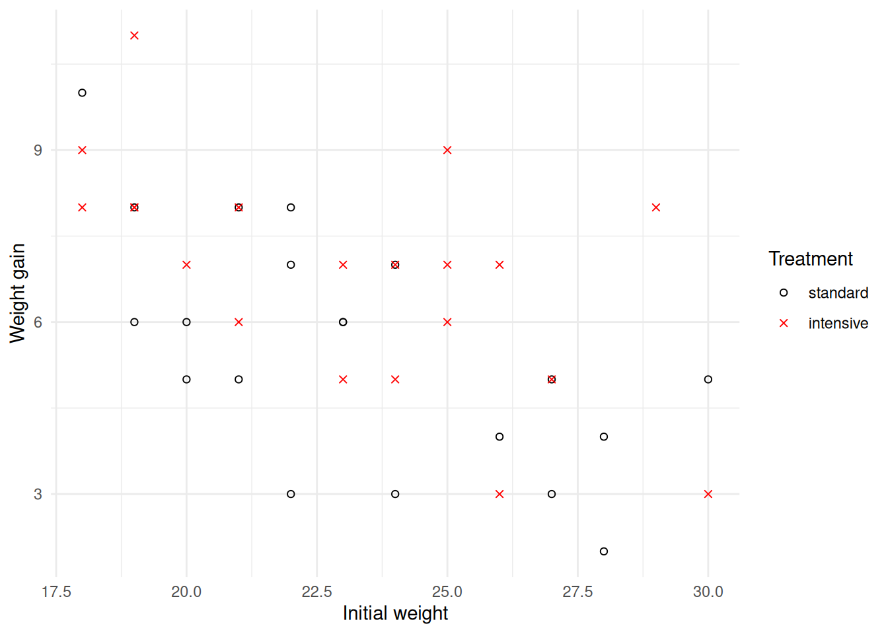
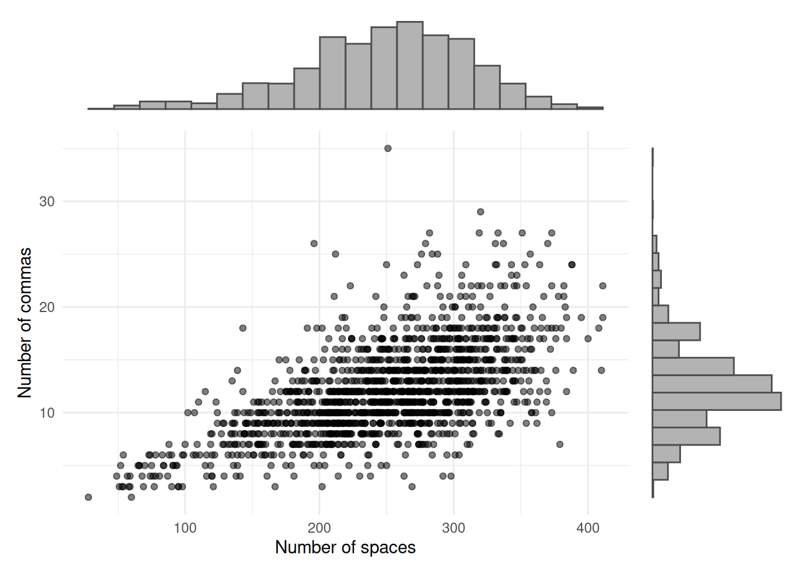

# Introduction

## What is Data Mining?{#sec:intro1}

What is data mining, and how does it differ from the statistics? It's
difficult (or perhaps we should say impossible) to give a definitive
answer to those questions. The boundaries between statistics, data
mining and machine learning are ill defined, and you would likely get
different answers from a computer scientist and a statistician if asked
to map out the territories of the respective disciplines.

In this paper you will get a statistician's take on data mining. We
regard data mining as essentially statistical in nature, albeit with a
different slant to many other statistics courses that you may encounter
at university. We'll try to give you a flavour of how data mining
differs from mainstream classical statistics through a couple of
examples.

::: {.example}
**Weight gain in goats**

This example concerns a designed experiment (conducted in Lincoln, New
Zealand) to investigate the effect of different drenching regimes on
goats. Goats are drenched as a matter of course to prevent worm
infestation, but it was conjectured that the standard method of
drenching was insufficient. A total of 40 goats were divided at random
into two groups of 20. Each goat was weighed at the start of the year,
and then again at the end of the year. Groups in the first group were
treated using a standard drenching program, while those in the second
underwent an intensive drenching regimen (involving more frequent
drenches through the year). The variables recorded in the dataset
`goats` are initial weight,
weight gain through the year (both measured in kilograms), and treatment
(either standard or intensive drenching). The data are plotted in Figure
\@ref(fig:goats) below.

(\#fig:goats)Scatterplot of weight gain against initial weight for goats on standard and intensive drenching regimens.

The principal question of interest here is whether or not the type of
drenching program affects a goat's weight gain. A secondary question is
whether the level of weight gain depends on the goat's initial weight,
and if so in what way.

We are definitely in the realm of classical statistics here! It is the
kind of dataset and scientific problem that would have been familiar
Ronald Fisher and Karl Pearson as they developed the basic theory and
methods for modern statistics, almost a century ago[^pearson]. The dataset is
of modest size, with $n=40$ cases and $p=3$ variables (namely weight
gain; initial weight; and treatment program). Moreover, the analysis of
these data should be driven by the specific scientific questions just
discussed. A statistician would use standard tools like regression and
hypothesis testing[^ancova]. The statistical models used will be easy to
interpret, with model parameters likely to have some clear physical
meaning.
:::

::: {.example}
**Amazon reviews**

This example contains data on reviews published on Amazon. The dataset
comprises information on 30 reviews by each of 50 reviewers, giving a
total of $n=1500$ reviews. For each review, a total of $p=10,000$
variables are recorded, including word frequency (for example, the
number of occurrences of the word 'book' in each review); usage of
digits and punctuation; word and sentence length; and usage frequency of
words and so on. A scatterplot of two of the variables (number of spaces
in the review, and number of commas) appears in Figure \@ref(fig:amazon), along
with histograms displaying the marginal distributions of each variable.

(\#fig:amazon)Plot of number of commas against number of spaces in reviews on Amazon.

Perhaps the first thing that stands out in this example, compared to the
last one, is the sheer quantity of data. Here there are 15 million
individual pieces of data, whereas we had just $120$ in the goats
dataset. A second noteworthy point is that the dataset is massively
multivariate. Classical statistical theory and methods (like linear
regression, for example) are designed for cases where there are (many)
more records ($n$) than variables ($p$), but we have quite the reverse
for the Amazon data.

The Amazon review data were collated, in part, to provide the raw
material for developing tools for authorship identification. In other
words, given a particular new review by purported author X, is there an
automated methodology by which we can examine whether it truly is by X
by looking at earlier reviews by the same author? This is a
classification problem (often referred to as a *supervised learning*
problem by computer scientists). Of course, such a rich dataset can also
be used to address other problems in stylometry[^stylometry], natural language
processing[^natlangproc] and linguistics. For example, one might look for
associations in the use of written language. If someone typically writes
in long sentences and uses many commas, are they also likely to be a
relatively heavy user of semi-colons?
:::

Such classification and association problems are common in data mining.
Furthermore, the methods and models used to address them are usually
highly complex and do not have easily interpretable parameters. This
lack of interpretability is usually inconsequential to the data miner:
the quality of a classifier, for example, being measured solely in terms
of its ability to correctly assign individuals to the correct category.

Having explored some of the underlying ideas, we are now in a position
to list some of the differences between classical statistics and data
mining. As intimated above, the boundaries between these areas are
somewhat fluid, so the distinctions that we draw are hardly set in
stone. Nonetheless, they should provide you with a feel for what data
mining is all about.

-   Data mining almost always involves large to massive datasets, while
    the datasets in classical statistical analyses can be quite modest
    in size. In this paper we focus principally on large datasets (say
    $10^3$--$10^6$ elements) rather than massive ones, in order to allow
    you to perform analyses on your home computer.

-   Classical statistical methods are typically designed to deal with
    situations where there are many more records $n$ than variables $p$.
    In data mining the reverse will sometimes be true. An important
    modern instance of this occurs with gene expression data, were we
    typically have measurements on thousands of genes taken from tens to
    hundreds of people or specimens.

-   In classical statistics the aim of an analysis is often estimation
    or testing of some parameter or another. In data mining the problems
    are more often concerned with classification, prediction, or
    association. Sometimes a data miner will not have any specific aim
    beyond developing a better understanding of the data. In that case,
    data mining is very much an approach to *exploratory data analysis*.

-   Classical statistical models are usually easy to interpret; for
    example, one can write down the fitted model in a straightforward
    manner. In data mining the models are typically complex and 'black
    box' in nature.

## Statistical Computing with R{#sec:Rinitial}

This course makes heavy use of the statistics package R. You may have
met this package before and be confident using it, in which case you
will be aware how wonderful it is! If not, don't worry. You'll find an
introduction to R in the second chapter of these notes, and plenty of
guidance in its use throughout the remainder of the study guide.

For those of you who haven't met R before, you're in for some good news
-- this package is freely available for download from the website
`https://www.r-project.org/`. Some even better news is that R is
state-of-the-art statistical computing, and is widely used package by
statistics researchers. It is extremely flexible and powerful.

Be warned, however, that R is not 'point and click'. You need to type in
commands. In fact this is a great thing from a learning perspective,
since it requires you to think about what you are doing! While you may
find R hard going to begin with, you will most likely be a fan of the
package by the end of semester. That's certainly our experience with the
great majority of students. Nonetheless, it requires practice.

A crucial learning element of this course are the practical computing workshops.
Not only do they allow you to practice what you're learning, but they
also teach you some techniques that will be useful for other courses.

## The tidyverse

Our philosophy is to use the `tidyverse` as much as we practically can.
If you haven't used the functionality in the `tidyverse` much in the
past, then we can recommend the online text "R for Data Science" by the author
of much of the tidyverse, Hadley Wickham:

https://r4ds.had.co.nz

In addition, the main tidyverse website is a useful resource:

https://tidyverse.org

## A roadmap for these notes {#sec:notes-roadmap}

These notes are designed to read as a connected workflow rather than as
independent topics. In practice, a data mining project usually begins
with getting data into R and understanding how they are represented
(Section \@ref(sec:dataload)). It then moves to data quality checks,
especially the detection and treatment of missing values
(Section \@ref(sec:missing)).

From there, the notes split into the main task families summarised in
Section \@ref(sec:task-compare). Section \@ref(sec:predictionbasics)
introduces supervised prediction methods, while Chapter 5 gathers the
same ideas into a modern `tidymodels` workflow using recipes,
workflows, resampling, and tuning. Classification methods are covered
in Section \@ref(sec:lda), clustering methods in
Section \@ref(sec:cluster-compare), and association rules in
Section \@ref(sec:association-fit). Ensemble methods in
Section \@ref(sec:ensemble) then return to supervised learning and show
how combining many models can improve predictive performance.

The order of the chapters reflects both ideas and practice. We first
learn what the main methods are and why they work, then we revisit them
through a more reproducible modelling pipeline.

### Comparing the main task families {#sec:task-compare}

The table below provides a compact map of the main problem types that
appear throughout the notes.

| Task | Output | Labelled data required? | Typical preprocessing | Common metrics | Main strengths | Typical use cases |
|:-----|:-------|:------------------------|:----------------------|:---------------|:---------------|:------------------|
| Prediction | Numeric target | Yes | Missing-value handling, scaling, dummy variables, train/test splitting | RMSE, MAE, $R^2$ | Flexible forecasting of quantitative outcomes | Wages, prices, yields, demand |
| Classification | Class label or class probabilities | Yes | Missing-value handling, factor encoding, scaling for some models, class-balance checks | Accuracy, sensitivity, specificity, ROC AUC, confusion matrix | Direct decisions for labelled outcomes | Diagnosis, credit risk, authorship, species ID |
| Clustering | Unlabelled groups | No | Scaling, dissimilarity choice, occasional imputation, outlier review | Within-cluster variation, silhouette width, stability | Finds structure without predefined classes | Customer segments, document groups, ecological types |
| Association rules | Co-occurring items or conditions | No designated target | Transaction encoding, item filtering, support thresholds | Support, confidence, lift | Interpretable co-occurrence patterns | Market baskets, questionnaires, recommenders |
| Ensembles | Combined predictions or classes | Usually yes | Same as supervised learning, plus resampling and tuning | Same as base task, plus out-of-bag or validation metrics | Often stronger predictive performance than one model alone | High-performing prediction and classification systems |

Looking ahead, Section \@ref(sec:dataload) starts this workflow by
showing how to import data carefully so that later preprocessing and
modelling steps are built on sound foundations.

[^pearson]: Every student taking a 300-level statistics paper should be at
    least vaguely familiar with the names Ronald Fisher and Karl
    Pearson. Look them up on Wikipedia if you're not!

[^ancova]: To be a little more precise, we would use an analysis of
    covariance (ANCOVA) type of model, something that you can learn
    about in the paper 161.251 Regression Modelling.
    
[^stylometry]: Stylometry is the study of style to determine the origin of a work
    (linguistic style in the case of authorship of books, artistic style
    in the case of provenance of paintings, etc.).

[^natlangproc]: Natural language processing is a branch of artificial intelligence
    concerned with computer handling of human language.
