# Prediction


## Prediction, Classification and Clustering

The remainder of the paper is largely concerned with prediction,
classification and clustering for large datasets. These are related
problems.

In prediction, the aim is to estimate the value of a quantitative
*target* variable using information from all other available variables
(the predictors). For prediction we will have two datasets -- a training
set and a test set. For records in the training set we have the correct
value of the target variable (or predictand[^1]), so that these data can
be used to construct a prediction methodology. The value of the target
variable is unavailable (or is regarded as unavailable) in the test set,
so our problem is to reconstruct these values.

In classification, we wish to use the predictor variables to assign each
observation to one of a number of pre-specified classes. Again, we have
training data, where the classes for each observation are known; and we
have test data, where they the classes are unknown and hence need
predicting. If one thinks of a qualitative target variable defining
class membership for each observation, then the classification problem
mirrors the prediction one exactly, except that the target is changed
from quantitative to qualitative.

Clustering is akin to the classification in that the aim is to divide
the observations into groups. However, in clustering these groups are
not known a priori: it is like classification without the training
dataset. We therefore seek to find natural groupings in the data without
any prior information to guide us. In the computer science and machine
learning literatures, classification and clustering are commonly
referred to as *supervised learning* and *unsupervised learning*
respectively.

**How this chapter connects.** This chapter introduces the main ideas
behind prediction and shows how the different model families behave. For
a modern implementation workflow built around reusable preprocessing,
resampling, tuning, and final model fitting, see Chapter 5. In other
words, this chapter is mainly about the methods; Chapter 5 is about
putting them to work cleanly.

To illustrate these ideas, consider the following archaeological
scenarios.

-   Archaeologist Dr Illinois Jane has found an incomplete fossilized
    skeleton of a Tyrannosaurus Rex. Dr Jane wishes to create replicas
    of the missing bones in order to display a full skeleton in her
    local museum. To do so, she must estimate the dimensions of the
    missing bones based on the bones that have been found. She has
    training data to help her, in the form of corresponding measurements
    taken from previously discovered complete Tyrannosaurus Rex
    skeletons

    Dr Jane is faced with a number of prediction problems here, since
    she wants to predict quantitative target variables (the lengths,
    etc., of the missing bones).

-   On her next expedition, Dr Jane uncovers fossils from a number of
    sauropods[^2]. She wants to know whether each fossilised dinosaur is
    a Brachiosaurus, or a Diplodocus, or an Apatosaurus, or none of
    these. This is classification problem, because the aim is to assign
    each fossilised dinosaur to one of four pre-specified classes.
    Training data are provided by measurements on Brachiosaurus,
    Diplodocus, Apatosaurus and other sauropod fossils from existing
    collections around the world.

-   On holiday in the north of Western Australia, Dr Jane discovers by
    chance a large number of fossilized fish. She has never before seen
    any fossils quite like these. There is quite a lot of variety in the
    fossils, so Dr Jane suspects that there are several species present.
    Using measurements taken on each fossil, she attempts to group them
    with the aim of distinguishing the different species that might be
    present. This is a clustering problem, because the goal is to form
    classes de novo.

In this chapter we will look at a variety of methods for prediction.
These range from from methods based on explicit, easily interpretable
models (in particular, linear regression) to computational black box
techniques (like neural networks). Specifically, we will consider
multiple linear regression; tree-based methods; and neural networks.

## The Basics of Prediction{#sec:predictionbasics}

The classical prediction problem works as follows. We have two datasets.
The first is the training data, where we have information on the
predictor and target variables for each record. The second is a test
dataset, where we know the values of the predictors, but not of the
target variable. Our aim then is to predict the target variable on these
test cases.

The basic approach will be to use the training data to construct a model
that relates the target variable to the predictors. This model will have
the predictors as 'inputs' and the target as an output, so that we can
predict the test cases from the variables that we observe on them.

The challenge is to construct a good model for prediction! There are two
issues here. First, we have to choose a particular type of model. For
example we might use linear regression; we might use tree-based methods;
we might use neural networks[^3]. Then, when we have decided on an
overall technique, we will need to tune the model. This might involve
selecting which predictors to include and which to exclude, or choosing
the size of a regression-tree, or selecting the complexity of a neural
network.

It might seem tempting to compare the various modelling techniques and
tuning parameters by seeing how well they reproduce the values of the
target variables in the training set. However, this will give a false
picture. Any model constructed from a given data set will tend to
predict that dataset rather well -- it's like having home ground
advantage in a sports match. However, the model will typically do less
well when applied to the independent test dataset.

One resolution is to split the training data into two or more subsets,
one of which becomes the new training set, and the other other(s) become
validation and/or (artificial) test sets. Now, if we construct our
various models from just the records in the new training set, we then
have the validation/artificial test sets as independent testing grounds.
(Returning to the sporting analogy, predicting on these datasets will be
playing away from home, since they were not used in model construction.)
Moreover, we actually know the true values of the target variable on
these sets, and can hence obtain an independent assessment of the
accuracy of our predictions.

Once we have used the validation/artificial test sets dataset to choose
the best model, it makes sense to recombine all the training data and
refit the model before applying it to the real test dataset. For
example, we might decide that the best type of model is a linear
regression with a particular set of variables based on our artificial
test data. We should then re-estimate the parameters of that model from
the full training set before making predictions on the test cases.

In the notes that follow you will sometimes see test datasets where the
target variable is present. This is for illustrative purposes. If we do
know the target variable, then we can compute errors in prediction and
hence provide comparisons between methods. However, do keep in mind that
in real-world prediction, the aim will be to predict on test cases
without the target present. Learn to do this well and a lucrative career
in anything from financial forecasting to sports betting to weather
forecasting might lie ahead of you!

## Linear Regression for Prediction{#sec:regress}

### Data Structures and Notation

Linear regression is a very large topic, the theory and practice of
which could occupy several university courses[^4]. Here we will restrict
ourselves to a brief overview, focusing on the use of linear regression
models for prediction.

We will seek to construct our regression models from the training data,
and will then apply these models to obtain predictions on the test data.
For the training data, one of the observed variables (or attributes)
will be the target; denote this by $y$. This variable is typically
referred to as the *response* in the context of regression modelling.
The remaining variables in the training data set (which are also the
variables available in the test data) are known as the predictors, and
will be denoted $x_1, x_2, \ldots, x_p$.

::: {.example}
**Prediction for Wage Data**

This example is concerned with data on workers in the U.S., collected in
the late 1980s. For each worker the following attributes are recorded.

  Attribute   Definition
  ----------- ---------------------------------------------------------------------------------
  `EDU`       Number of years of education
  `SOUTH`     Indicator variable for living in Southern Region ($1=$yes, $0=$no)
  `SEX`       F (female) or M (male)
  `EXP`       Number of years of work experience
  `UNION`     Union member? ($1=$yes, $0=$no)
  `WAGE`      Hourly wage (in dollars)
  `AGE`       Age in years
  `RACE`      Ethnicity (Hispanic, Other, or White)
  `OCCUP`     Occupation category (Clerical, Management, Other, Sales, Professional, Service)
  `SECTOR`    Employment sector (Construction, Manufacturing, or Other)
  `MARRIED`   Married? (no or yes)

The target variable (predictand) is `WAGE` (i.e. this is the variable
that we generically denote $y$). The other attributes are the predictors
(generically denoted $x_1, x_2, \ldots, x_{p}$, where $p=10$ is the
number of them). Notice that some of these predictors are numerical
variables (e.g. `EDU`, `AGE`) and some are categorical (e.g. `SEX`,
`OCCUP`).

The training set comprises data on 400 employees, which can be
downloaded into R by


``` r
wage.train <- read_csv("../data/wage-train.csv")
```

A test dataset of 134 observations is also available, which can be
downloaded into R by


``` r
wage.test <- read_csv("../data/wage-test.csv")
```

Notice that in this case the we actually have the values for the target
`WAGE` in the test data. This artificial situation means we can use the
test dataset to assess the performance of the prediction methodology
(since we know the true answer in each case).
:::

### The Linear Regression Model

The multiple linear regression model[^5] expresses the target variable
as a linear combination of the predictors. That is,

\begin{align}
y_i &= \beta_0 + \beta_1 x_{i1} + \beta_{2} x_{i2} + \cdots + \beta_p x_{ip} + \varepsilon_i \\
    &= \beta_0 + \sum_{j=1}^p \beta_j x_{ij} + \varepsilon_i\qquad(i=1,2,\ldots,n)\\
(\#eq:regress)\end{align}

where

-   $y_i$ is the value of the target variable for the $i$th observation
    in the training set.

-   $x_{ij}$ is the value of $j$th predictor for the $i$th observation
    in the training set.

-   $\varepsilon_1, \ldots \varepsilon_n$ are random error terms,
    usually assumed to be independent $N(0,\sigma^2)$ random
    variables[^6].

-   The coefficients $\beta_0, \beta_1, \ldots, \beta_p$ are unknown
    regression parameters, that must be estimated in practice.

You may have already spotted a problem with the model described in
equation \@ref(eq:regress) (particularly if you have studied linear
regression models previously). The model formulation is appropriate for
numerical predictors, but what about factors (i.e. categorical predictor
variables)? The answer is that we can replace each factor by a set of
dummy (indicator) variables. These are binary variables (i.e. taking
value zero or one), and can be used to code each level of each factor.
For instance, the variable `SEX` from the previous Example can be
replaced by two indicator variables, `MALE` and `FEMALE` (say), where
`MALE` is 1 for each male and 0 otherwise, and `FEMALE` takes the value
0 for each male and 1 for each female. Similarly, we could code
ethnicity using binary indicator variables for 'Other', 'Hispanic' and
'White' categories[^7]. It follows that we the regression model in
equation \@ref(eq:regress) is appropriate once we have coded each factor in
terms of numerical (binary) indicators[^8].

It is important to recognize that the multiple linear regression model
makes some rather strong assumptions. We have already noted assumptions
about the error terms in equation \@ref(eq:regress). However, even more
important is the implicit
assumption that the relationship between the target variable and the
predictors is linear. There are ways of relaxing this assumption
somewhat (for example, using *polynomial regression*), but we shall not
pursue these here. Rather, we will look later at methods that allow far
more flexible relationships between the response and the predictors.

### Fitting Linear Regression Models

In order to apply regression models in practice we must estimate the
parameters $\beta_0, \beta_1, 
\ldots, \beta_p$. This is referred to as 'fitting the model'. This can
be done using the *method of least squares*, whereby we select the
values $\hat \beta_0, \hat \beta_1, \ldots, 
\hat \beta_p$ that minimize the sum of squares

\begin{equation}
SS(\beta_0, \beta_1, \ldots, \beta_p) = \sum_{i=1}^n \left ( 
         y_i - \beta_0 - \beta_1 x_{i1} - \beta_{2} x_{i2} - \cdots - \beta_p x_{ip} \right )^2.
(\#eq:ss)\end{equation}

The minimizers
$\hat \beta_0, \hat \beta_1, \ldots, \hat \beta_p$ are called least
squares estimates of the parameters. The minimum value of the $SS$
(i.e. the value of $SS$ when the parameters are set to the least squares
estimates) is called the *residual sum of squares*, frequently
abbreviated to RSS. Hence

\begin{equation}
{\textsf {RSS}}= \sum_{i=1}^n  ( 
         y_i - \hat \beta_0 - \hat \beta_1 x_{i1} - \hat \beta_{2} x_{i2} - \cdots - \hat \beta_p x_{ip}  )^2.
(\#eq:rss)\end{equation}

Regression models can be fitted in R using the `lm` function[^9]. The
basic syntax is


``` r
lm(formula, data)
```

where

-   `formula` is the *model formula* (a required argument)

-   `data` is the data frame in use (optional).

A fitted model can be assigned to a fitted model object for later use
(as illustrated a little further below).

If the target variable is stored as the object `y` in R, and there are
two predictor variables stored as `x1`, `x2`, then the aforementioned
model formula will be


``` r
y ~ 1 + x1 + x2
```

The number `1` on the right hand side of the formula tells R that you
want to include an intercept (i.e. a $\hat \beta_0$) term in your model.
In fact you can omit the `1 +` from the formula since R includes an
intercept by default, but some people like to include it for aesthetic
reasons. If you want to fit a regression through the origin, then the
model is specified by `y ~ -1 + x`.

R will look first in the data frame argument to `lm` (if provided) when
searching for the variables in a model formula. It will then look in the
user's workspace. In general, it is recommended that you do supply a
data frame argument to `lm` in order to avoid confusion between common
variable names in different datasets.

One very useful convention in R model formulae is that a dot on the
right-hand side of the formula represents all variables in the data
frame excluding the target. For instance, if the data frame `my.df`
contains variables `y`, `x1` and `x2`, then


``` r
my.lm <- lm(y ~ x1 + x2, data=my.df)
```

and


``` r
my.lm2 <- lm(y ~ . , data=my.df)
```

produce identical fitted models, saved as `my.lm` and `my.lm2`
respectively in the above code.

::: {.example}
**Regression Modelling for the Wage Data**

In this example we fit a regression model to the training data from the
wage dataset.


``` r
wage.lm <- lm(WAGE ~ . , data=wage.train)
summary(wage.lm)
```

```
#> 
#> Call:
#> lm(formula = WAGE ~ ., data = wage.train)
#> 
#> Residuals:
#>     Min      1Q  Median      3Q     Max 
#> -10.517  -2.251  -0.491   1.711  34.314 
#> 
#> Coefficients:
#>                     Estimate Std. Error t value Pr(>|t|)    
#> (Intercept)         -0.08843    6.67921  -0.013  0.98944    
#> EDU                  0.80550    1.06299   0.758  0.44906    
#> SOUTH               -0.59829    0.46847  -1.277  0.20233    
#> SEXM                 1.76563    0.47176   3.743  0.00021 ***
#> EXP                  0.26571    1.05648   0.252  0.80156    
#> UNION                1.57952    0.57570   2.744  0.00636 ** 
#> AGE                 -0.18206    1.05542  -0.172  0.86314    
#> RACEOther           -0.27022    1.08367  -0.249  0.80322    
#> RACEWhite            0.64714    0.94797   0.683  0.49523    
#> OCCUPManagement      3.69919    0.83060   4.454 1.11e-05 ***
#> OCCUPOther          -0.63296    0.79143  -0.800  0.42434    
#> OCCUPProfessional    1.62208    0.75193   2.157  0.03161 *  
#> OCCUPSales          -1.23499    0.93477  -1.321  0.18723    
#> OCCUPService        -0.45767    0.73144  -0.626  0.53187    
#> SECTORManufacturing -0.25052    1.16225  -0.216  0.82945    
#> SECTOROther         -1.79173    1.12877  -1.587  0.11326    
#> MARRIEDYes           0.05904    0.47013   0.126  0.90013    
#> ---
#> Signif. codes:  0 '***' 0.001 '**' 0.01 '*' 0.05 '.' 0.1 ' ' 1
#> 
#> Residual standard error: 4.166 on 383 degrees of freedom
#> Multiple R-squared:  0.3317,	Adjusted R-squared:  0.3038 
#> F-statistic: 11.88 on 16 and 383 DF,  p-value: < 2.2e-16
```

Some comments on this R snippet.

-   The first line of code fits a linear model with `WAGE` as the
    response (target) and all other variables in the data frame
    `wage.train` as predictors. The resulting fitted model is saved as
    the object `wage.lm`. (There is no requirement to use a name of the
    form `something.lm` for the fitted model, but such a naming
    convention can be helpful when it comes to remembering the
    attributes of each of the objects in your workspace.)

-   The presence of a row of dots in the R snippet indicates that we
    have deleted some non-essential output.

-   The `summary` function attempts to provide a summary of whatever
    type of object it is applied to. For linear models we get a generic
    type of table of regression coefficients. This table includes the
    estimated coefficients themselves
    (i.e. $\hat \beta_0, \ldots, \hat \beta_p$); their standard errors;
    and t-values and corresponding p-values for testing whether the
    associated coefficient is different from zero. A small p-value
    (usually interpreted as one less than $0.05$) indicates that there
    is statistically significant evidence that the corresponding
    coefficient is not zero. (This is highlighted using stars -- the
    more stars, the stronger the evidence that the coefficient is
    non-zero.)

    The interpretation of p-values for individual regression terms is
    quite subtle[^10]. For the purposes of the current paper it is
    sufficient to recognize that (highly) significant terms are
    providing important information about the response variable, and
    hence should be useful in generating predictions. Non-significant
    variables are not provide so much information (at least when all
    other variables have been taken into account), and hence may be
    adding noise to the prediction model as much as anything else.

    Hence, in the current example we see that `Union` is a significant
    predictor of `WAGE`. `Union` is a binary variable with 1 indicating
    union membership and 0 indicating lack thereof. Given the positive
    coefficient for `Union`, it appears that belonging to a union has a
    positive impact on a worker's hourly wage (having adjusted for all
    the other predictors).
:::

::: {.example}
**Tidying the Linear Model for the Wage Data**

In the previous example we used the `summary()` command to gain information from
the linear model. This combines information on the model equation (e.g. coefficients
and their standard errors) with information on the overall model fit (the
multiple $R^2$, overall $F$ statistic, residual degrees of freedom etc)

The `broom` package contains some tools to tidy the output from linear models
(and other models) in a consistent way. The two functions for summarising model
fit are `tidy()`, which produces a tidy data frame for the coefficients of the
model:


``` r
library(broom)
tidy(wage.lm)
```

```
#> # A tibble: 17 × 5
#>    term                 estimate std.error statistic     p.value
#>    <chr>                   <dbl>     <dbl>     <dbl>       <dbl>
#>  1 (Intercept)         -0.088428   6.6792  -0.013239 0.98944    
#>  2 EDU                  0.80550    1.0630   0.75777  0.44906    
#>  3 SOUTH               -0.59829    0.46847 -1.2771   0.20233    
#>  4 SEXM                 1.7656     0.47176  3.7427   0.00020998 
#>  5 EXP                  0.26571    1.0565   0.25151  0.80156    
#>  6 UNION                1.5795     0.57570  2.7437   0.0063614  
#>  7 AGE                 -0.18206    1.0554  -0.17250  0.86314    
#>  8 RACEOther           -0.27022    1.0837  -0.24935  0.80322    
#>  9 RACEWhite            0.64714    0.94797  0.68266  0.49523    
#> 10 OCCUPManagement      3.6992     0.83060  4.4536   0.000011093
#> 11 OCCUPOther          -0.63296    0.79143 -0.79976  0.42434    
#> 12 OCCUPProfessional    1.6221     0.75193  2.1572   0.031609   
#> 13 OCCUPSales          -1.2350     0.93477 -1.3212   0.18723    
#> 14 OCCUPService        -0.45767    0.73144 -0.62572  0.53187    
#> 15 SECTORManufacturing -0.25052    1.1623  -0.21555  0.82945    
#> 16 SECTOROther         -1.7917     1.1288  -1.5873   0.11326    
#> 17 MARRIEDYes           0.059039   0.47013  0.12558  0.90013
```

And `glance()` which provides a single row data frame with summary statistics
of model fit:


``` r
glance(wage.lm)
```

```
#> # A tibble: 1 × 12
#>   r.squared adj.r.squared  sigma statistic    p.value    df  logLik    AIC
#>       <dbl>         <dbl>  <dbl>     <dbl>      <dbl> <dbl>   <dbl>  <dbl>
#> 1   0.33174       0.30383 4.1656    11.883 3.0923e-25    16 -1129.6 2295.3
#> # ℹ 4 more variables: BIC <dbl>, deviance <dbl>, df.residual <int>, nobs <int>
```

The nice thing about the `glance` output is you can use it directly as if it is
a list object, and use the `$` operator (complete with tab auto-completion!)


``` r
wage.modfit <- glance(wage.lm)
wage.modfit$r.squared
```

```
#> [1] 0.3317438
```
:::

### Prediction

Regression models can be used for a variety of purposes. For example,
their straightforward interpretability means that they can be employed
to better understand the relationships between variables, and also to
quantify the effects of predictors on the response. However, our primary
interest here is in the use of these models for prediction.

Given estimates of the model parameters (obtained using the method of
least squares) we can form the *fitted model* as 

\begin{align}
\hat y &= \hat \beta_0 + \hat \beta_1 x_{1} + \hat \beta_{2} x_{2} + \cdots + \hat \beta_p x_{p} \\
    &= \hat \beta_0 + \sum_{j=1}^p \hat \beta_j x_{j}.
(\#eq:regress-fit)
\end{align}

We can hence obtain *point
predictions* by substituting in requisite values for the predictors and
then calculating the resulting value for $\hat y$. We use the phrase
'point predictions' to emphasise that this procedure generates just a
single prediction. Also useful are *prediction intervals*, which specify
a range of values with an associated level of confidence.

Prediction for linear models in R can be carried out using the `predict`
command. The syntax for computing point predictions is as follows:


``` r
predict(my.lm, newdata=my.test.predictors)
```

where `my.lm` is the fitted regression model to perform the prediction,
and `my.test.predictors` is a data frame containing (as rows) the sets
of predictors for which we wish to make predictions[^11]. We can obtain
predictions intervals (in addition to the point predictions) by


``` r
predict(my.lm, newdata=my.test.predictors, interval="prediction")
```

By default the prediction interval will be at the 95% level (so that
there is probability 0.95 that each prediction interval will contain the
true target value, assuming that the model is adequate). This percentage
can be changed through the optional `level` argument to `predict`.

::: {.example}
**Prediction for the Wage Data**

Here we use the model fitted in the previous example to make predictions
for the target variable (hourly wage) in the test data set.


``` r
wage.pred <- predict(wage.lm, newdata=wage.test, interval="prediction")
head(wage.pred)
```

```
#>         fit        lwr      upr
#> 1  8.377106 -0.1071914 16.86140
#> 2  9.016646  0.6028001 17.43049
#> 3  8.499586  0.1763713 16.82280
#> 4 15.155114  6.6854034 23.62483
#> 5  8.152215 -0.2501431 16.55457
#> 6 10.610263  2.3114289 18.90910
```

Unfortunately, this isn't **tidy** - the output is not a data.frame, so we
can't just pass this across to `ggplot2` for plotting.

A better solution is to use `augment()` from the `broom` package. The nice thing
about `broom` is it provides a consistent interface across multiple model types,
it works not just for the `lm()` function but for many others. As the name
suggests, instead of just returning the prediction information, it **augments**
the data we supply with the predictions. The augmented columns all start with a
period (`.`).


``` r
wage.tidypred <- augment(wage.lm, newdata=wage.test, interval="prediction")
wage.tidypred |> select(starts_with("."), everything())
```

```
#> # A tibble: 134 × 15
#>    .fitted   .lower .upper  .resid   EDU SOUTH SEX     EXP UNION  WAGE   AGE
#>      <dbl>    <dbl>  <dbl>   <dbl> <dbl> <dbl> <chr> <dbl> <dbl> <dbl> <dbl>
#>  1  8.3771 -0.10719 16.861 -4.6271    11     0 M        11     0  3.75    28
#>  2  9.0166  0.60280 17.430 -1.0166    12     0 F        43     1  8       61
#>  3  8.4996  0.17637 16.823 -2.4996    13     1 M         7     0  6       26
#>  4 15.155   6.6854  23.625  7.6749    18     0 F        37     0 22.83    61
#>  5  8.1522 -0.25014 16.555 -3.0022    13     1 M         1     1  5.15    20
#>  6 10.610   2.3114  18.909 -4.4603    16     0 F        16     0  6.15    38
#>  7  6.9590 -1.3276  15.246 -3.9590    12     1 F        28     0  3       46
#>  8 11.641   3.0315  20.251 -6.6413    14     0 M         0     0  5       20
#>  9 11.561   3.2827  19.838 -1.7005    15     0 M        13     0  9.86    34
#> 10 13.685   5.2854  22.084 -7.4347    18     0 M        27     0  6.25    51
#> # ℹ 124 more rows
#> # ℹ 4 more variables: RACE <chr>, OCCUP <chr>, SECTOR <chr>, MARRIED <chr>
```

As this is tidy, we can quite happily use `ggplot2` to do plots, e.g. a plot
of the true target values (i.e. `WAGE`) against predictions (i.e. `.fitted`) based
on the linear model `wage.lm`:


``` r
ggplot(wage.tidypred) +
  geom_point(mapping = aes(x=.fitted, y=WAGE)) +
  labs(x="Predicted wage",
       y="True wage")
```

<div class="figure">
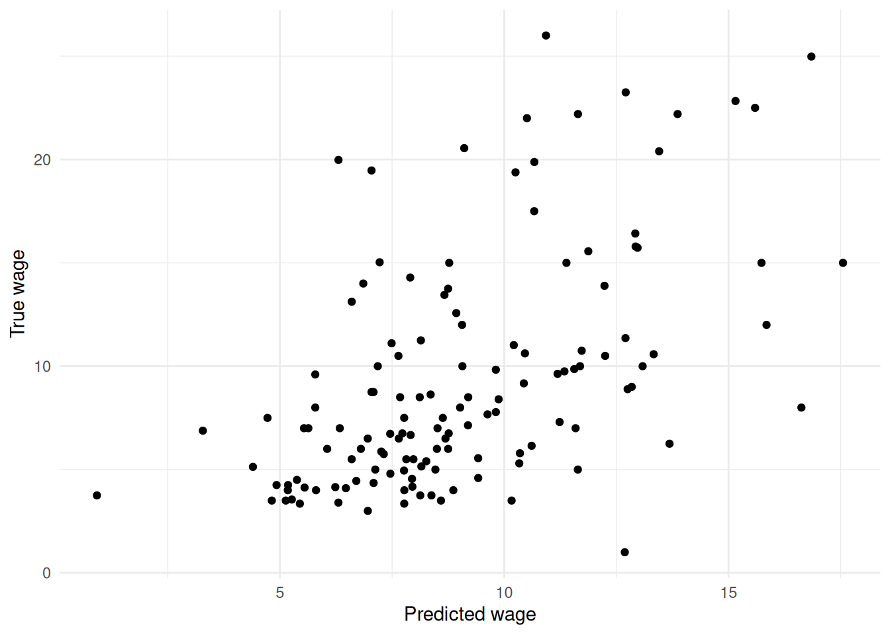
<p class="caption">(\#fig:wagepred1)Scatterplot of true wages against predicted wages.</p>
</div>

A second plot embellishes this by adding the range of
95% prediction intervals, as depicted by vertical lines for each
observation in the test set.


``` r
ggplot(wage.tidypred) +
  geom_linerange(mapping = aes(x=.fitted, ymin=.lower, ymax=.upper)) +
  geom_point(mapping = aes(x=.fitted, y=WAGE), col='red') +
  labs(x="Predicted wage",
       y="True wage")
```

<div class="figure">
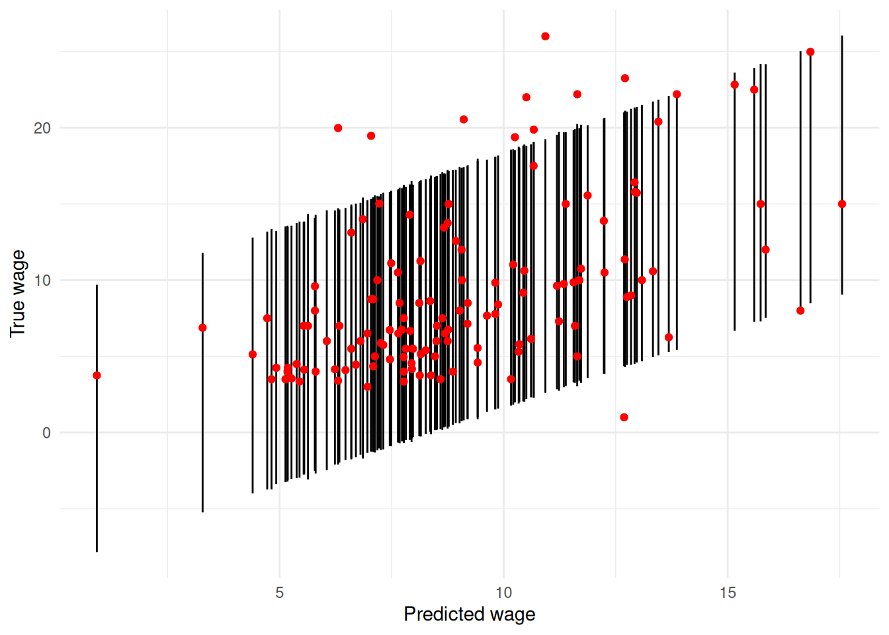
<p class="caption">(\#fig:wagepred2)Scatterplot of true wages against predicted wages, with 95% prediction intervals depicted by vertical lines.</p>
</div>

Some noteworthy points are as follows.

-   The `predict` command saves the predictions in the object `wage.pred`.
    Because we specified the `interval` argument in `predict`, the
    object `wage.pred` is a three column matrix. The first column
    contains the predictions themselves; the second and third columns
    are lower and upper bounds respectively for 95% prediction
    intervals. This is not tidy for plotting.

-   The `augment` command gives us the same information by augmenting
    the `wage.test` data with additional columns `.fitted`, `.lower`,
    `.upper` and `.resid`. These should be self-explanatory.
  
-   The plotting command for the first Figure \@ref(fig:wagepred1)
    requires no special comment, but the
    code to produce Figure \@ref(fig:wagepred2) utilises the
    `geom_linerange()` layer which you may not have seen before. This uses
    `ymin` and `ymax` to draw line segments. There is also `geom_pointrange`
    available that combines the line range and point geometries into one.

-   Two things are strikingly clear from the Figures. First, the (point)
    predictions are not terribly impressive. If the regression model
    produced highly accurate predictions then the plot of true versus
    predicted values would lie more or less on a 45$^\circ$ straight
    line. Instead we see considerable variation. Second, the prediction
    intervals are very wide, indicating a high degree of imprecision in
    the predictions. Consider, for example, that when the true value of
    `WAGE` is about 8 dollars per hour, the prediction intervals range
    from about $0$ to $16$ dollars per hour.

    Of course, zero dollars per hour (or even slightly negative values
    in some cases) is nonsensical in the prediction interval, but
    reflects the dependence of linear regression models on their
    underlying assumptions (in this case the pertinent one being that
    the errors are normally distributed).
:::

### Prediction Accuracy and the Bias-Variance Trade-Off

Why are the predictions so variable in the previous Example? After all,
we seem to have quite a lot of information available -- 10 attributes on
400 individuals. However, how many of these variables are providing
useful information for predicting the target variable? Inclusion of
predictors that have very little association with the target will simply
add noise to the prediction process.

This discussion suggests that we should try and identify the relatively
uninformative predictors, and remove them from the model in order to
reduce the noise in the system. However, we should be aware that
deletion of any predictor that is related to the target (no matter how
weak that relationship is) will introduce bias in the prediction
process.

Consider a very simple example in which there are only two predictors,
$x_1$ and $x_2$, where the first of these is strongly informative about
the target $y$, and the latter very weakly so. The model using both
predictors is $$y = \beta_0 + \beta_1 x_1 + \beta_2 x_2 + \varepsilon$$
Denote this model $M_1$. Because the error term has zero mean, we can
compute the mean (expected) value of the response variable as
\begin{equation}
{\textsf E}[y] = \beta_0 + \beta_1 x_1 + \beta_2 x_2.
(\#eq:m1)
\end{equation}

We can expect $\beta_2$ to be very close to zero (since $x_2$ is only
weakly informative about $y$). Suppose that its true value is
$\beta_2 = 0.0001$. Suppose further that if we estimate this parameter
from training data, then we might obtain an estimate $\hat \beta_2$
anywhere in the range $(-0.15,\, 0.15)$ (depending on the particular
quirks of the sample of training data that we happen to have to hand).
It follows that unless we get very lucky, the estimate $\hat \beta_2$
will be further from the true value than will be zero. In other words,
it would typically be better to set $\beta_2 = 0$ (i.e. eliminate the
variable $x_2$ from the model) than to try and estimate this parameter.

This discussion suggests that we should prefer model $M_2$,
$$y = \beta_0 + \beta_1 x_1 +  \varepsilon$$
where the second predictor is excluded. Note that
\begin{equation}
{\textsf E}[y] = \beta_0 + \beta_1 x_1
(\#eq:m2)
\end{equation}
under $M_2$. Since this expected value ignores the small
but non-zero contribution from the term $\beta_2 x_2$ in equation
\@ref(eq:m1), it follows
that equation \@ref(eq:m2) misspecifies the mean value ${\textsf E}[y]$. In
other words, the model is biased.

In summary, excluding a very weakly informative predictor will introduce
bias into the prediction procedure, but will eliminate variability
inherent in having to estimate its coefficient (i.e. the corresponding
$\beta$). This leads us to a critical idea in prediction (and indeed in
Statistics in general). The controllable error in prediction can be
decomposed into two types. First, there is bias due to misspecification
of the model. Second, there is variance derived from uncertainty in the
estimates of the regression parameters. It will often be worth
introducing a small amount of bias if we can obtain a large reduction in
variance as a result. This is known as the *bias-variance trade-off*.

We can express these ideas mathematically as follows. Suppose that we
are trying to predict a test case with target $y_0$ and predictors
$x_{1,0}, \ldots, x_{p,0}$. The target can be decomposed as
\begin{equation}
y_0 = f_0 + \varepsilon_0
(\#eq:pred-decompose)
\end{equation}
where $f_0 = f_0(x_{1,0}, \ldots, x_{p,0})$
is predictable from $x_{1,0}, \ldots, x_{p,0}$, and $\varepsilon_0$ is
unpredictable error[^12]. It follows that the performance of a predictor
$\hat y$ can be assessed by how well it estimates $f_0$. We can measure
that in terms of mean squared error (MSE), defined by
\begin{equation}
\textsf{MSE}(\hat y) = {\textsf E}\left [ (\hat y - f_0)^2 \right ].
(\#eq:mse)\end{equation}
This is the 'controllable error' (as opposed to the
unpredictable $\varepsilon_0$) that was mentioned earlier. It can be
decomposed into squared bias and variance components as follows[^13]:
\begin{align}
\textsf{MSE}(\hat y) &= {\textsf E}\left [ (\hat y - f_0)^2 \right ] \\
             &= {\textsf E}\left [ (\hat y - {\textsf E}[\hat y] + {\textsf E}[\hat y] - f_0)^2 \right ] \\
             &= {\textsf E}\left [ (\hat y - {\textsf E}[\hat y])^2 + ({\textsf E}[\hat y] - f_0)^2 + 2 (\hat y - {\textsf E}[\hat y])({\textsf E}[\hat y] - f_0) \right ] \\
             &= {\textsf E}\left [ (\hat y - {\textsf E}[\hat y])^2 \right ] + {\textsf E}\left [ ({\textsf E}[\hat y] - f_0)^2 \right ] + 2 {\textsf E}\left [  (\hat y - {\textsf E}[\hat y])({\textsf E}[\hat y] - f_0) \right ] \\
             &= {\textsf E}\left [ (\hat y - {\textsf E}[\hat y])^2 \right ] +  ({\textsf E}[\hat y] - f_0)^2  + 2 ({\textsf E}[\hat y] - {\textsf E}[\hat y])({\textsf E}[\hat y] - f_0) \\
             &= {\textsf E}\left [ (\hat y - {\textsf E}[\hat y])^2 \right ] +  ({\textsf E}[\hat y] - f_0)^2   \\
             &= {\textsf {var}}(\hat y) + \left [ {\textsf {bias}}(\hat y) \right ]^2
(\#eq:mse-decompose)\end{align}
where
${\textsf {bias}}(\hat y) = {\textsf E}[\hat y] - f_0$ is the systematic
difference between the mean of our predictor $\hat y$ and the
estimand[^14] $f_0$. Equation \@ref(eq:mse-decompose)
 describes the bias-variance trade-off in a transparent manner.

::: {.example}
**Prediction Performance for the Wage Data**

If you look back at the previous Example you will see that several of
the predictors are not statistically significant. We might therefore try
removing one or more of these variables from the model in order to
improve prediction performance courtesy of a bias-variance trade-off.
Here we consider removing `RACE` from the model.


``` r
wage.lm.2 <- lm(WAGE ~ . -RACE, data=wage.train)
wage.pred.test <- augment(wage.lm, newdata=wage.test)
wage.pred.test.2 <- augment(wage.lm.2, newdata=wage.test)
wage.pred.train <- augment(wage.lm, newdata=wage.train)
wage.pred.train.2 <- augment(wage.lm.2, newdata=wage.train)
wage.pred.all <- bind_rows(list(test1 = wage.pred.test,
                                test2 = wage.pred.test.2,
                                train1 = wage.pred.train,
                                train2 = wage.pred.train.2), .id="Prediction")
wage.pred.all |>
  group_by(Prediction) |>
  summarise(MSE = mean((.fitted - WAGE)^2))
```

```
#> # A tibble: 4 × 2
#>   Prediction    MSE
#>   <chr>       <dbl>
#> 1 test1      21.890
#> 2 test2      21.880
#> 3 train1     16.614
#> 4 train2     16.717
```

There is quite a lot going on in that R snippet! The most important
points are as follows.

-   The first line of code fits a new regression model, which is stored
    as `wage.lm.2`. Notice the use of minus signs on the right-hand side
    of the model formula to remove unwanted terms. (It is quicker here
    to remove two unwanted terms than to list the eight predictors that
    we do wish to include.)

-   The objects `wage.pred.test` and `wage.pred.test.2` respectively
    contain predictions for the observations in the test dataset.

-   Recall that the observed mean squared error (MSE) of prediction is given by
    $$\textsf{MSE}_{test} = \frac{1}{n_{test}} \sum_{i=1}^{n_{test}} \left ( y_{test,i} - \hat y_{test,i} \right )^2$$
    where $n_{test}$ denotes the number of observations in the test
    dataset; $y_{test,i}$ is the value of the target for the $i$th test
    observation; and $\hat y_{test,i}$ is the corresponding prediction
    based on a regression model. We can also compute a mean squared error on the training dataset:
    $$\textsf{MSE}_{train} = \frac{1}{n_{train}} \sum_{i=1}^{n_{train}} \left ( y_{train,i} - \hat y_{train,i} \right )^2$$
    using the obvious notation. To do this we generate `wage.pred.train`
    and `wage.pred.train.2` respectively.

-   To compute the mean squared error (MSE) of prediction across all
    models and data at once, we utilise `bind_rows` from `dplyr` to
    combine them. This takes a named list, and when supplied with the
    `.id` argument creates an additional column with the name, in this
    case `Prediction`.

-   Finally we compute the mean squared error by grouping by `Prediction`
    and then `summarise()`.

-   The observed MSE values on the test data are slightly lower for
    the second model, indicating we get slightly better predictions overall
    using that model. Removal of the `RACE` has been beneficial.
    
    However, when we look at the MSE values on the training data, we notice
    two quite striking details. First, the mean squared errors based on the
    training data are considerably smaller than those based on the test
    data. Second, the first model is preferable on this measure.

    What is going on here is that measuring predictive accuracy based on
    the training data gives biased results. The model was constructed
    using the training data, and so will be specially tailored to that
    dataset. To use a sporting analogy, the model enjoys home ground
    advantage when used to predict the training data, while real
    prediction (e.g. on the test data) is like playing away from home.
    This explains why the MSE values on the training set are so much
    lower.

    Digging a little deeper, you should be able to see that
    $\textsf{MSE}_{train} = {\textsf {RSS}}/n_{train}$ where
    ${\textsf {RSS}}$ is the residual sum of squares for the regression
    model, defined in equation \@ref(eq:rss). Now,
    removal of predictors can never reduce ${\textsf {RSS}}$, and will
    generally cause it to increase (albeit by a very smaller amount if
    the predictors in question are weakly associated with the response).
    It follows that $\textsf{MSE}_{train}$ will always favour the model
    with more predictors, and hence fails to take proper account of the
    bias-variance trade-off. Again, this is because
    $\textsf{MSE}_{train}$ alone is not a good measure of the true
    predictive power of the model. We should not let the results on
    $\textsf{MSE}_{train}$ persuade us that the first model is better
    than the second.
:::

### Model Selection

The previous discussion indicates the need for methods of model
selection, whereby we choose between models with different sets of
predictor variables. Our aim will be to find the combination that
provides the best the best possible predictions in the test data,
although in practice we will typically have to make do with find a model
that is merely good (as opposed to the very best).

There are a myriad of model selection techniques available for linear
regression models. We shall discuss just one here[^15], namely
*backwards variable selection* algorithm using *AIC* (Akaike information
criterion). This method requires only a training dataset, and works by
starting with a model containing all the available predictors. The
algorithm then proceeds step by step, systematically removing predictors
that provide little information about the target variable. In more
detail, at each step the predictor which adds least information to the
model (as measured by AIC) is removed, unless all remaining predictors
provide a useful amount of information. When that occurs the algorithm
terminates.

Note the following.

-   The AIC criterion can be motivated by concepts in information theory
    and entropy. It is defined in such a way that a *smaller* value of
    AIC indicates a better model. AIC can be said to describe the
    bias-variance trade-off in model construction.

-   Each factor (i.e. categorical predictor variables) is handled as a
    whole in the variable selection process. For example, for the wage
    data we must either include the variable `OCCUP` or exclude it; it
    would be meaningless to include some of its levels (e.g. management)
    while excluding others.

-   Backwards variable selection in R can be conducted using the `step`
    command. The required syntax is

    
    ``` r
    step(my.full.model)
    ```

    where `my.full.model` is a fitted linear model containing all the
    predictors[^16].

::: {.example}
**Model Selection for the Wage Data**

We perform model selection for the wage data as follows.


``` r
wage.lm.step <- step(wage.lm)
```

```
#> Start:  AIC=1158.11
#> WAGE ~ EDU + SOUTH + SEX + EXP + UNION + AGE + RACE + OCCUP + 
#>     SECTOR + MARRIED
#> 
#>           Df Sum of Sq    RSS    AIC
#> - MARRIED  1      0.27 6646.1 1156.1
#> - AGE      1      0.52 6646.3 1156.1
#> - EXP      1      1.10 6646.9 1156.2
#> - RACE     2     40.93 6686.7 1156.6
#> - EDU      1      9.96 6655.7 1156.7
#> - SOUTH    1     28.30 6674.1 1157.8
#> <none>                 6645.8 1158.1
#> - SECTOR   2    112.42 6758.2 1160.8
#> - UNION    1    130.62 6776.4 1163.9
#> - SEX      1    243.06 6888.8 1170.5
#> - OCCUP    5    607.85 7253.6 1183.1
#> 
#> Step:  AIC=1156.13
#> WAGE ~ EDU + SOUTH + SEX + EXP + UNION + AGE + RACE + OCCUP + 
#>     SECTOR
#> 
#>          Df Sum of Sq    RSS    AIC
#> - AGE     1      0.47 6646.5 1154.2
#> - EXP     1      1.04 6647.1 1154.2
#> - RACE    2     41.81 6687.9 1154.6
#> - EDU     1      9.81 6655.9 1154.7
#> - SOUTH   1     28.22 6674.3 1155.8
#> <none>                6646.1 1156.1
#> - SECTOR  2    112.87 6758.9 1158.9
#> - UNION   1    131.19 6777.2 1161.9
#> - SEX     1    242.88 6888.9 1168.5
#> - OCCUP   5    607.86 7253.9 1181.1
#> 
#> Step:  AIC=1154.15
#> WAGE ~ EDU + SOUTH + SEX + EXP + UNION + RACE + OCCUP + SECTOR
#> 
#>          Df Sum of Sq    RSS    AIC
#> - RACE    2     41.84 6688.4 1152.7
#> - SOUTH   1     28.44 6675.0 1153.9
#> <none>                6646.5 1154.2
#> - SECTOR  2    112.72 6759.2 1156.9
#> - UNION   1    130.95 6777.5 1160.0
#> - SEX     1    242.44 6889.0 1166.5
#> - EXP     1    322.16 6968.7 1171.1
#> - OCCUP   5    608.88 7255.4 1179.2
#> - EDU     1    476.98 7123.5 1179.9
#> 
#> Step:  AIC=1152.66
#> WAGE ~ EDU + SOUTH + SEX + EXP + UNION + OCCUP + SECTOR
#> 
#>          Df Sum of Sq    RSS    AIC
#> <none>                6688.4 1152.7
#> - SOUTH   1     34.92 6723.3 1152.8
#> - SECTOR  2    103.96 6792.3 1154.8
#> - UNION   1    118.47 6806.8 1157.7
#> - SEX     1    228.41 6916.8 1164.1
#> - EXP     1    325.89 7014.3 1169.7
#> - OCCUP   5    619.40 7307.8 1178.1
#> - EDU     1    508.20 7196.6 1180.0
```

``` r
summary(wage.lm.step)
```

```
#> 
#> Call:
#> lm(formula = WAGE ~ EDU + SOUTH + SEX + EXP + UNION + OCCUP + 
#>     SECTOR, data = wage.train)
#> 
#> Residuals:
#>     Min      1Q  Median      3Q     Max 
#> -10.478  -2.356  -0.465   1.816  34.331 
#> 
#> Coefficients:
#>                     Estimate Std. Error t value Pr(>|t|)    
#> (Intercept)         -0.90527    2.12135  -0.427 0.669804    
#> EDU                  0.64072    0.11816   5.423 1.04e-07 ***
#> SOUTH               -0.66172    0.46554  -1.421 0.156008    
#> SEXM                 1.70014    0.46766   3.635 0.000315 ***
#> EXP                  0.08465    0.01949   4.342 1.80e-05 ***
#> UNION                1.49610    0.57142   2.618 0.009187 ** 
#> OCCUPManagement      3.80875    0.82545   4.614 5.38e-06 ***
#> OCCUPOther          -0.46062    0.78207  -0.589 0.556217    
#> OCCUPProfessional    1.74273    0.74045   2.354 0.019092 *  
#> OCCUPSales          -1.07803    0.92503  -1.165 0.244572    
#> OCCUPService        -0.47098    0.72954  -0.646 0.518929    
#> SECTORManufacturing -0.34063    1.15779  -0.294 0.768756    
#> SECTOROther         -1.78939    1.12390  -1.592 0.112171    
#> ---
#> Signif. codes:  0 '***' 0.001 '**' 0.01 '*' 0.05 '.' 0.1 ' ' 1
#> 
#> Residual standard error: 4.157 on 387 degrees of freedom
#> Multiple R-squared:  0.3275,	Adjusted R-squared:  0.3066 
#> F-statistic:  15.7 on 12 and 387 DF,  p-value: < 2.2e-16
```

The first line of code implements backwards variable selection with AIC,
and stores the final model as `wage.lm.step`. The output at each step of
the algorithm displays a table describing the variables that are
currently in the model, and the effects of removing each one. The tables
are ordered by increasing AIC. For example, at the very first step the
effect of removing the variable `MARRIAGE` is to produce a model with
AIC of 1156.1. This is the lowest AIC that can be obtained by deleting a
single predictor (or by leaving the model unchanged).

The algorithm halts once `MARRIED`, `AGE` and `RACE` have been removed
from the model. At that stage the AIC cannot be reduced by removing any
single predictor.
:::

Finally, we note that while model selection using AIC is generally well
regarded, it will not guarantee improved prediction accuracy.


``` r
wage.lm.step |>
  augment(newdata = wage.test) |>
  summarise(MSE = mean((.fitted - WAGE)^2))
```

```
#> # A tibble: 1 × 1
#>      MSE
#>    <dbl>
#> 1 21.921
```

Comparing this result with that from the previous Example, we see that
the model produced by the backwards selection algorithm is slightly
worse in terms of prediction MSE than both of those we looked at
earlier.

## Regression Trees{#sec:regtree}

### Introduction to Regression Trees{#sec:introtree}

Linear regression models make assumptions about the form of the
relationship between the target and the predictors. When these
assumptions hold, such regression models are extremely effective
predictors[^21]. However, linear regression models can perform terribly
if the model underlying assumptions fail. In such circumstances we will
want more flexible methods of prediction, that are less dependent on
modelling assumptions. Regression trees[^22] are one such method.

The basic idea of regression trees is to split the data into groups
defined in terms of the predictors, and then estimate the response
within each group by a fixed value. Most commonly, the groups are formed
by a sequence of binary splits, so that the resulting partition of the
data can be described by a *binary tree*. These ideas, and also the
flexibility inherent in tree-based regression models, are illustrated in
the following example.

::: {.example}
**A Regression Tree Model for a Toy Dataset**

We generated an artificial dataset of 400 observations with a single
predictor $x$ and a target $y$. A scatterplot of the data is displayed
in Figure \@ref(fig:toytree1). The relationship between $x$ and $y$ is
clearly quite complicated, and so would be difficult to model using
linear regression.

<div class="figure">
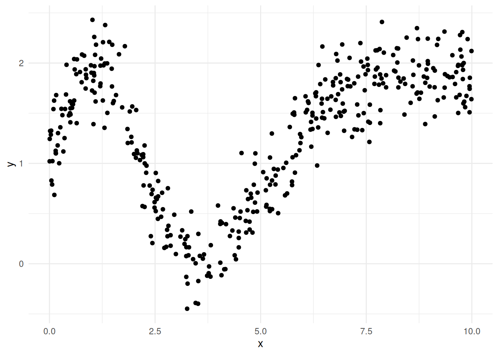
<p class="caption">(\#fig:toytree1)Scatterplot of toy dataset.</p>
</div>

A tree based method works by systematically splitting the data into
groups according to $x$, and then predicting the target using the means
within each group. The recursive partitioning of the data (i.e. the
division into groups) is displayed using a tree in Figure \@ref(fig:toytree2). From
the first branching of the tree (at its root) we see that the initial
step is to divide the data into two parts: those with $x < 6.013$ branch
to the left, and those with $x \ge 6.013$ branch to the right. The next
step is to further divide those group with $x < 6.013$ into sub-groups
with $x < 2.113$ and $x \ge 2.113$.

<div class="figure">
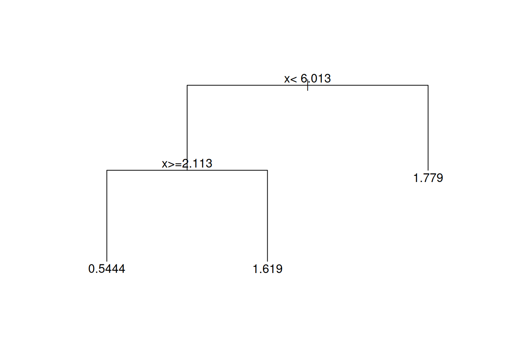
<p class="caption">(\#fig:toytree2)Regression tree for the toy dataset.</p>
</div>

In principle we could partition the data further (by creating splits in
the current groups), but for simplicity we will stop with the current
set of *leaves*. At each leaf the target is estimated by the mean value
of the y-variable for all data at that leaf. This means that the
predictions are constant across the range of x-values defining each
leaf. This is illustrated in Figure \@ref(fig:toytree3).

<div class="figure">
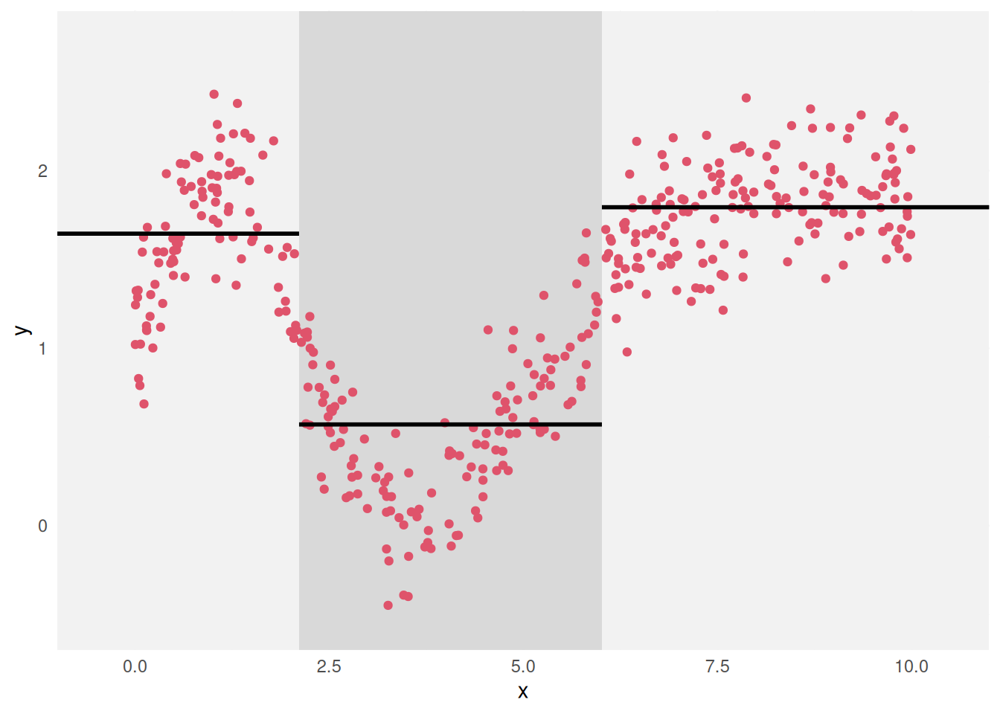
<p class="caption">(\#fig:toytree3)Scatterplot of the toy dataset, with the partitioning of the data indicated by the background shading and the predictions within each group plotted as the horizontal line segments.</p>
</div>
:::

### How to Grow a Tree

Before describing methodology for constructing a regression tree, we
need to define some terms. In mathematics, a tree is a type of
undirected graph. In the language of graph theory, the branches of the
trees are called *edges* or arcs, and the vertices are often referred to
as *nodes*. The trees that we use are *rooted* (with the root of the
tree conventionally plotted at the top of the tree) and are binary
(i.e. each vertex splits into two branches). Vertices at the tips of the
tree (i.e. those without further splits) are called leaves.

A regression tree is constructed by making a sequence of binary splits.
At each step of the algorithm, we need to examine each of the current
set of terminal nodes (i.e. leaves on the current tree) to see which
split will most improve the tree. Implicit in this statement is the need
for some measure of the quality of a tree, by which we can identify the
optimal split.

If we are thinking purely in terms of how well the tree fits the
training data, then a natural measure of quality for any given tree is
the residual sum of squares. This can be written as
$${\textsf {RSS}}_{train} = \sum_{i=1}^{n_{train}} \left ( y_{train,i} - \hat y_{train,i} \right )^2$$
where $\hat y_{train,i}$ is the tree-based prediction. Now the optimal
predictions (in terms of minimizing the squared error) are provided by
group means. In other words, if observation $i$ is assigned to leaf
$\ell$, then $\hat y_{i} = \bar y_{\ell}$ where $\bar y_{\ell}$ is the
mean of all data at that leaf (and where we have suppressed the
subscript $train$ to simplify the notation). It follows that the
residual sum of squares for a tree can be written in the form
$${\textsf {RSS}}= \sum_{\ell} \sum_{i \in C_{\ell}} \left ( y_{i} - \bar y_{\ell} \right )^2$$
where the set $C_{\ell}$ indexes the observation at leaf $\ell$.

::: {.example}
**A Very Simple Choice of Splits**

Suppose that we observed the following data:

::: {.center}
  ----- ----- ----- -----
  $x$     0.1   0.3   0.5
  $y$       2     3     7
  ----- ----- ----- -----
:::

It is clear that we need consider only two splits: (i) split the data
according to whether $x < 0.2$ or $x \ge 0.2$, or (ii) split the data
according to whether $x < 0.4$ or $x \ge 0.4$. The resulting trees are
displayed in Figure \@ref(fig:splits), where the values of the target variables are
shown for the observations at each vertex.

<div class="figure">
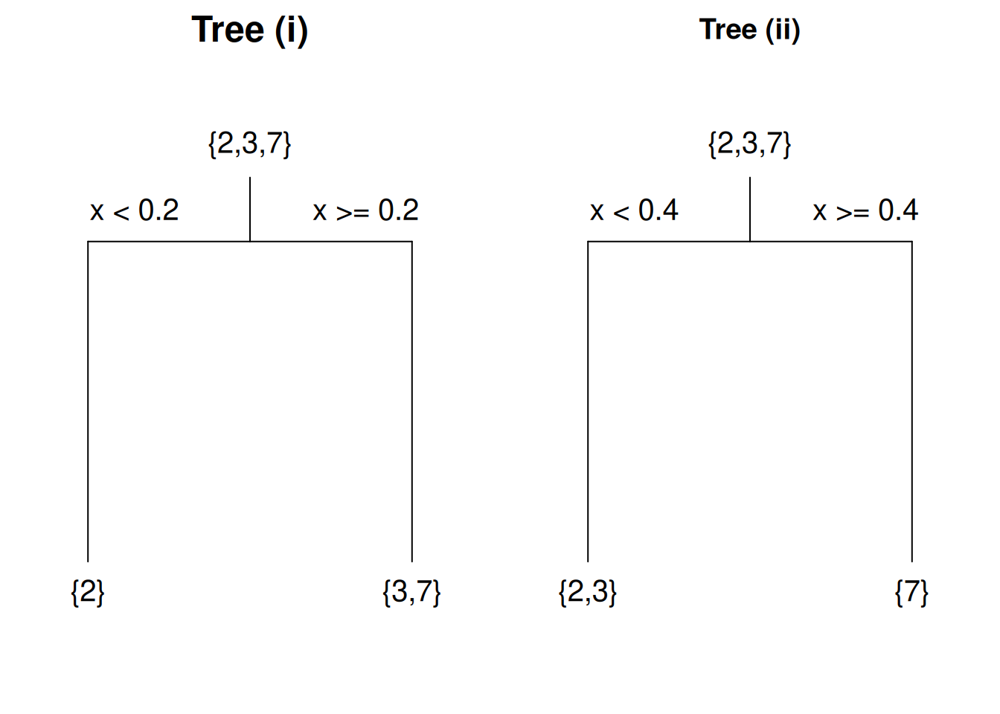
<p class="caption">(\#fig:splits)Trees constructed using two possible splits of a simple dataset.</p>
</div>

For tree (i) the mean for the left-hand leaf is $\bar{y}_1 = 2$ and the
right-hand leaf is $\bar{y}_2 = (3+7)/2 = 5$. Hence for tree (i) we have
$${\textsf {RSS}}= \left [ (2-2)^2 \right ] + \left [ (3-5)^2 + (7-5)^2 \right ] = 8.$$
Following similar calculations, for tree (ii) we have
$${\textsf {RSS}}= \left [ (2-2.5)^2 + (3-2.5)^2 \right ] + \left [ (7-7)^2 \right ] = 0.5.$$
We conclude that the second split is better.

Note that we would have got the same results using different splits; for
example, a split of $x < 0.11$ and $x \ge 0.11$ for tree (i). However,
it is conventional to split at the midpoint between the maximum of the
'low valued' branch and the minimum of the 'high valued' branch.
:::

So far we have dealt only with splits based on numerical predictors.
With factors (i.e. categorical predictors) we split by dividing the
factor levels into two sets, and then sending observations down left or
right branch according to this division. The separation of the levels is
again done so as to minimize the residual sum of squares.

If we restrict attention to trees of a certain size (i.e. with a maximum
number of splits), then the reader with a particularly well developed
sense of curiosity (or good mathematical intuition) might be tempted to
ask whether a sequence of splits chosen to minimize the residual sum of
squares at each step will produce the optimal tree (i.e. the one with
the lowest residual sum of squares overall). The answer is no. The kind
of step by step methodology that is employed in tree construction is
known as a 'greedy' algorithm. It is relatively computationally cheap to
perform, but is not guaranteed to generate the best of all trees. In
general that would require a sense of forward planning that is not
enabled in a greedy algorithm.

### Implementing Regression Trees in R

Regression trees can be constructed in R using the `rpart` function[^23].
This is part of the `rpart` library, which must be pre-loaded before the
functions therein can be used. The basic syntax for `rpart` mirrors that
for `lm`: for example,


``` r
rpart(y ~ x1 + x2, data=mydata)
```

will fit a regression tree with target variable `y` and predictors `x1`
and `x2`, with R searching first the data frame `mydata` when looking
for these variables.

::: {.example}
**Building a Regression Tree for the Wage Data**

Here we build a regression tree from the US wage training data, and then
use it to make predictions on the test set. The code below constructs
the tree, then summarises and plots it.


``` r
library(rpart)
wage.rp <- rpart(WAGE ~ . ,data=wage.train)
summary(wage.rp)
```

```
#> Call:
#> rpart(formula = WAGE ~ ., data = wage.train)
#>   n= 400 
#> 
#>            CP nsplit rel error    xerror      xstd
#> 1  0.17185785      0 1.0000000 1.0033163 0.1511414
#> 2  0.04854524      1 0.8281422 0.8402243 0.1236693
#> 3  0.03576135      2 0.7795969 0.8162939 0.1226450
#> 4  0.02396234      3 0.7438356 0.8256132 0.1529199
#> 5  0.02018117      4 0.7198732 0.8379863 0.1533427
#> 6  0.01628015      5 0.6996921 0.8609038 0.1553798
#> 7  0.01581756      6 0.6834119 0.8744208 0.1556766
#> 8  0.01442217      7 0.6675943 0.8704068 0.1556746
#> 9  0.01119671      9 0.6387500 0.8558673 0.1552453
#> 10 0.01000000     10 0.6275533 0.8638567 0.1555358
#> 
#> Variable importance
#>   OCCUP     EDU     EXP     AGE   UNION     SEX MARRIED 
#>      33      25      12      12      10       5       2 
#> 
#> Node number 1: 400 observations,    complexity param=0.1718578
#>   mean=8.930075, MSE=24.86239 
#>   left son=2 (280 obs) right son=3 (120 obs)
#>   Primary splits:
#>       OCCUP splits as  LRLRLL,   improve=0.17185780, (0 missing)
#>       EDU   < 13.5 to the left,  improve=0.13989640, (0 missing)
#>       AGE   < 26.5 to the left,  improve=0.06522658, (0 missing)
#>       SEX   splits as  LR,       improve=0.03670674, (0 missing)
#>       EXP   < 9.5  to the left,  improve=0.03420540, (0 missing)
#>   Surrogate splits:
#>       EDU < 14.5 to the left,  agree=0.833, adj=0.442, (0 split)
#> 
#> Node number 2: 280 observations,    complexity param=0.04854524
#>   mean=7.576857, MSE=12.58379 
#>   left son=4 (226 obs) right son=5 (54 obs)
#>   Primary splits:
#>       UNION  < 0.5  to the left,  improve=0.13701870, (0 missing)
#>       AGE    < 26.5 to the left,  improve=0.08093803, (0 missing)
#>       SEX    splits as  LR,       improve=0.07101318, (0 missing)
#>       EXP    < 8.5  to the left,  improve=0.07000718, (0 missing)
#>       SECTOR splits as  RRL,      improve=0.03933339, (0 missing)
#>   Surrogate splits:
#>       EXP < 45.5 to the left,  agree=0.811, adj=0.019, (0 split)
#> 
#> Node number 3: 120 observations,    complexity param=0.03576135
#>   mean=12.08758, MSE=39.26979 
#>   left son=6 (23 obs) right son=7 (97 obs)
#>   Primary splits:
#>       EDU    < 12.5 to the left,  improve=0.07547045, (0 missing)
#>       AGE    < 36.5 to the left,  improve=0.02870219, (0 missing)
#>       SECTOR splits as  LRL,      improve=0.02857539, (0 missing)
#>       SEX    splits as  LR,       improve=0.02630380, (0 missing)
#>       EXP    < 11.5 to the left,  improve=0.02292460, (0 missing)
#>   Surrogate splits:
#>       EXP < 33.5 to the right, agree=0.817, adj=0.043, (0 split)
#>       AGE < 21.5 to the left,  agree=0.817, adj=0.043, (0 split)
#> 
#> Node number 4: 226 observations,    complexity param=0.02018117
#>   mean=6.935, MSE=9.904874 
#>   left son=8 (54 obs) right son=9 (172 obs)
#>   Primary splits:
#>       AGE    < 25.5 to the left,  improve=0.08965858, (0 missing)
#>       EXP    < 8.5  to the left,  improve=0.07329911, (0 missing)
#>       EDU    < 13.5 to the left,  improve=0.06449993, (0 missing)
#>       SECTOR splits as  RRL,      improve=0.05416370, (0 missing)
#>       OCCUP  splits as  R-R-RL,   improve=0.04765219, (0 missing)
#>   Surrogate splits:
#>       EXP < 7.5  to the left,  agree=0.956, adj=0.815, (0 split)
#> 
#> Node number 5: 54 observations,    complexity param=0.01119671
#>   mean=10.26315, MSE=14.8552 
#>   left son=10 (12 obs) right son=11 (42 obs)
#>   Primary splits:
#>       SEX    splits as  LR,       improve=0.13881020, (0 missing)
#>       EDU    < 10.5 to the left,  improve=0.11655580, (0 missing)
#>       OCCUP  splits as  L-L-RR,   improve=0.05054403, (0 missing)
#>       EXP    < 40.5 to the right, improve=0.04604305, (0 missing)
#>       SECTOR splits as  RLR,      improve=0.04402349, (0 missing)
#>   Surrogate splits:
#>       OCCUP splits as  L-R-RR,   agree=0.833, adj=0.250, (0 split)
#>       EXP   < 42.5 to the right, agree=0.796, adj=0.083, (0 split)
#> 
#> Node number 6: 23 observations
#>   mean=8.552174, MSE=11.82924 
#> 
#> Node number 7: 97 observations,    complexity param=0.02396234
#>   mean=12.92588, MSE=42.10987 
#>   left son=14 (66 obs) right son=15 (31 obs)
#>   Primary splits:
#>       AGE    < 38.5 to the left,  improve=0.05834135, (0 missing)
#>       EXP    < 15.5 to the left,  improve=0.04795734, (0 missing)
#>       OCCUP  splits as  -R-L--,   improve=0.03518085, (0 missing)
#>       SECTOR splits as  LRL,      improve=0.02017132, (0 missing)
#>       UNION  < 0.5  to the right, improve=0.01365590, (0 missing)
#>   Surrogate splits:
#>       EXP    < 16.5 to the left,  agree=0.979, adj=0.935, (0 split)
#>       EDU    < 13.5 to the right, agree=0.701, adj=0.065, (0 split)
#>       SECTOR splits as  RLL,      agree=0.691, adj=0.032, (0 split)
#> 
#> Node number 8: 54 observations
#>   mean=5.253148, MSE=4.125855 
#> 
#> Node number 9: 172 observations,    complexity param=0.01628015
#>   mean=7.463023, MSE=10.55235 
#>   left son=18 (132 obs) right son=19 (40 obs)
#>   Primary splits:
#>       EDU    < 13.5 to the left,  improve=0.08920385, (0 missing)
#>       SECTOR splits as  RRL,      improve=0.06955595, (0 missing)
#>       OCCUP  splits as  R-R-RL,   improve=0.04830948, (0 missing)
#>       SEX    splits as  LR,       improve=0.04205271, (0 missing)
#>       RACE   splits as  LRR,      improve=0.02647224, (0 missing)
#>   Surrogate splits:
#>       EXP < 7.5  to the right, agree=0.814, adj=0.20, (0 split)
#>       AGE < 63.5 to the left,  agree=0.779, adj=0.05, (0 split)
#> 
#> Node number 10: 12 observations
#>   mean=7.576667, MSE=6.288422 
#> 
#> Node number 11: 42 observations
#>   mean=11.03071, MSE=14.65164 
#> 
#> Node number 14: 66 observations,    complexity param=0.01442217
#>   mean=11.85167, MSE=41.02728 
#>   left son=28 (42 obs) right son=29 (24 obs)
#>   Primary splits:
#>       MARRIED splits as  RL,       improve=0.040291440, (0 missing)
#>       EXP     < 5.5  to the right, improve=0.030118200, (0 missing)
#>       OCCUP   splits as  -R-L--,   improve=0.017535030, (0 missing)
#>       AGE     < 28.5 to the right, improve=0.010555670, (0 missing)
#>       UNION   < 0.5  to the right, improve=0.009285974, (0 missing)
#>   Surrogate splits:
#>       AGE  < 26.5 to the right, agree=0.697, adj=0.167, (0 split)
#>       EXP  < 5.5  to the right, agree=0.682, adj=0.125, (0 split)
#>       RACE splits as  LRL,      agree=0.667, adj=0.083, (0 split)
#> 
#> Node number 15: 31 observations,    complexity param=0.01581756
#>   mean=15.2129, MSE=36.7275 
#>   left son=30 (11 obs) right son=31 (20 obs)
#>   Primary splits:
#>       SEX   splits as  LR,       improve=0.13816220, (0 missing)
#>       AGE   < 41.5 to the right, improve=0.08685389, (0 missing)
#>       EXP   < 32.5 to the right, improve=0.05752757, (0 missing)
#>       OCCUP splits as  -R-L--,   improve=0.05612376, (0 missing)
#>       EDU   < 15.5 to the left,  improve=0.02790855, (0 missing)
#>   Surrogate splits:
#>       UNION < 0.5  to the right, agree=0.742, adj=0.273, (0 split)
#> 
#> Node number 18: 132 observations
#>   mean=6.928939, MSE=7.920723 
#> 
#> Node number 19: 40 observations
#>   mean=9.2255, MSE=15.18909 
#> 
#> Node number 28: 42 observations
#>   mean=10.87976, MSE=20.54322 
#> 
#> Node number 29: 24 observations,    complexity param=0.01442217
#>   mean=13.5525, MSE=72.32849 
#>   left son=58 (16 obs) right son=59 (8 obs)
#>   Primary splits:
#>       EXP   < 5.5  to the right, improve=0.102400000, (0 missing)
#>       AGE   < 29   to the right, improve=0.074819910, (0 missing)
#>       SEX   splits as  RL,       improve=0.056089480, (0 missing)
#>       OCCUP splits as  -R-L--,   improve=0.024575440, (0 missing)
#>       EDU   < 16.5 to the left,  improve=0.004440909, (0 missing)
#>   Surrogate splits:
#>       AGE < 27.5 to the right, agree=0.958, adj=0.875, (0 split)
#> 
#> Node number 30: 11 observations
#>   mean=12.17545, MSE=16.64208 
#> 
#> Node number 31: 20 observations
#>   mean=16.8835, MSE=39.90923 
#> 
#> Node number 58: 16 observations
#>   mean=11.62812, MSE=20.25744 
#> 
#> Node number 59: 8 observations
#>   mean=17.40125, MSE=154.2513
```

Some points to note:

-   We start by loading the `rpart` package.

-   The second command saves a regression tree as `wage.rp`. Note the
    use of the dot in the model formula, again standing for all
    variables in the dataset excluding the target.

-   The summary of `wage.rp` returns information on the formation of all
    splits. We have omitted much of the output (where indicated by the
    string of dots) to save space.

-   The table at the head of the summary for `wage.rp` provides
    information on the extent to which each new split (i.e. the creation
    of each new node) has improved the model. We will examine the
    meaning of the various quantities in this table later, in section \@ref{sec:treeprune}.

-   The remainder of the summary output describes each node in turn[^24].
    For each vertex we get an ordered list of the top few possible
    splits (the *primary splits*). These are specified by inequalities
    for continuous predictors, and by sequences of L's and R's for the
    levels of categorical predictors (indicating whether observations
    split down the left or right branch). The listed improvements are
    measured in terms of a the fractional reduction in the residual sum
    of squares for the data at the node in question (the *parent* node
    for the split). In more detail, suppose that $\hat y$ is the
    prediction for all data at the parent node, and that $\hat y_L$ and
    $\hat y_R$ are the predictions at the left and right 'child' nodes
    respectively. Then if we define
    ${\textsf {RSS}}_P = \sum_{i \in P} (y_i - \hat y)^2$ as the
    residual sum of squares at the parent, and
    ${\textsf {RSS}}_L = \sum_{i \in L} (y_i - \hat y_L)^2$ and
    ${\textsf {RSS}}_R = \sum_{i \in R} (y_i - \hat y_R)^2$ as the
    residuals sums of squares at left and right children, then the
    improvement is measured by
    $${\tt improve} = 1 - \frac{{\textsf {RSS}}_R + {\textsf {RSS}}_L}{{\textsf {RSS}}_P}.$$

    With these comments in mind, we see that the first node (at the root
    of the tree) was formed by splitting on the variable `OCCUP`.
    Observations at levels 1, 3, 5 and 6 (i.e. `Clerical`, `Other`,
    `Sales` and `Service`) are sent down the left-hand branch at
    the split; those at levels 2 and 4 (i.e. `Management` and `Professional`) are
    sent down the right-hand branch. Splitting in this way results in a
    17.2% reduction in the residual sum of squares. (The next best
    option would have been to split according to `EDU < 13.5`, which
    would have resulted in a 14% reduction in residual sum of squares.)

    The next split is at node 2, the left-hand child of the node. We can
    see that a total of 280 observations were sent to this node at the
    first split. The optimal split here is on `UNION<0.5` (i.e. whether
    or not the worker has union membership), giving a 13.7% reduction in
    residual sum of squares for observations at node 2.

    The leaves of the tree (i.e. the terminal nodes) are described by
    the number of observations, the mean response (i.e. prediction) and
    sum of squares at each one. For example, there is a leaf (node 30)
    with 11 observations and mean target value $12.18$.

We can plot the structure of the tree using


``` r
plot(wage.rp, compress=TRUE, margin=0.1)
text(wage.rp)
```

<div class="figure">
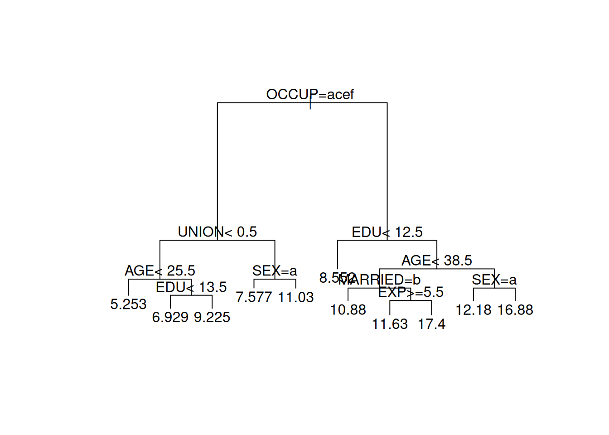
<p class="caption">(\#fig:wagetree)Regression tree for the US wage data.</p>
</div>

The command `plot(wage.rp)` plots just the structure of the
regression tree. We add text describing the splits by
`text(wage.rp`). The optional arguments `compress=TRUE` 
and `margin=0.1` in the plot
command tends to improve the appearance of the plotted tree.
Note that the splits based on factors use alphabetically ordered
letters to represent the factor levels (i.e. 'a' for level 1, 'b'
for level 2 and so forth).

We can obtain predictions from the fitted regression tree by applying
the `predict` command[^25].


``` r
wage.rp.pred <- wage.test |>
  bind_cols(.pred = predict(wage.rp, newdata=wage.test))
wage.rp.pred |> select(.pred, WAGE, everything())
```

```
#> # A tibble: 134 × 12
#>      .pred  WAGE   EDU SOUTH SEX     EXP UNION   AGE RACE  OCCUP  SECTOR MARRIED
#>      <dbl> <dbl> <dbl> <dbl> <chr> <dbl> <dbl> <dbl> <chr> <chr>  <chr>  <chr>  
#>  1  6.9289  3.75    11     0 M        11     0    28 White Other  Const… No     
#>  2  7.5767  8       12     0 F        43     1    61 Other Servi… Other  Yes    
#>  3  6.9289  6       13     1 M         7     0    26 White Other  Manuf… Yes    
#>  4 12.175  22.83    18     0 F        37     0    61 White Profe… Manuf… No     
#>  5 11.031   5.15    13     1 M         1     1    20 White Servi… Other  No     
#>  6 11.628   6.15    16     0 F        16     0    38 White Profe… Other  No     
#>  7  6.9289  3       12     1 F        28     0    46 White Cleri… Other  Yes    
#>  8 10.880   5       14     0 M         0     0    20 White Profe… Const… Yes    
#>  9 10.880   9.86    15     0 M        13     0    34 White Profe… Other  Yes    
#> 10 16.884   6.25    18     0 M        27     0    51 Other Profe… Other  Yes    
#> # ℹ 124 more rows
```

``` r
wage.rp.pred |>
  summarise(MSE = mean((.pred - WAGE)^2))
```

```
#> # A tibble: 1 × 1
#>      MSE
#>    <dbl>
#> 1 24.399
```


Here we have computed the mean squared error of prediction on the
artificial test data using the regression tree `wage.rp`. A comparison
with the linear regression models discussed earlier shows that the
regression tree predictions are a little worse (a mean squared error of
$24.4$ in comparison to $21.9$ for regression model `wage.lm`). This
could be because the relationship between the target and the important
predictor variables is close to linear, or because the of regression
tree model requires refining.

You may have noticed in the regression tree summary in the Example above
that *surrogate splits* are listed for some nodes. A surrogate split is
an alternative that approximates the (best) primary split. Surrogate
splits come into play when there are missing data. Specifically, if an
observation lacks data on the current split variable, then it will be
assigned to a branch by applying the surrogate splitting rule. For
instance, had any observation lacked information on `OCCUP`, then it
would instead have been assigned based on the surrogate split rule
`EDU < 14.5`. The use of surrogate splits allows regression trees to
make use of records that are partially complete. In comparison,
regression models cannot do so (unless one first imputes replacements
for the missing values).
:::

### Pruning{#sec:treeprune}

Construction of the regression tree for the wage data halted when there
were multiple observations at each leaf. In principle we can continue to
split the nodes in any regression tree until we eventually end up with a
tree with one observation at each leaf (assuming that each record has a
unique combination of values for its predictors). However, this would
produce a highly unreliable prediction model.

To understand why, think in terms of bias-variance trade-off. If we have
a regression tree with just a single observation at each leaf, then the
predictions will be highly variable (if unbiased). On the other hand, if
there are a good number of observations at each leaf then the averaging
process will result in a far smaller variance for the prediction. The
price to pay will be increased bias. In more detail, the predictable
mean of the target (i.e. $f_0$ from equation \@ref(eq:pred-decompose))
will typically vary according to the
predictors. The regression tree models this as constant within each
leaf, so that the greater the range of predictor values the worse the
approximation.

Consider, for example, the regression tree for the toy example in
Section \@ref(sec:introtree). The tree in Figure \@ref(fig:toytree2)
gives rise to the prediction model depicted in Figure \@ref(fig:toytree3).
Clearly the horizontal line segments give only a crude approximation to
the trend in the data. Were we to divide the x-axis into much small
intervals, we could more closely track the trend in the target variable
(and hence reduce the bias). However, if we took this to an extreme, and
make the intervals so short that each contained just a few data points,
then the predictions would be hugely variable. See Figure \@ref(fig:treebiasvariance).

<div class="figure">
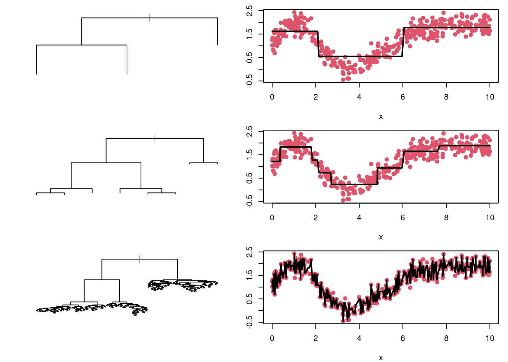
<p class="caption">(\#fig:treebiasvariance)Regression trees for the toy dataset with different numbers of splits. The predicted values, plotted as horizontal black lines, are connected to make it easier to follow their trend as a function of $x$. The top tree is very simple, and produces predictions with low variance but high bias. The bottom tree is highly complex, and produces predictions with high variance but low bias. The middle tree seems to produce a reasonable bias-variance trade-off.</p>
</div>

An alternative way of thinking about the bias-variance trade off is in
terms of the balance between model complexity and model fit. Model
complexity can be measured in terms of the number of vertices in the
tree, while model fit can be measured by the residual sum of squares of
the fitted tree. The top tree in Figure \@ref(fig:treebiasvariance) is
a simple model (low complexity), with a fairly poor fit to the data.
The bottom tree in Figure \@ref(fig:treebiasvariance) follows the training data extremely
closely (i.e. has a very low residual sum of squares), but is highly
complex -- far more complex than seems warranted. The middle tree
provides a balance in terms of model complexity and model fit.

The concept of model complexity motivates a methodology for determining
the level of pruning regression trees. Specifically, we introduce the
complexity parameter $cp$, which specifies the minimum improvement in
model fit that warrants inclusion of a new split (and the additional
complexity that this implies). This means that if at any stage of the
tree growing we encounter a situation where no split produces an
improvement of at least $cp$, then the tree is complete[^26]. The measure
of improvement is once again the relative improvement in residual sum of
squares. The default value of $cp$ is $0.01$, but this can be changed by
specifying the `cp` argument of `rpart`.

::: {.example}
**Regression Trees of Different Complexities for the Wage Data**

The regression tree for the wage training data displayed earlier in
Figure \@ref(fig:wagetree)
was constructed using the default value of the complexity parameter
$cp = 0.01$. We here build trees using $cp=0.1$ and $cp=0.001$, and use
them for prediction on the wage test data. The resulting trees are
plotted in Figure \@ref(fig:wagetree2).


``` r
wage.rp.1 <- rpart(WAGE ~ ., data=wage.train, cp=0.1)
wage.rp.2 <- rpart(WAGE ~ ., data=wage.train, cp=0.001)
```

<div class="figure">
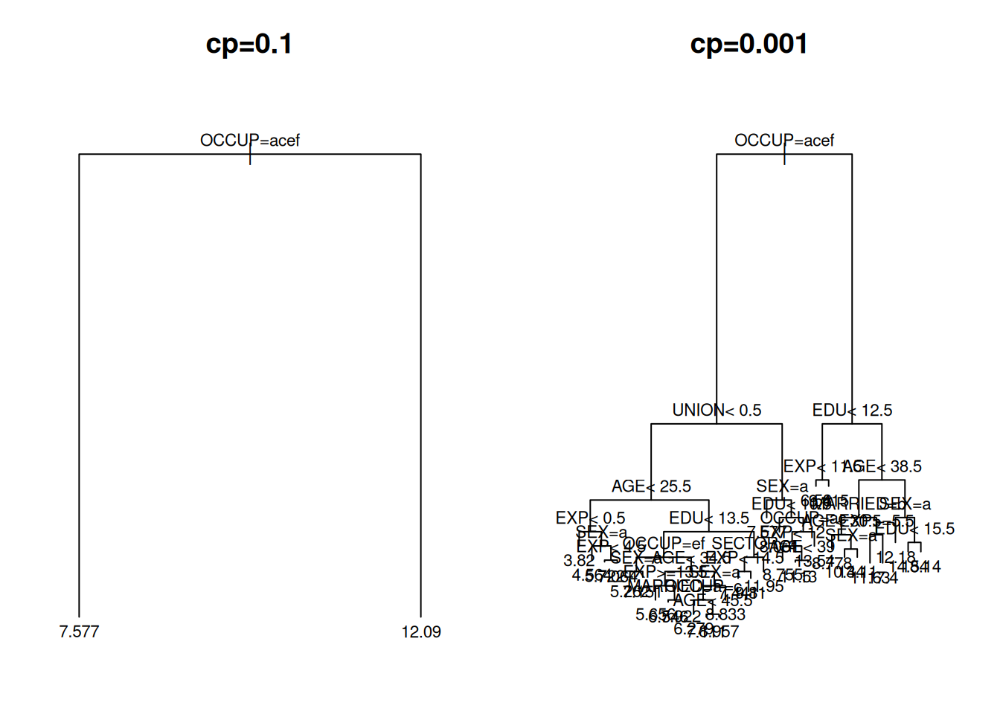
<p class="caption">(\#fig:wagetree2)Regression trees for the US wage data with complexity parameters $cp=0.1$ (left-hand panel) and $cp=0.001$ right-hand panel) respectively.</p>
</div>

The main points to take away are first, that the choice of $cp=0.1$ leads
to a hugely simple tree
(with just a single split) while $cp=0.001$ generates a much more
complex tree.

We can also compute mean square error on the test data.


``` r
wage.rp.pred.2 <- wage.test |>
  bind_cols(
    .pred1 = predict(wage.rp.1, newdata=wage.test),
    .pred2 = predict(wage.rp.2, newdata=wage.test)
  )
wage.rp.pred.2 |>
  summarise(MSE.1 = mean((.pred1 - WAGE)^2),
            MSE.2 = mean((.pred2 - WAGE)^2))
```

```
#> # A tibble: 1 × 2
#>    MSE.1  MSE.2
#>    <dbl>  <dbl>
#> 1 26.349 22.650
```


The second point of interest is that the mean squared
error of prediction for the second tree is much lower than the first.
Indeed, the mean squared error of $\textsf{MSE}= 22.6$ is noticeably
lower than that using the default value of $cp=0.01$.
:::

### Validation and Cross-Validation{#sec:validation}

The default value of $cp=0.01$ for the complexity parameter feels quite
reasonable, at an intuitive level, but it is only a rule-of-thumb.
Moreover, as we saw in the previous Example, we can often get better
prediction results using alternative values of $cp$. This raises the
question as to how we might try and determine a better value of $cp$ for
prediction. Of course, if we have a test set including values for the
target, then we could simply use the value of $cp$ that leads to minimal
predictive error. While in practice the regression tree will be applied
to real test data where the target is unobserved (hence the need for
prediction!), we might nevertheless try and replicate this approach to
selection of $cp$ using the data that we do have.

We could take all the data for which we have target values, and divide
them into training and *validation* datasets. The training data would be
used for growing trees in the usual manner, but performance for any
given value of $cp$ would be assessed by predictive accuracy on the
validation dataset[^27]. A potential shortcoming of this approach is the
dependence on the particular choice of validation dataset (in essence, a
lack of symmetry in the way in which we handle each record), and the
reduction in size of the training dataset. We could address the latter
issue by splitting the data in proportions 90% to 10% for training and
validation sets respectively, but there remains the problem that the
particular 10% of observations in the latter set may be unusual.

We can deal with this by using *cross-validation*. The idea is that we
split the data into ten blocks of equal size, with each block in turn
being set aside as the validation data. Starting with the first block as
the validation set, we train the regression tree on the remaining 90% of
the data and calculate the prediction error for various values of $cp$.
We then set aside the second block as the validation set, and compute
the prediction error for models trained on the other 90%, and so on.
Eventually we will have ten sets of prediction errors, which can be
averaged to give a cross-validation estimate of prediction error for
each value of $cp$ that we employed.

Before we illustrate the use of cross-validation for tree selection on
the wage data, a number of general points about cross-validation warrant
attention.

-   The 90% to 10% data split just described gives rise to so-called
    *10-fold cross-validation*. While this is common choice, it is by no
    means the only one. For models that are highly computationally
    expensive we might prefer 5-fold cross-validation (i.e. a split of
    80% to 20% between validation and training sets at each step).

-   Cross-validation results are subject to noise arising from the
    random split into the cross-validation blocks. We can avoid this by
    splitting the data into $n$ parts, with $n-1$ records in the
    training set and just one in the validation set at each step. This
    is known as *leave-one-out cross validation*. It can be very time
    consuming to implement.

-   The general idea of cross-validation is used far more widely in
    Statistics than just for regression trees.

::: {.example}
**Cross-Validation Regression Tree Selection for the Wage Data**

A table of model characteristics for different values of $cp$ can be
obtained using the command `printcp`. (This in fact mirrors the first
part of the output that we obtain when using the `summary` function of a
regression tree.) The argument for `printcp` is the most complex model
to be assessed (i.e. the one corresponding to the smallest value of
$cp$).


``` r
printcp(wage.rp.2)
```

```
#> 
#> Regression tree:
#> rpart(formula = WAGE ~ ., data = wage.train, cp = 0.001)
#> 
#> Variables actually used in tree construction:
#> [1] AGE     EDU     EXP     MARRIED OCCUP   SECTOR  SEX     UNION  
#> 
#> Root node error: 9945/400 = 24.862
#> 
#> n= 400 
#> 
#>           CP nsplit rel error  xerror    xstd
#> 1  0.1718578      0   1.00000 1.00634 0.15211
#> 2  0.0485452      1   0.82814 0.84062 0.12540
#> 3  0.0357614      2   0.77960 0.81574 0.12535
#> 4  0.0239623      3   0.74384 0.80052 0.12384
#> 5  0.0201812      4   0.71987 0.86921 0.15412
#> 6  0.0162802      5   0.69969 0.87747 0.15446
#> 7  0.0158176      6   0.68341 0.87389 0.15427
#> 8  0.0144222      7   0.66759 0.86985 0.15411
#> 9  0.0111967      9   0.63875 0.87675 0.15401
#> 10 0.0086679     10   0.62755 0.88142 0.15514
#> 11 0.0083654     11   0.61889 0.87124 0.15476
#> 12 0.0074470     12   0.61052 0.88156 0.15524
#> 13 0.0069457     13   0.60307 0.87837 0.15518
#> 14 0.0059255     14   0.59613 0.86830 0.15443
#> 15 0.0051826     15   0.59020 0.88544 0.15490
#> 16 0.0048281     16   0.58502 0.88212 0.15502
#> 17 0.0042593     18   0.57536 0.87946 0.15504
#> 18 0.0039354     19   0.57110 0.89074 0.15530
#> 19 0.0035496     20   0.56717 0.88993 0.15533
#> 20 0.0032478     21   0.56362 0.89380 0.15530
#> 21 0.0027961     22   0.56037 0.89116 0.15502
#> 22 0.0022777     23   0.55757 0.88619 0.15479
#> 23 0.0019702     25   0.55302 0.88848 0.15473
#> 24 0.0015765     26   0.55105 0.88889 0.15477
#> 25 0.0012715     28   0.54790 0.89082 0.15472
#> 26 0.0010866     29   0.54662 0.89188 0.15479
#> 27 0.0010344     30   0.54554 0.88985 0.15480
#> 28 0.0010000     31   0.54450 0.88998 0.15480
```

The `xerror` column in the output table contains cross-validation
estimates of the (relative) prediction error. The `xstd` is the standard
error (i.e. an estimate of the uncertainty) for these cross-validation
estimates. What we see is that the minimum cross-validation error occurs
when $cp=0.2396$. (Note that any tree grown with $cp$ between this value
of the next in the table, $cp=0.2018$ will produce the same tree.)
However, the differences between the values of `xerror` are quite small
compared to the entries in `xstd`, indicating that the cross-validation
results do not provide a strong preference for any tree with between 1
and 31 vertices.

Finally, we compute the mean squared prediction error on the test data,
using an optimal cross-validation value of the complexity parameter of
$cp=0.023$.


``` r
wage.rp.3 <- rpart(WAGE ~ ., data=wage.train, cp=0.023)
wage.rp.pred.3 <- wage.test |> bind_cols(.pred = predict(wage.rp.3, newdata=wage.test))
wage.rp.pred.3 |> summarise(MSE = mean((.pred - WAGE)^2))
```

```
#> # A tibble: 1 × 1
#>      MSE
#>    <dbl>
#> 1 23.312
```


The prediction error of $\textsf{MSE}=23.3$ is a bit better than that
obtained using the default value of $cp$, but is less good than we
obtained with $cp=0.001$. This simply reflects the fact that
cross-validation results are subject to error, and so are by no means
certain to identify the best model.
:::

### Tree instability {#sec:treeinstability}

Unfortunately, decision tree models are known to be **unstable**. When many variables are available, there are often many potential competing splits that serve to improve the model fit by around the same amount. However, the choice of which split to use can then result in very different subtrees.

One way to see this is to produce a tree for a data set and then take a bootstrap resample by randomly re-selecting the same number of observations from the data frame with replacement and producing another tree. Ideally the trees should not differ much as the data come from the same underlying population (we have simply resampled the original data).

However, as we will see, often the trees can be markedly different.

::: {.example}
**Unstable trees for the WAGE data**

Consider the following code snippet that produces a bootstrap resample of the `wage-train` data:


``` r
set.seed(5)
wage.train.bs <- slice_sample(wage.train, n=400, replace=TRUE)
```

This dataset has the same (or very similar) relationships between `WAGE` and the other numeric variables, as we can see in Figure \@ref(fig:wageresample).

<div class="figure">

<p class="caption">(\#fig:wageresample)Relationships between `WAGE` and the numeric variables from the  `wage.train` and `wage.train.bs` datasets.</p>
</div>

The same holds for the categorical predictors. Thus, we might expect that trees produced using the `wage.train` or `wage.train.bs` data sets should be similar. The tree from `wage.train.bs` is shown in Figure \@ref(fig:wageunstable).

<div class="figure">

<p class="caption">(\#fig:wageunstable)Tree produced from the `wage.train.bs` bootstrap resampled dataset.</p>
</div>

Comparing this to the tree in Figure \@ref(fig:wagetree) we see that it is quite different, with even the first split differing. The variables `SEX` and `MARRIED` are used in the tree for `wage.train`, yet both these variables are unused in the `wage.train.bs` tree. Similarly, the variable `UNION` is used in the `wage.train.bs` tree but not in the `wage.train` tree.
:::

## Random forests{#sec:randomforest}

A forest is a collection of trees. A random forest is a collection of decision trees (e.g. regression trees) generated by applying two separate randomisation processes:

1. The data (rows) are randomised through a bootstrap resample.
2. A random selection of predictors (columns) are utilised for each split, rather than using all variables.

Once done, a tree is fit to the data. The process is then repeated, and many trees are generated. Predictions are then averaged across all the trees in the forest.

The forest then benefits from the instability of the trees: Each bootstrap resample is likely to generate a different tree as tree building is a brittle process. This is further enhanced by considering only a subset of the available predictor variables for each split in the tree. Essentially the forest is ensuring that all parts of the data available to us are explored by fitting many purposefully different trees. By averaging across many different trees the forest is generally able to do better than any particular tree - particularly when forward predicting on new data.

Random forests are examples of **ensemble methods** which combine prediction across multiple different models to give a better prediction than just one of the models could provide.

The key mechanism underlying random forests is *bagging* (bootstrap
aggregating): each tree is trained on a different bootstrap resample of
the training data, and predictions are averaged across all trees.
Because each bootstrap sample produces a somewhat different tree (recall
the instability demonstrated in Section \@ref(sec:treeinstability)), the
average of many such trees is considerably more stable than any single
tree. Random forests add one further step -- random predictor subsets at
each split -- which makes the individual trees less correlated with each
other and thereby improves the benefit of averaging (the formal
variance-reduction argument is given in Section \@ref(sec:ensemble)).
Other ensemble strategies, including boosting and stacking, are also
covered in that chapter.

There are two key parameters when fitting a random forest that can potentially be tuned:

1. The number of predictor variables to consider for each split. This can be important for tuning model fit. Often using fewer predictor variables for each split can work well to ensure the trees differ.
2. The tree depth. Typically the trees are not pruned, as we don't mind if the individual trees over-fit as we'll be averaging out any over-fitting. The depth of the tree is generally controlled by restricting splits to nodes with some minimum number of observations.

### Implementation in R

There are a number of different packages in R that can fit random forests. For example:

- `randomForest()` from the `randomForest` package
- `ranger()` from the `ranger` package
- `ml_random_forest()` from the `sparklyr` package

For practical work, `ranger()` is a good modern default: it is fast,
widely used, and fits naturally into the `tidymodels` workflow that we
develop in Chapter 5. The older `randomForest()` package remains useful
to know about because you will still encounter it in older code and
examples.

::: {.example}
**Random forest for the WAGE data**

A random forest model is fit to the WAGE data with default arguments as follows, and prediction
on the test set is performed:


``` r
library(ranger)
set.seed(1945)
wage.rf.1 <- ranger(WAGE ~ ., data = wage.train, num.trees = 500)
wage.rf.1.pred <- wage.test |>
  bind_cols(.pred = predict(wage.rf.1, data = wage.test)$predictions)
wage.rf.1.pred |>
  summarise(MSE = mean((.pred - WAGE)^2))
```

```
#> # A tibble: 1 × 1
#>      MSE
#>    <dbl>
#> 1 21.369
```

Some notes:

 -  As the forest utilises randomisation, we set the random seed so we can reproduce these results.

 -  The forest performs reasonably well without additional tuning, which
    is one reason random forests are so popular in practice.

 -  The argument `num.trees = 500` asks for 500 trees in the forest,
    which is a common default choice.

We can tune the model by altering the `mtry` parameter, which selects
the number of predictors to consider for each split in the tree. Another
possible tuning parameter governs the depth of the tree, given in
`ranger` by `min.node.size`. Smaller values allow deeper trees.


``` r
wage.rf.2 <- ranger(WAGE ~ ., data = wage.train, num.trees = 500,
                    mtry = 2)
wage.rf.3 <- ranger(WAGE ~ ., data = wage.train, num.trees = 500,
                    mtry = 2, min.node.size = 1)
wage.rf.pred <- wage.test |>
                  bind_cols(
                    .pred2 = predict(wage.rf.2, data = wage.test)$predictions,
                    .pred3 = predict(wage.rf.3, data = wage.test)$predictions
                  )
wage.rf.pred |>
  summarise(MSE.2 = mean((.pred2 - WAGE)^2),
            MSE.3 = mean((.pred3 - WAGE)^2))
```

```
#> # A tibble: 1 × 2
#>    MSE.2  MSE.3
#>    <dbl>  <dbl>
#> 1 21.372 21.756
```

 -  The `wage.rf.2` forest is fit with `mtry=2`, so that just 2 predictors (chosen at random) will be considered for each split.
 
 -  The `wage.rf.3` forest additionally sets `min.node.size=1` so that
    the trees will be grown more deeply.

 -  We bind the predictions from both forests as separate columns `.pred2` and `.pred3` to the `wage.test` data, so that we can then use `summarise()` to compute the mean square error of each.
 
 -  In this example, the original forest performs better.

 -  For a more systematic version of this tuning process, using
    cross-validation rather than a single validation split, see
    Chapter 5.
:::

## Neural Networks{#sec:neuralnet}

### An Introduction to Neural Networks

An artificial neural network (often abbreviated to just 'neural
network') is a type of prediction model based on a crude representation
of a human brain. The model comprises a highly interconnected network of
'neurons' (the nodes of the network) which 'fire' and hence produce an
output only if the level of input is sufficiently high.

<div class="figure">
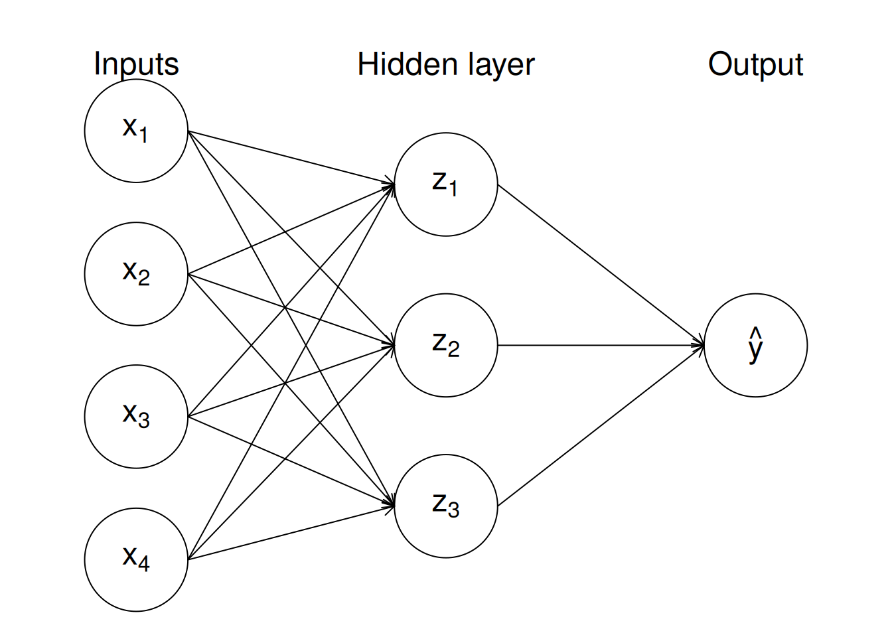
<p class="caption">(\#fig:nnetdiag)Diagram of a simple artificial neural network.</p>
</div>

An artificial (feed-forward) neural network consists of an ordered
sequence of layers of neurons, as illustrated in Figure \@ref(fig:nnetdiag). Each
node in one layer is connected to all nodes in the previous layer,
through which it receives information, and to all nodes in the next
layer, to which it sends information. The first layer (working from the
left, with the network arrayed as in the Figure) comprises the input
nodes, where predictor information is fed into the network. Next follow
a number of hidden layers, and finally there is an output node[^28]. In
principle a neural network can be many hidden layers, with each
additional layer adding to the flexibility, complexity and computational
cost of the model. In practice neural networks with just a single hidden
layer are often preferred. We shall focus on neural networks of this
type henceforth.

### Building a Neural Network

To implement a neural network we must (i) decide on the number, $M$, of
nodes in the hidden layer; (ii) devise functions to relate the *derived
features* $z_1, \ldots, z_M$ (i.e. the values in the hidden layer) to
the input variables; and (iii) choose a function to describe the
predicted target $\hat y$ in terms of $z_1, \ldots, z_M$. Now, neural
networks are rather complex things (we are definitely entering the
territory of 'black box' prediction models here), and there is little by
way of theory to help with these choices. In particular, selection of
the number of hidden nodes is something of an art. Nevertheless, for
prediction problems we will not need more hidden nodes than the number
of predictors $p$, where we think of factors in terms of their dummy
variable representation[^29]. Using $\lceil p/2 \rceil$ hidden nodes is
often a reasonable place to start, though some further exploration is
often useful[^30].

The function that relates the derived features to the inputs
(i.e. predictors) is called the *activation function*, which we shall
denote by $\phi$. It operates on a linear combination of the predictors,
so that $z_k = \phi(v_k)$ where
\begin{equation}
v_k = \alpha_{0k} + \alpha_{1k} x_1 + \cdots + \alpha_{pk} x_p
(\#eq:hiddenfeature)
\end{equation}
for $k=1,\ldots,M$. The usual choice of
$\phi$ is the sigmoid function $$\phi(v) = \frac{1}{1 + e^{-v}}$$ which
is plotted in Figure \@ref(fig:activation).

<div class="figure">
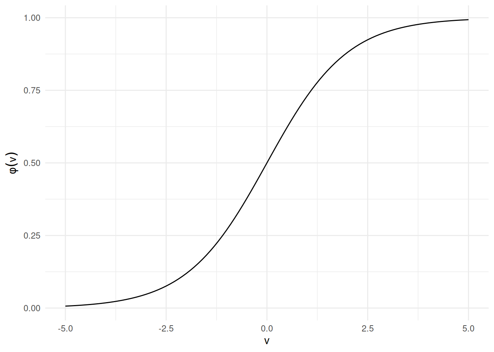
<p class="caption">(\#fig:activation)A sigmoid activation function.</p>
</div>

The predicted target $\hat y$ is then derived as a linear combination of
the hidden features:
\begin{equation}
\hat y = \beta_0 + \beta_1 z_1 + \cdots + \beta_M z_M.
(\#eq:nnetoutput)
\end{equation}

The parameters $\alpha_{01}, \alpha_{11}, \ldots, \beta_{M}$ of the
neural network are often referred to as *weights*. They must be
estimated by fitting the model to training data. We seek to select the
weights that minimize the residual sum of squares for predictions from
the neural network, but this process is not straightforward because of
the complexity of the model (and in particular, the sheer number of
parameters that need to be estimated). In practice neural networks are
fitted using a so-called 'back propagation algorithm'.

### Prediction Using Neural Networks in R

The R function for fitting a neural network is `nnet`. This is part of
the `nnet` package which must be pre-loaded. The syntax to fit a neural
network (of the type described above) is of the form


``` r
nnet(y ~ x1 + x2 + x3 + x4, data=mydata, size=2, linout=TRUE)
```

The specification of the model formula and data frame is familiar, but
there are two other arguments that require attention. The `size`
argument specifies the number of nodes in the hidden layer. It has no
default value. The argument `linout` is logical, and indicates whether
the relationship between the prediction (output $\hat y$) and the
derived features is linear (as in Equation \@ref(eq:nnetoutput)) or not.
The default setting for this
argument is `FALSE`, whereupon the right-hand side of Equation \@ref(eq:nnetoutput)
is transformed so that $\hat y$ is forced to
lie in the interval $[0,1]$. This default setting turns out to be
appropriate for classification problems (when we are trying to estimate
probabilities of class membership) but for prediction problems we must
set `linout=TRUE`.

In addition to the essential arguments just discussed, `nnet` has a
number of important optional arguments that control the operation of the
model fitting algorithm. The `decay` argument deserves particular
attention. It controls the weight updating rate in the back propagation
algorithm, and can have quite a significant impact on the results. The
default value is zero, but setting `decay` to a value such as $0.01$ or
$0.001$ is often a better choice.

The model fitting algorithm used by `nnet` requires initial values to be
set for the weights. By default, the algorithm selects the starting
value for each weight randomly on the interval $[-0.5,0.5]$. It turns
out that the final values of the weights can be quite dependent upon the
choice of initial values, and as a consequence you may find that the
fitted neural network (and hence predictions) can vary, even when one is
running precisely the same code. This variation can be suppressed by
setting the random number seed with the `set.seed()` command, but the
fact remains that fitting neural networks using `nnet` is a more
uncertain and difficult business than fitting either linear regression
or regression tree models.

Once we have a fitted neural network model, the `predict` command can be
applied to obtain predictions in the usual way.

::: {.example}
**Neural Network Prediction for the Wage Data**

We apply neural networks, built on the wage training data, to predict
wages in the test dataset. In determining the number of hidden nodes to
select initially, we note that the data frame has 5 numerical
predictors, namely `EDU`, `SOUTH`, `EXP`, `UNION`, and `AGE`; and 5
factors, namely `SEX` (with 2 levels), `RACE` (3 levels\", `OCCUP` (6
levels), `SECTOR` (3 levels) and `MARRIAGE` (2 levels). This gives an
equivalent number of numerical predictors of
$p = 5 + 1 + 2 + 5 + 2 + 1 = 16$, and hence suggests that we start by
trying $p/2 = 8$ nodes in the hidden layer.


``` r
library(nnet)
set.seed(1069)
wage.nn.1 <- nnet(WAGE ~ .,size=8, data=wage.train, linout=TRUE)
```

```
#> # weights:  145
#> initial  value 35238.295276 
#> iter  10 value 9797.535740
#> iter  20 value 9281.078015
#> iter  30 value 8407.104646
#> iter  40 value 7137.560954
#> iter  50 value 6409.347535
#> iter  60 value 6055.671851
#> iter  70 value 5653.071563
#> iter  80 value 5458.217813
#> iter  90 value 5339.338424
#> iter 100 value 5294.441153
#> final  value 5294.441153 
#> stopped after 100 iterations
```

Notice that this network stopped training after 100 iterations, the default.

We should increase the number of iterations to ensure convergence. We'll also
try varying the `decay` and `size` parameters:


``` r
set.seed(1069)
wage.nn.1 <- nnet(WAGE ~ .,size=8, data=wage.train, linout=TRUE, maxit=250)
```

```
#> # weights:  145
#> initial  value 35238.295276 
#> iter  10 value 9797.535740
#> iter  20 value 9281.078015
#> iter  30 value 8407.104646
#> iter  40 value 7137.560954
#> iter  50 value 6409.347535
#> iter  60 value 6055.671851
#> iter  70 value 5653.071563
#> iter  80 value 5458.217813
#> iter  90 value 5339.338424
#> iter 100 value 5294.441153
#> iter 110 value 5277.264786
#> iter 120 value 5259.477058
#> iter 130 value 5221.375520
#> iter 140 value 5213.262776
#> iter 150 value 5204.729204
#> iter 160 value 5186.140067
#> iter 170 value 5181.490169
#> iter 180 value 5180.836426
#> iter 190 value 5180.713899
#> iter 200 value 5180.681210
#> iter 210 value 5180.664533
#> iter 220 value 5180.656824
#> iter 230 value 5180.649072
#> final  value 5180.648896 
#> converged
```

``` r
set.seed(1069)
wage.nn.2 <- nnet(WAGE ~ .,size=8, data=wage.train, linout=TRUE, maxit=1000, decay=0.01)
```

```
#> # weights:  145
#> initial  value 35238.563668 
#> iter  10 value 9791.548415
#> iter  20 value 8939.685765
#> iter  30 value 7877.035081
#> iter  40 value 6878.376122
#> iter  50 value 6481.117353
#> iter  60 value 6207.284772
#> iter  70 value 5888.370643
#> iter  80 value 5679.460865
#> iter  90 value 5587.558053
#> iter 100 value 5562.770888
#> iter 110 value 5549.232998
#> iter 120 value 5534.746892
#> iter 130 value 5377.320342
#> iter 140 value 4956.878840
#> iter 150 value 4748.302776
#> iter 160 value 4666.816050
#> iter 170 value 4641.362805
#> iter 180 value 4522.339012
#> iter 190 value 4249.076658
#> iter 200 value 4148.421313
#> iter 210 value 4141.294333
#> iter 220 value 4128.342428
#> iter 230 value 4113.462752
#> iter 240 value 4088.338712
#> iter 250 value 4036.092349
#> iter 260 value 3885.738552
#> iter 270 value 3665.268656
#> iter 280 value 3599.800099
#> iter 290 value 3598.014247
#> iter 300 value 3587.143227
#> iter 310 value 3579.255264
#> iter 320 value 3558.760159
#> iter 330 value 3544.988341
#> iter 340 value 3537.662068
#> iter 350 value 3526.169481
#> iter 360 value 3511.864771
#> iter 370 value 3490.326282
#> iter 380 value 3471.140803
#> iter 390 value 3467.922148
#> iter 400 value 3463.300108
#> iter 410 value 3459.851024
#> iter 420 value 3458.404360
#> iter 430 value 3458.068068
#> iter 440 value 3457.741192
#> iter 450 value 3457.539546
#> iter 460 value 3457.523272
#> iter 470 value 3457.490380
#> iter 480 value 3457.378970
#> iter 490 value 3456.983406
#> iter 500 value 3456.783995
#> iter 510 value 3456.677792
#> iter 520 value 3456.545741
#> iter 530 value 3456.508321
#> iter 540 value 3456.497985
#> iter 550 value 3456.495455
#> iter 560 value 3456.493827
#> final  value 3456.493751 
#> converged
```

``` r
set.seed(1069)
wage.nn.3 <- nnet(WAGE ~ .,size=5, data=wage.train, linout=TRUE, maxit=250)
```

```
#> # weights:  91
#> initial  value 35078.872453 
#> iter  10 value 9898.773133
#> iter  20 value 9639.053885
#> iter  30 value 9144.093441
#> iter  40 value 7826.027699
#> iter  50 value 7280.906397
#> iter  60 value 7014.257397
#> iter  70 value 6633.590521
#> iter  80 value 6445.393572
#> iter  90 value 6204.602833
#> iter 100 value 6060.848795
#> iter 110 value 6010.770063
#> iter 120 value 5868.244858
#> iter 130 value 5771.944799
#> iter 140 value 5702.256407
#> iter 150 value 5664.424728
#> iter 160 value 5642.921250
#> iter 170 value 5618.526653
#> iter 180 value 5613.555296
#> iter 190 value 5613.229284
#> final  value 5613.219380 
#> converged
```

``` r
set.seed(1069)
wage.nn.4 <- nnet(WAGE ~ .,size=5, data=wage.train, linout=TRUE, maxit=1000, decay=0.01)
```

```
#> # weights:  91
#> initial  value 35079.059683 
#> iter  10 value 9899.087090
#> iter  20 value 9696.645570
#> iter  30 value 8506.433897
#> iter  40 value 7929.135956
#> iter  50 value 7076.357762
#> iter  60 value 6759.033520
#> iter  70 value 6585.682663
#> iter  80 value 6527.502204
#> iter  90 value 6514.004580
#> iter 100 value 6486.715687
#> iter 110 value 6422.863823
#> iter 120 value 6413.359669
#> iter 130 value 6404.914846
#> iter 140 value 6391.157083
#> iter 150 value 6366.201123
#> iter 160 value 6361.773124
#> iter 170 value 6315.485887
#> iter 180 value 6183.450268
#> iter 190 value 6057.247575
#> iter 200 value 6045.648792
#> iter 210 value 6018.709366
#> iter 220 value 5833.713519
#> iter 230 value 5240.280659
#> iter 240 value 4877.286607
#> iter 250 value 4634.578901
#> iter 260 value 4533.734798
#> iter 270 value 4486.430186
#> iter 280 value 4470.048547
#> iter 290 value 4443.323159
#> iter 300 value 4418.315674
#> iter 310 value 4408.905750
#> iter 320 value 4378.615462
#> iter 330 value 4331.182426
#> iter 340 value 4281.052058
#> iter 350 value 4231.356086
#> iter 360 value 4190.805869
#> iter 370 value 4172.890858
#> iter 380 value 4165.957930
#> iter 390 value 4161.924512
#> iter 400 value 4159.483437
#> iter 410 value 4158.166529
#> iter 420 value 4157.733398
#> iter 430 value 4157.658218
#> iter 440 value 4157.581357
#> iter 450 value 4157.535733
#> iter 460 value 4157.531644
#> final  value 4157.529530 
#> converged
```

``` r
wage.nn.pred <- wage.test |> bind_cols(
  nn.1 = predict(wage.nn.1, newdata=wage.test),
  nn.2 = predict(wage.nn.2, newdata=wage.test),
  nn.3 = predict(wage.nn.3, newdata=wage.test),
  nn.4 = predict(wage.nn.4, newdata=wage.test)
)
wage.nn.pred |>
  pivot_longer(starts_with("nn."), names_to = "model", values_to=".pred") |>
  group_by(model) |>
  summarise(MSE = mean((.pred - WAGE)^2))
```

```
#> # A tibble: 4 × 2
#>   model    MSE
#>   <chr>  <dbl>
#> 1 nn.1  24.423
#> 2 nn.2  32.163
#> 3 nn.3  21.948
#> 4 nn.4  29.739
```


Some points to note:

-   We reinitialize the random number generator before fitting each
    model so as to improve comparability between models of the same
    size.

-   We combine the predictions by creating multiple columns named `nn.1` through `nn.4`.

-   We compute the MSE for all four models at once by pivoting the four prediction columns
    longer, so we can group by and summarise to compute the MSE at once.

-   The first model has 8 hidden nodes. Given that there are $p+1$
    weights to estimate per hidden node (the number of $\alpha$
    parameters in Equation \@ref(eq:hiddenfeature), and 8+1 parameters to estimate for
    the output nodes (the number of $\beta$ parameters in Equation \@ref(eq:nnetoutput)
     the model hence has
    $17\times 8 + 9 = 145$ weights to be determined. The mean prediction
    error for this model on the artificial test set is
    $\textsf{MSE}= 24.4$.

-   In the second model we try specifying 0.01 for the `decay` argument. As a result
    we notice a much better training RSS (the final value of iteration output), but
    a significantly worse prediction on the independent test set of $\textsf{MSE}= 32.2$.
    This is due to **overfitting**. We have so many degrees of freedom that we've
    coerced the neural network into fitting the training data too well - with new
    observations that are just a bit different, we get the predictions badly wrong.
    We can see this when we look at the prediction on the training data, which are
    significantly lower for `wage.nn.2`:
    
    
    ``` r
    wage.nn.pred.train <- wage.train |> bind_cols(
      nn.1 = predict(wage.nn.1, newdata=wage.train),
      nn.2 = predict(wage.nn.2, newdata=wage.train),
      nn.3 = predict(wage.nn.3, newdata=wage.train),
      nn.4 = predict(wage.nn.4, newdata=wage.train)
    )
    wage.nn.pred.train |>
      pivot_longer(starts_with("nn."), names_to = "model", values_to=".pred") |>
      group_by(model) |>
      summarise(MSE = mean((.pred - WAGE)^2))
    ```
    
    ```
    #> # A tibble: 4 × 2
    #>   model     MSE
    #>   <chr>   <dbl>
    #> 1 nn.1  12.952 
    #> 2 nn.2   8.3982
    #> 3 nn.3  14.033 
    #> 4 nn.4  10.217
    ```

-   The third and fourth models differ from the first and second only in that we
    reduce the number of hidden nodes to 5, thus reducing the number of weights
    to 91. As a result, the prediction errors for the neural nets are $21.9$ for
    the default value of `decay` and $29.7$ for decay 0.01.
:::

## Summary of Prediction Methods

There are a number of steps involved in statistical prediction. The
first is to choose a methodology. At one extreme are linear regression
models, with powerful supporting theory but limited flexibility. We may
expect linear regression models to perform well in cases where the
relationships between variables are almost linear, but to struggle when
this is clearly not the case. At the other extreme are neural networks,
which can handle more or less any kind of relationships between
variables, but are so complicated that model fitting and assessment can
be an uncertain business.

Having selected a methodology, we are faced with the problems of model
fitting and model selection. In general, the more theory that we have
available on a type of model, the more straightforward model fitting
will be, and the more options we will have for model selection. Model
fitting is implemented using training data, and is usually done with the
aim of minimizing the residual sum of squares. With regard to model
selection, in linear regression this is a matter of deciding which
variables should be in the model, while for regression trees we must
choose the number of splits in the tree. When we lack theory (or it is
too complex to implement), we can employ generic approaches like the use
of validation datasets for model comparison, or cross-validation
techniques.

We might assess the accuracy of our prediction model. This can be done
using an artificial test dataset, which should be independent of
training and validation sets (so as to avoid bias due to unfair 'home
advantage'). The rich theory for linear regression models allows us to
assess prediction accuracy (e.g. through prediction intervals) without
the need for a test dataset, but the results are reliable only when
model assumptions hold.

Once we have selected what we think is a good prediction model (e.g. a
neural network with 6 nodes in the hidden layer and some given value of
the decay parameter) we are in a position to do 'real world' prediction
on test cases where the target is truly missing. As mentioned in Section
\@ref(sec:predictionbasics), we should refit our preferred model
on all the training data before applying it to the real test dataset.

::: {.example}
**Time for a Final Example on Prediction**

We have covered a lot of detail on various techniques for prediction.
With such detail comes the danger that you might lose sight of the big
picture. To try and help, this Example tries to put everything together
in an easy to follow 'toy' application.

Imagine that you are advising the owner of a shop selling antique clocks
on pricing. For each clock data is available on two predictor variables,
as follows:

  ------------- ---------------------------------------------------
  `Age`         age of clock, in years
  `Condition`   factor on three levels, `good`, `average`, `poor`
  ------------- ---------------------------------------------------

The shop has recently sold 50 clocks. For these clocks the sale price is
available, in addition to the predictor variables. The information on
these 50 clocks forms the training data. The shop has another 20 clocks
in stock, awaiting sale. These form the test data.

We must use the training data to create some rule relating the target
variable `Price` (sale price, in dollars) to the predictor variables.
Whatever methodology we employ to construct this rule (be it linear
regression, or neural networks, or whatever) will result in a function
$f$ that forms a prediction
$$\widehat {\tt Price} = f({\tt Age}, {\tt Condition})$$ for any given
values of the predictor variables. We then apply this rule to the unsold
clocks (the test data), so that in each case we get a predicted price.

Suppose for simplicity that we just consider two methods of prediction:
linear regression, and regression trees. The R code below creates
prediction rules using each of these methodologies, assesses their
efficacy on a validation set, and then applies the better of them to
make predictions on the test data.

We start by just looking at a print out of some of the data.


``` r
clock.train <- read_csv("../data/clock-train.csv")
clock.test <- read_csv("../data/clock-test.csv")
clock.train |> slice_head(n=4)
```

```
#> # A tibble: 4 × 3
#>     Age Condition Price
#>   <dbl> <chr>     <dbl>
#> 1    67 Average     220
#> 2   161 Average     630
#> 3    96 Poor        200
#> 4    63 Average     230
```

``` r
clock.test |> slice_head(n=4)
```

```
#> # A tibble: 4 × 2
#>     Age Condition
#>   <dbl> <chr>    
#> 1    70 Good     
#> 2    89 Good     
#> 3    63 Poor     
#> 4   127 Poor
```

Notice (of course) that the training data includes the sale price,
whereas the (real) test data does not (which is why we're trying to
predict it!)

Next, we divide the training data into a new training set and a
validation (i.e. artificial test) set. The `rsample` package has the
useful function `initial_split` for this:


``` r
library(rsample)
set.seed(442)
split = initial_split(clock.train, prop = 0.8)
clock.train.new <- training(split)
clock.validation <- testing(split)
```

The object `split` contains information on how the split has been performed.
We have specified `prop=0.8` to retain 80% of the data for training, and
20% of the data for the validation set. This is somewhat arbitrary, though
this sort of 80/20 or 75/25 split is common. We extract the new training
data and validation data using the `training`
and `testing` functions. Note the use of the `set.seed` command to
initialize the random number generator, so that we can later recreate
this precise example if we wish.

We now use the new training data to build linear regression and
regression tree prediction models. We then assess their predictive
accuracy on the validation set.


``` r
library(rpart)
clock.lm <- lm(Price ~ Age + Condition, data=clock.train.new)
clock.rp <- rpart(Price ~ Age + Condition, data=clock.train.new, cp=0.001)
clock.pred <- clock.validation |>
  bind_cols(
    pred.lm = predict(clock.lm, newdata=clock.validation),
    pred.rp = predict(clock.rp, newdata=clock.validation)
  )
clock.pred
```

```
#> # A tibble: 10 × 5
#>      Age Condition Price pred.lm pred.rp
#>    <dbl> <chr>     <dbl>   <dbl>   <dbl>
#>  1   161 Average     630  626.75  655   
#>  2   145 Poor        410  414.26  655   
#>  3    64 Average     220  159.02  361.25
#>  4   143 Average     490  539.96  655   
#>  5   140 Average     480  525.49  655   
#>  6   149 Poor        380  433.55  655   
#>  7   165 Good       1040  908.30  655   
#>  8    98 Poor        190  187.63  236.43
#>  9   118 Average     350  419.41  361.25
#> 10   143 Average     480  539.96  655
```

``` r
clock.pred |> summarise(MSE.lm = mean((pred.lm - Price)^2),
                         MSE.rp = mean((pred.rp - Price)^2))
```

```
#> # A tibble: 1 × 2
#>   MSE.lm MSE.rp
#>    <dbl>  <dbl>
#> 1 3694.2 39521.
```

The `clock.pred` dataset combines the true sales prices from the validation
set with the predictions using the linear model and
regression tree, just for the purposes of illustrating the performance
of the two methods in this example. As is confirmed by the final mean
squared error values, the linear model appears the much better model for
prediction in this case.

It is natural to use a linear model to predict the sale prices on the
real test data (since it has far lower prediction MSE on the validation
data). However, before we do so, it makes sense to refit the linear
model to the original training data. The point is that the split into
new training data and validation has served its purpose (i.e. to decide
whether regression trees or linear regression is preferable in this
case). We should now be able to get a slightly better linear regression
model if we fit it using all 50 training cases, rather than just the 40
that were retained in the reduced training set.


``` r
clock.lm.final <- lm(Price ~ Age + Condition, data=clock.train)
clock.pred.test <- clock.test |>
  bind_cols(PredPrice = predict(clock.lm.final, newdata=clock.test))
clock.pred.test
```

```
#> # A tibble: 20 × 3
#>      Age Condition PredPrice
#>    <dbl> <chr>         <dbl>
#>  1    70 Good        467.14 
#>  2    89 Good        557.33 
#>  3    63 Poor         20.243
#>  4   127 Poor        324.03 
#>  5   145 Poor        409.47 
#>  6    87 Poor        134.16 
#>  7    87 Good        547.83 
#>  8    91 Average     282.74 
#>  9   180 Poor        575.61 
#> 10   171 Poor        532.89 
#> 11   148 Average     553.31 
#> 12   140 Good        799.41 
#> 13   172 Good        951.30 
#> 14   136 Good        780.42 
#> 15    86 Average     259.01 
#> 16    95 Good        585.81 
#> 17    85 Good        538.34 
#> 18   122 Average     429.89 
#> 19    97 Average     311.22 
#> 20   153 Average     577.04
```

The final command displays the predictions on the test cases alongside
the predictor variables.

We close this Example by noting that this analysis is simpler than one
would follow in practice. There was no attempt to tune the methods, for
instance by examining the effects of including additional terms in the
linear model (say a quadratic term in `Age`) or adjusting the complexity
parameter in the regression tree. We also did not consider neural
networks.
:::

The previous example has illustrated how one would perform prediction in
a real problem (and provides a guide for attempting a real world prediction
problem like you might do in an assignment). The rest of the examples in
this chapter dealt with the artificial setting in which we knew the
values of the target variable for the test cases, since one of the
purposes of those examples is to learn more about the comparative
performance of various prediction methods.

Looking ahead, Chapter 5 revisits this material using `recipes`,
`workflows`, resampling, and tuning, so that the same prediction ideas
can be used in a more reproducible modelling pipeline.

[^1]: The *predictand* is the variable whose value one is trying to
    predict. The predictors are those variables that are used to
    generate the prediction.

[^2]: The sauropods are a class (more precisely, and 'infraorder') of
    'lizard hipped' dinosaurs with small heads, long necks and tails,
    and thick legs. Brachiosaurus, Diplodocus, and Apatosaurus are well
    known examples.

[^3]: There are many alternative methods of prediction available, but
    the three just listed are the ones that we will focus upon.

[^4]: At Massey, a detailed, intermediate level coverage of linear
    regression is provided in the paper 161.251 Regression Modelling

[^5]: A linear regression model with two or more predictors is often
    referred to as a multiple linear regression model.

[^6]: The notation $N(\mu,\sigma^2)$ refers to a normal distribution
    with mean $\mu$ and variance $\sigma^2$.

[^7]: It actually turns out that one of the indicator variables for each
    factor is redundant, since we must have a 'baseline' against which
    other factor levels are measured. Knowledge of the details are not
    required for this paper.

[^8]: However, note that the $p$ in the equation will no longer
    correspond to the original number of predictors if some of these
    were factors that require coding in terms of multiple binary
    variables.

[^9]: The function name `lm` standard for *linear model*, of which
    linear regression models are one example. See the paper 161.251 for
    further details.

[^10]: See paper 161.251 for details.

[^11]: Note that if the data frame `my.test.predictors` also contains
    values for the target variable (or any other variables) these will
    be ignored for the purposes of computing the predictions

[^12]: We may assume without loss of generality that the error is
    centred at zero, so that $f_0 = {\textsf E}[y_0]$ is the mean value
    of the target.

[^13]: You will not be expected to reproduce the decomposition of MSE in
    an exam, but you should be able to state the result and understand
    its consequences.

[^14]: The estimand is the thing we are trying to estimate.

[^15]: Other related methods of variable selection are covered in
    161.251

[^16]: The `step` function can implement other algorithms for variable
    selection, but these are beyond the scope of this paper

[^21]: There is some elegant mathematical theory to demonstrate that
    linear regression models fitted using the method of least squares
    are optimal (in some natural senses) when the underlying assumptions
    are valid.

[^22]: Regression trees go under a variety of different names. You may
    them referred to under the more general acronym CART (classification
    and regression trees), and they may also be described recursive
    partitioning methods (for reasons that will soon become clear).

[^23]: The function name `rpart` is an abbreviation of *recursive
    partitioning*.

[^24]: Note that the node numbers increase as we move down the tree, but
    that the numbers are not consecutive (there are gaps in the
    numbering sequence.

[^25]: This is an example of R's clever generic syntax. The `predict`
    command interprets the type of object to which it is applied, and
    then computes predictions in the appropriate manner.

[^26]: This is a pruned tree, in the sense that it is much smaller than
    the tree that would be obtained were we to split until all leaves
    contain just a single observation.

[^27]: If you are wondering about the difference between a validation
    data and an artificial test dataset with target values, it is in
    their usage. Validation datasets are used for model selection; for
    example, to choose the best size of regression tree. Artificial test
    datasets with target values are used to estimate prediction errors.
    The prediction errors observed on the validation dataset will not be
    unbiased, because (by definition) they will be smallest for the
    selected model. Use of an independent test dataset means that we can
    assess that component of prediction error that arises from
    uncertainty in model selection.

[^28]: Neural networks can also be used to predict multidimensional
    targets, when the output layer will comprise multiple nodes.

[^29]: Recall that if we have a factor with $K$ levels, then it can be
    represented by $K-1$ dummy variables (the $K$th being a redundant
    'baseline' case). As a consequence, if we had a model with 3
    numerical predictors and one factor on 4 levels, then there would be
    $p = 3+ (4-1) = 6$ effective predictors for the purposes of
    determining $p$

[^30]: The mathematical notation $\lceil x \rceil$ denotes the *ceiling*
    of the value $x$, which is the smallest integer at least as large as
    $x$. Hence $\lceil 1.13 \rceil = 2$, for example

