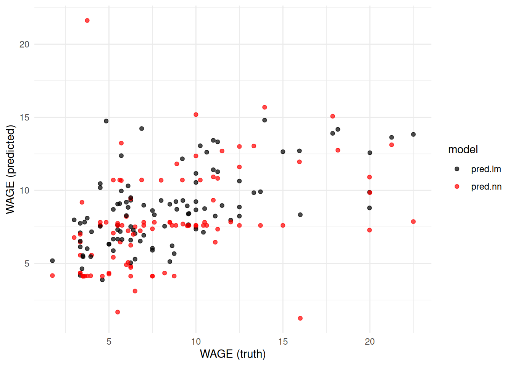

# Tidy modelling


The [prediction chapter](#prediction) has shown us how to fit and assess the performance
of the [linear model](#sec:regress), [regression trees](#sec:regtree), [random forests](#sec:randomforest) and [neural networks](#sec:neuralnet).

In each case both the model fitting and obtaining predictions was consistent:

- We use a formula syntax to specify the model and provide the training data.
- We use the `predict` command on the resulting model object, providing testing data.

This works well as long as all our models follow this same syntax. Unfortunately,
many models require different syntaxes for one or both of these steps.

In addition, there are often other things that we may want to do, such as
processing the data beforehand (e.g. to scale predictors to a common scale or impute
missing values). Any data transformation we perform on the training set will
need to be replicated on the test set. Further, the tools we've used for
summarising model performance (computing MSE via `dplyr::summarise()`) are metric-specific,
and it would be nice to be able to easily switch to other metrics, or to compute
many metrics at once (e.g. the mean absolute error, or root mean squared error).

The `tidymodels` set of packages is designed for modelling in a consistent and tidy
fashion. The idea is that it abstracts the specific syntaxes for
fitting different models and provides a common interface that generally works across
a wide range of model types. It also has packages for data processing and model
evaluation, among other things.

We will begin with the core pieces of the framework and then extend them
to a more complete workflow using `workflows`, resampling, and simple
tuning.

The packages we'll be focusing on in this chapter are:

- `rsample` for resampling.
- `recipes` for data processing.
- `parsnip` for model fitting.
- `workflows` for bundling preprocessing and a model together.
- `tune` for resampling-based evaluation and tuning.
- `yardstick` for measuring model performance.

The [tidymodels website](https://tidymodels.org) has a number of excellent tutorials and an overview of some of the additional packages available (e.g. `tune`, `workshop`).

**How this chapter connects.** Sections \@ref(sec:predictionbasics) and
\@ref(sec:roc) introduced the main supervised-learning methods. This
chapter turns those ideas into a reusable workflow: split the data,
preprocess them, fit a model, evaluate it honestly, then tune and
finalise it. The preprocessing stage also connects back to
Section \@ref(sec:missing), because missing-value handling belongs in
the same pipeline rather than being treated as a mysterious side quest.

## Splitting and resampling data

The `rsample` package is used for resample data sets. A dataset resample is where the dataset is split in two in some way. This may be via *bootstrapping*, sampling the same number of rows from a data set with replacement, or by randomly dividing the rows into two sets, creating training and validation or artificial test sets. In either case the rows of the data are in one of two sets: Either in the 'analysis' or 'training' set, or the 'assessment', 'testing' or 'validation' sets[^bootstraprows].

This process may be repeated multiple times, producing multiple pairs of analysis and assessment sets. In the case of bootstrapping, the analysis sets could be used to compute a resampling distribution of some summary statistic such as the sample mean[^bootstrapresample]. In the case of a data split, it might be for cross-validation. Collections of resamples like this can be managed using the `rsample` package.

The main functionality that we'll be using is to split a data set into training set and validation sets using the `initial_split()` function, so that we can compare model performance to select the best model for the dataset at hand. We can then use that best model, retrained on all the data to build a final model for predicting the outcome on a separate testing dataset where the outcome is unknown.

::: {.example #wagesplit}
**Splitting the US Wage data**

We can split the US wage data into a new training and artificial test/validation set using the `initial_split()` function.


``` r
library(rsample)
set.seed(1945)
wage.orig <- read_csv("../data/wage-train.csv") |> rowid_to_column()
split <- initial_split(wage.orig, prop = 0.75)
split
```

```
#> <Training/Testing/Total>
#> <300/100/400>
```

``` r
wage.new.train <- training(split)
wage.validation <- testing(split)
wage.new.train |> slice_head(n=4)
```

```
#> # A tibble: 4 × 12
#>   rowid   EDU SOUTH SEX     EXP UNION  WAGE   AGE RACE  OCCUP     SECTOR MARRIED
#>   <int> <dbl> <dbl> <chr> <dbl> <dbl> <dbl> <dbl> <chr> <chr>     <chr>  <chr>  
#> 1    59    12     0 M        16     1 13.26    34 White Other     Other  Yes    
#> 2   132    12     0 F        42     0  3.64    60 White Manageme… Other  Yes    
#> 3   333    13     1 M        17     0  8.06    36 White Professi… Other  Yes    
#> 4   262     8     0 F        29     0  3.4     43 Other Service   Other  Yes
```

``` r
wage.validation |> slice_head(n=4)
```

```
#> # A tibble: 4 × 12
#>   rowid   EDU SOUTH SEX     EXP UNION  WAGE   AGE RACE  OCCUP SECTOR     MARRIED
#>   <int> <dbl> <dbl> <chr> <dbl> <dbl> <dbl> <dbl> <chr> <chr> <chr>      <chr>  
#> 1     7     8     1 M        27     0  6.5     41 White Other Other      Yes    
#> 2     8     9     1 M        30     1  6.25    45 White Other Other      No     
#> 3    11    12     0 F        16     1  5.71    34 White Other Manufactu… Yes    
#> 4    12     7     0 M        42     1  7       55 Other Other Manufactu… Yes
```

 -  For demonstration purposes, we add row identifiers to the original data set using `rowid_to_column()`.
 
 -  We supply the proportion that we wish to remain in the training/analysis portion of the data to
    `initial_split()`. The default is 0.75 which is a good rule of thumb.

 -  The object returned by `initial_split` is of type `rsplit`, holding details of the data split
    (the underlying dataset and the rows to be assigned to either set).

 -  The `training()` and `testing()` functions then extract the relevant dataset from the split.
 
 -  Looking at the first few rows of each shows how the rows have been randomly assigned to each data set.
:::

## Data processing with recipes

Often the data that we have to work with needs processing prior to applying models. This may be due to data quality issues (e.g. we may have to impute missing values or remove columns or rows that are very incomplete) or may be to ensure the data is in the form for a particular model (e.g. neural networks require numeric variables to be reasonably small and on similar scales to avoid computational issues, and other models require factor variables to be converted to numeric via indicator variables).

In the case of transforming variables via scaling, such as normalising a numeric measure to have mean zero and variance one, we need to ensure that the transformation is identical across the training and testing datasets. We can't normalise variables across the two sets separately, as the datasets are likely to have at least slightly different means and variances.

The `recipes` package takes care of these details, providing a set of instructions (a `recipe`) for taking our raw data (ingredients) and preparing a data set ready for modelling.

If we need imputation, this is also where it should happen. For
example, Section \@ref(sec:missing) discussed replacing missing values
using summaries or nearby observations. In a modern modelling workflow,
those choices should be encoded as recipe steps so that they are learned
from the training data and then applied in exactly the same way to new
data.

::: {.example #wagerecipe}
**A recipe for scaling the US Wage data**

Suppose we wish to prepare the new training and validation sets from example \@ref(exm:wagesplit) for use in a neural network model, so wish to normalise the numeric variables to the same scale (mean 0, variance 1)[^normalwage]. We do this by constructing a `recipe` for this data, specifying the formula and dataset we plan to use for modelling which defines outcome variable and predictors:


``` r
library(recipes)
wage.recipe <- recipe(WAGE ~ ., data=wage.new.train)
wage.recipe
```

Our next step is to remove the `rowid` variable as not being useful for modelling and to normalise the numeric variables except those that are binary indicators (`UNION` and `SOUTH`):


``` r
wage.recipe.norm <- wage.recipe |>
  step_rm(rowid) |>
  step_normalize(all_numeric_predictors(), -UNION, -SOUTH)
wage.recipe.norm
#> 
#> ── Recipe ──────────────────────────────────────────────────────────────────────
#> 
#> ── Inputs
#> Number of variables by role
#> outcome:    1
#> predictor: 11
#> 
#> ── Operations
#> • Variables removed: rowid
#> • Centering and scaling for: all_numeric_predictors(), -UNION, -SOUTH
```

We then prep (train) this recipe with the training set:


``` r
wage.recipe.trained <- wage.recipe.norm |> prep(wage.new.train)
wage.recipe.trained
#> 
#> ── Recipe ──────────────────────────────────────────────────────────────────────
#> 
#> ── Inputs
#> Number of variables by role
#> outcome:    1
#> predictor: 11
#> 
#> ── Training information
#> Training data contained 300 data points and no incomplete rows.
#> 
#> ── Operations
#> • Variables removed: rowid | Trained
#> • Centering and scaling for: EDU, EXP, AGE | Trained
```

Finally, we `bake` our recipe into the final datasets:


``` r
wage.train.baked <- wage.recipe.trained |> bake(wage.new.train)
wage.valid.baked <- wage.recipe.trained |> bake(wage.validation)
```

This has resulted in datasets where our numeric variables have been centered and scaled to have mean zero and standard deviation one:


``` r
skimr::skim(wage.train.baked)
```

```
#> ── Data Summary ────────────────────────
#>                            Values          
#> Name                       wage.train.baked
#> Number of rows             300             
#> Number of columns          11              
#> _______________________                    
#> Column type frequency:                     
#>   factor                   5               
#>   numeric                  6               
#> ________________________                   
#> Group variables            None            
#> 
#> ── Variable type: factor ───────────────────────────────────────────────────────
#>   skim_variable n_missing complete_rate ordered n_unique
#> 1 SEX                   0             1 FALSE          2
#> 2 RACE                  0             1 FALSE          3
#> 3 OCCUP                 0             1 FALSE          6
#> 4 SECTOR                0             1 FALSE          3
#> 5 MARRIED               0             1 FALSE          2
#>   top_counts                        
#> 1 M: 163, F: 137                    
#> 2 Whi: 244, Oth: 40, His: 16        
#> 3 Oth: 79, Pro: 66, Cle: 59, Ser: 50
#> 4 Oth: 238, Man: 49, Con: 13        
#> 5 Yes: 195, No: 105                 
#> 
#> ── Variable type: numeric ──────────────────────────────────────────────────────
#>   skim_variable n_missing complete_rate       mean      sd      p0      p25
#> 1 EDU                   0             1 9.0362e-17 1       -2.4861 -0.50040
#> 2 SOUTH                 0             1 2.7333e- 1 0.44642  0       0      
#> 3 EXP                   0             1 1.4767e-16 1       -1.4393 -0.74953
#> 4 UNION                 0             1 1.7667e- 1 0.38202  0       0      
#> 5 AGE                   0             1 2.0102e-16 1       -1.6121 -0.73595
#> 6 WAGE                  0             1 9.0937e+ 0 5.1498   2.01    5.25   
#>        p50      p75    p100 hist 
#> 1 -0.50040  1.0882   1.8825 ▁▁▇▂▅
#> 2  0        1        1      ▇▁▁▁▃
#> 3 -0.23222  0.62998  2.6992 ▇▇▃▂▂
#> 4  0        0        1      ▇▁▁▁▂
#> 5 -0.17433  0.63441  2.5215 ▆▇▅▂▂
#> 6  8       11.68    44.5    ▇▃▁▁▁
```
Note that the baked validation set will not have mean zero and standard deviation one, as it was normalised using the same transformation as used for the training set (i.e. subtract the mean and divide by the standard deviation from the training set). Nonetheless they should be expected to be close to zero and one:


``` r
skimr::skim(wage.valid.baked)
```

```
#> ── Data Summary ────────────────────────
#>                            Values          
#> Name                       wage.valid.baked
#> Number of rows             100             
#> Number of columns          11              
#> _______________________                    
#> Column type frequency:                     
#>   factor                   5               
#>   numeric                  6               
#> ________________________                   
#> Group variables            None            
#> 
#> ── Variable type: factor ───────────────────────────────────────────────────────
#>   skim_variable n_missing complete_rate ordered n_unique
#> 1 SEX                   0             1 FALSE          2
#> 2 RACE                  0             1 FALSE          3
#> 3 OCCUP                 0             1 FALSE          6
#> 4 SECTOR                0             1 FALSE          3
#> 5 MARRIED               0             1 FALSE          2
#>   top_counts                        
#> 1 M: 52, F: 48                      
#> 2 Whi: 81, Oth: 14, His: 5          
#> 3 Oth: 33, Cle: 17, Man: 15, Ser: 13
#> 4 Oth: 80, Man: 16, Con: 4          
#> 5 Yes: 64, No: 36                   
#> 
#> ── Variable type: numeric ──────────────────────────────────────────────────────
#>   skim_variable n_missing complete_rate      mean      sd      p0      p25
#> 1 EDU                   0             1 -0.21446  0.93791 -2.8833 -0.50040
#> 2 SOUTH                 0             1  0.37     0.48524  0       0      
#> 3 EXP                   0             1  0.11525  1.0890  -1.4393 -0.68487
#> 4 UNION                 0             1  0.21     0.40936  0       0      
#> 5 AGE                   0             1  0.072786 1.0627  -1.6121 -0.71349
#> 6 WAGE                  0             1  8.4391   4.4758   1.75    5.4375 
#>         p50      p75    p100 hist 
#> 1 -0.50040   0.29389  1.8825 ▁▁▇▂▂
#> 2  0         1        1      ▇▁▁▁▅
#> 3 -0.14600   0.91019  2.4406 ▇▇▃▃▃
#> 4  0         0        1      ▇▁▁▁▂
#> 5 -0.084468  0.81413  2.5215 ▆▇▅▃▃
#> 6  7.25     10.448   22.5    ▇▇▃▁▁
```

Typically the above process will be done without many of the intermediate objects[^baking]:


``` r
wage.recipe <- recipe(WAGE ~ ., data=wage.new.train) |>
  step_rm(rowid) |>
  step_normalize(all_numeric_predictors(), -UNION, -SOUTH)
wage.prepped <- wage.recipe |> prep(wage.new.train)
wage.train.baked <- bake(wage.prepped, wage.new.train)
wage.valid.baked <- bake(wage.prepped, wage.validation)
```
:::

## Modelling with parsnip

We have seen throughout the [prediction chapter](#prediction) that each prediction model has its own functions available for fitting the model and predicting new observations given a model.

In the case of linear models via `lm`, regression trees via `rpart`, random forests via `randomForest`and neural networks via `nnet` both the construction of models and prediction from those models follow essentially identical syntaxes. We fit models using:


``` r
model <- model_fit_function(outcome ~ predictors, data = training)
```

and do prediction via:


``` r
pred <- predict(model, newdata=testing)
```

Unfortunately, this convenient formulation is not the norm. There are model types that are fit by providing a vector outcome and matrix of predictors (e.g. `glmnet` for penalised regression), and there are model types where predictions require additional processing to yield a vector of outcomes (e.g. `ranger` for random forests).

The `parsnip` package[^parnsippun] is designed to alleviate this by providing a consistent interface to a wide range of models for both prediction and classification. The idea is that we have essentially two main functions `fit` and `predict` that apply over different types of model fit using different modelling engines. For example, the linear regression model `linear_reg` can be fit using the `lm` engine we're familiar with, or via penalised regression[^penalised] with `glmnet` or in a Bayesian framework[^bayes] with `stan`. Whichever model or engine we choose, the `predict` method will always return a data frame with one row for each row of the new data supplied to it which is convenient for binding as a new column.

::: {.example #wagefit}
**Fitting a linear regression and neural network to the US Wage data using parsnip**

Below we utilise the baked training set from Example \@ref(exm:wagerecipe) to
fit a linear regression and neural network model with the `parsnip` package.


``` r
library(parsnip)
set.seed(1937)
wage.spec.lm <- linear_reg(mode = "regression",
                           engine = "lm")
wage.spec.nn <- mlp(mode = "regression",
                    engine="nnet",
                    hidden_units = 5,
                    penalty = 0.01,
                    epochs = 1000)

wage.fit.lm <- wage.spec.lm |> fit(WAGE ~ ., data=wage.train.baked)
wage.fit.nn <- wage.spec.nn |> fit(WAGE ~ ., data=wage.train.baked)

wage.fit.lm |> extract_fit_engine() |> summary()
```

```
#> 
#> Call:
#> stats::lm(formula = WAGE ~ ., data = data)
#> 
#> Residuals:
#>     Min      1Q  Median      3Q     Max 
#> -10.633  -2.525  -0.484   1.756  33.448 
#> 
#> Coefficients:
#>                     Estimate Std. Error t value Pr(>|t|)    
#> (Intercept)          8.89597    1.90234   4.676 4.53e-06 ***
#> EDU                  1.93566    2.83666   0.682   0.4956    
#> SOUTH               -0.79529    0.58502  -1.359   0.1751    
#> SEXM                 1.09477    0.58390   1.875   0.0618 .  
#> EXP                  2.24480   12.95455   0.173   0.8626    
#> UNION                1.66693    0.72430   2.301   0.0221 *  
#> AGE                 -1.39124   12.41196  -0.112   0.9108    
#> RACEOther           -0.67047    1.31630  -0.509   0.6109    
#> RACEWhite           -0.03322    1.15322  -0.029   0.9770    
#> OCCUPManagement      4.37077    1.06815   4.092 5.59e-05 ***
#> OCCUPOther           0.10389    0.98664   0.105   0.9162    
#> OCCUPProfessional    1.59936    0.89974   1.778   0.0765 .  
#> OCCUPSales          -1.41473    1.23081  -1.149   0.2513    
#> OCCUPService         0.02945    0.88981   0.033   0.9736    
#> SECTORManufacturing -0.09914    1.41650  -0.070   0.9442    
#> SECTOROther         -1.58032    1.37506  -1.149   0.2514    
#> MARRIEDYes           0.28569    0.58704   0.487   0.6269    
#> ---
#> Signif. codes:  0 '***' 0.001 '**' 0.01 '*' 0.05 '.' 0.1 ' ' 1
#> 
#> Residual standard error: 4.389 on 283 degrees of freedom
#> Multiple R-squared:  0.3125,	Adjusted R-squared:  0.2736 
#> F-statistic:  8.04 on 16 and 283 DF,  p-value: 8.386e-16
```
Some notes:

 -  As we'll be fitting a neural network, we set the random seed so we can reproduce these results.

 -  The `linear_reg` command details that we're performing regression using the `lm` engine.
    These are the defaults, so we could have just used `linear_reg()` here.

 -  The `mlp` command is short for MultiLayer Perceptron model (a neural network). We're configuring
    the model in regression mode (as neural nets can also do classification) using the `nnet` engine
    which is the default. The additional parameter `hidden_units` defines the number of nodes in the
    hidden layer (i.e. the `size` argument of `nnet`) while `penalty` defines the amount of weight decay
    (the `decay` parameter of `nnet`). The `epochs` parameter is for the maximum number of training
    iterations (`maxit` in `nnet`). The `parsnip` package redefines its own names for these
    parameters and translates them for each of the possible engines that can be used (e.g. neural nets
    can also be fit using the `keras` engine).

 -  Once we've defined the model specifications, we then fit each model via `fit()`, supplying the
    model formula and training data.

 -  The objects returned from `fit()` are of type `model_fit`, which is a wrapper around whichever
    object type was returned from the given engine. We can use `extract_fit_engine()` to pull out
    the actual model object (e.g. the result from `lm` in the case of linear regression). This can
    be useful for interogating the model fit such as looking at coefficients or plotting a regression
    tree.

Once we have our model fits, we can perform prediction:
 

``` r
wage.pred <- wage.validation |>
  bind_cols(
    predict(wage.fit.lm, new_data = wage.valid.baked) |> rename(pred.lm = .pred),
    predict(wage.fit.nn, new_data = wage.valid.baked) |> rename(pred.nn = .pred)
    )

wage.pred |>
  select(rowid, WAGE, pred.lm, pred.nn, everything()) |>
  slice_head(n=4)
```

```
#> # A tibble: 4 × 14
#>   rowid  WAGE pred.lm pred.nn   EDU SOUTH SEX     EXP UNION   AGE RACE  OCCUP
#>   <int> <dbl>   <dbl>   <dbl> <dbl> <dbl> <chr> <dbl> <dbl> <dbl> <chr> <chr>
#> 1     7  6.5   5.2901  7.5072     8     1 M        27     0    41 White Other
#> 2     8  6.25  7.5207  4.8145     9     1 M        30     1    45 White Other
#> 3    11  5.71  9.9598 10.676     12     0 F        16     1    34 White Other
#> 4    12  7     8.9805  7.5999     7     0 M        42     1    55 Other Other
#> # ℹ 2 more variables: SECTOR <chr>, MARRIED <chr>
```

``` r
wage.pred |> summarise(
  MSE.lm = mean((WAGE - pred.lm)^2),
  MSE.nn = mean((WAGE - pred.nn)^2)
)
```

```
#> # A tibble: 1 × 2
#>   MSE.lm MSE.nn
#>    <dbl>  <dbl>
#> 1 12.831 19.256
```

 -  In the `predict()` functions we're providing the baked validation data so that we match the baked 
    training data.

 -  We choose to bind the predictions to the original validation data, rather than the baked
    validation data. This can be useful for comparing predictions with predictors on the original
    scales.

 -  The `predict()` function returns a data frame with a column `.pred` containing the predictions. As
    we have two models here and wish to have the predictions side by side, we're renaming each of these
    to something we will remember.

 -  As we have a data.frame from the prediction, we can easily summarise these results to extract the MSE.
    In this case, the linear regression performs better than the neural network.
:::

## Model performance with yardstick

We have largely been using the mean square error for assessing model predictive performance. This is a useful measure in that it generally decomposes to be the sum of the variance and bias squared, so captures the variance-bias trade-off well. However, as it is a squared measure, it is not on the same scale as the outcome variable, which makes translating the MSE into it's effect on individual predictions difficult.

An alternate measure would be the **root mean squared error** (RMSE), the square root of MSE. This is on the same scale as the data, so at least the magnitude can be used to assess predictive performance. If the MSE is 25, then this corresponds to an RMSE of 5, so we might expect predictions to generally be within about 10 units (twice the RMSE - in the same way a 95% confidence interval corresponds to roughly 2 standard errors) of their true value, assuming the errors are relatively symmetric.

But there are other measures available as well. The **mean absolute error** is given by
$$\textsf{MAE} = \frac{1}{n} \sum_{i=1}^n |y_i - \hat{y}_i|,$$
which is also on the same scale as the outcome variable. This measure is preferred in the case where there may be just a few observations that are predicted poorly. Such observations contribute greatly to the MSE or RMSE as the squaring of already large errors amplifies their effects. These observations will still contribute more than other observations to the MAE, but there is no squaring to further accentuate their effect.

The `yardstick` package provides a range of metrics for assessing model performance.

::: {.example}
**Assessing model fits on the US Wage data with yardstick**

Consider the models fit in Example \@ref(exm:wagefit). The `metrics` function from `yardstick` gives a set of standard metrics (RMSE, $R^2$, MAE) for predictive performance on each model in turn.


``` r
library(yardstick)
wage.pred |> metrics(truth = WAGE, estimate = pred.lm)
```

```
#> # A tibble: 3 × 3
#>   .metric .estimator .estimate
#>   <chr>   <chr>          <dbl>
#> 1 rmse    standard     3.5820 
#> 2 rsq     standard     0.35758
#> 3 mae     standard     2.7634
```

``` r
wage.pred |> metrics(truth = WAGE, estimate = pred.nn)
```

```
#> # A tibble: 3 × 3
#>   .metric .estimator .estimate
#>   <chr>   <chr>          <dbl>
#> 1 rmse    standard     4.3882 
#> 2 rsq     standard     0.15622
#> 3 mae     standard     3.0061
```

Alternatively, we could pivot our two model predictions long so we can evaluate both
models at once.


``` r
wage.long <- wage.pred |>
  pivot_longer(starts_with("pred."), names_to="model", values_to="pred")

wage.long |>
  group_by(model) |>
  metrics(truth = WAGE, estimate = pred)
```

```
#> # A tibble: 6 × 4
#>   model   .metric .estimator .estimate
#>   <chr>   <chr>   <chr>          <dbl>
#> 1 pred.lm rmse    standard     3.5820 
#> 2 pred.nn rmse    standard     4.3882 
#> 3 pred.lm rsq     standard     0.35758
#> 4 pred.nn rsq     standard     0.15622
#> 5 pred.lm mae     standard     2.7634 
#> 6 pred.nn mae     standard     3.0061
```
Some notes:

 -  The two columns `pred.lm` and `pred.nn` contain our predictions. We need the predictions
    in a single column if we wish to evaluate both at once. The `pivot_longer()` specification
    creates a `model` column filled with "pred.lm" and "pred.nn", and a `pred` column with the
    corresponding predictions.

 -  We `group_by(model)` so that the `metrics` function is run on each model in turn.

 -  The result allows relatively easy comparison, though we could optionally add
 
    
    ``` r
    pivot_wider(names_from = model, values_from = .estimate)
    ```
    
    if we wanted a three by two table.
    
 -  In this example the linear model does better than the neural network across all metrics.

The other advantage to pivoting longer is we can more easily produce charts of the predictions, such as that given in Figure \@ref(fig:wagepredictions). It is clear from this chart that the neural network is performing considerably worse than the linear model.


``` r
ggplot(data = wage.long) +
  geom_point(mapping = aes(x=WAGE, y=pred, col=model), alpha=0.7) +
  scale_colour_manual(values = c(pred.lm = 'black', pred.nn='red')) +
  labs(x = "WAGE (truth)", y = "WAGE (predicted)")
```

<div class="figure">

<p class="caption">(\#fig:wagepredictions)Comparison of predictions for the US Wage data from a linear model and neural network</p>
</div>

:::

## Workflows {#sec:tidymodels-workflow}

Once we have a recipe and a model specification, the next natural step
is to bundle them together. A `workflow` does exactly that. This helps
avoid the fiddly business of remembering which baked dataset matches
which model, and it keeps preprocessing and modelling tied together in a
single object.

::: {.example}
**Bundling a recipe and model into a workflow**

Below we combine the wage recipe with the linear model and neural
network specifications from Example \@ref(exm:wagefit).


``` r
library(workflows)

wage.wf.lm <- workflow() |>
  add_recipe(wage.recipe) |>
  add_model(wage.spec.lm)

wage.wf.nn <- workflow() |>
  add_recipe(wage.recipe) |>
  add_model(wage.spec.nn)

wage.wf.nn.fit <- wage.wf.nn |> fit(data = wage.new.train)
predict(wage.wf.nn.fit, new_data = wage.validation) |>
  slice_head(n = 4)
```

```
#> # A tibble: 4 × 1
#>     .pred
#>     <dbl>
#> 1  5.9473
#> 2 10.382 
#> 3 10.301 
#> 4  9.1854
```

Some notes:

 -  The workflow is given the **raw** training data. It takes care of
    prepping and baking the recipe internally before fitting the model.

 -  When we predict on `wage.validation`, we again supply the raw data.
    The workflow applies the same preprocessing steps automatically.

 -  If we later decide to add imputation or dummy-variable creation,
    those changes belong in the recipe, not scattered through multiple
    separate code blocks.
:::

## Resampling with `fit_resamples()` {#sec:tidymodels-resamples}

The validation split from Example \@ref(exm:wagesplit) is useful, but
it is still only one split. A model may look slightly better or worse
just because of that one random partition. Resampling gives us a more
stable picture by repeating the assessment over several training and
validation folds.

::: {.example}
**Comparing two workflows by cross-validation**

We can compare the linear model and neural network workflows using
5-fold cross-validation on the training data.


``` r
library(tune)

set.seed(1945)
wage_folds <- vfold_cv(wage.new.train, v = 5)

wage.resamples.lm <- wage.wf.lm |>
  fit_resamples(resamples = wage_folds,
                metrics = metric_set(rmse, mae, rsq))

wage.resamples.nn <- wage.wf.nn |>
  fit_resamples(resamples = wage_folds,
                metrics = metric_set(rmse, mae, rsq))

bind_rows(
  collect_metrics(wage.resamples.lm) |> mutate(model = "linear model"),
  collect_metrics(wage.resamples.nn) |> mutate(model = "neural network")
) |>
  select(model, .metric, mean, std_err)
```

```
#> # A tibble: 6 × 4
#>   model          .metric    mean  std_err
#>   <chr>          <chr>     <dbl>    <dbl>
#> 1 linear model   mae     3.0457  0.20526 
#> 2 linear model   rmse    4.3640  0.42507 
#> 3 linear model   rsq     0.29957 0.061394
#> 4 neural network mae     4.3880  0.43099 
#> 5 neural network rmse    6.2532  0.93070 
#> 6 neural network rsq     0.16021 0.042837
```

Some notes:

 -  `vfold_cv()` creates a collection of training/assessment splits from
    `wage.new.train`. The original held-out set `wage.validation`
    remains untouched for later.

 -  `fit_resamples()` fits the workflow separately on each analysis fold
    and evaluates it on the corresponding assessment fold.

 -  The resulting summary is usually more trustworthy than judging two
    models from a single split alone.
:::

## Simple tuning with `tune_grid()` {#sec:tidymodels-tuning}

Resampling is also the natural setting for tuning hyperparameters. To
illustrate this, let us tune a random forest using the same wage data.
This updates the random-forest story from Section \@ref(sec:randomforest)
into a more modern workflow.

::: {.example}
**Tuning a random forest with `ranger`**


``` r
library(ranger)

wage.spec.rf <- rand_forest(mode = "regression",
                            trees = 500,
                            mtry = tune(),
                            min_n = tune()) |>
  set_engine("ranger")

wage.wf.rf <- workflow() |>
  add_recipe(wage.recipe) |>
  add_model(wage.spec.rf)

wage.rf.grid <- crossing(
  mtry = c(2L, 4L, 6L),
  min_n = c(2L, 5L, 20L)
)

wage.rf.tune <- wage.wf.rf |>
  tune_grid(resamples = wage_folds,
            grid = wage.rf.grid,
            metrics = metric_set(rmse, mae, rsq))

show_best(wage.rf.tune, metric = "rmse")
```

```
#> # A tibble: 5 × 8
#>    mtry min_n .metric .estimator   mean     n std_err .config        
#>   <int> <int> <chr>   <chr>       <dbl> <int>   <dbl> <chr>          
#> 1     2    20 rmse    standard   4.5334     5 0.41464 pre0_mod3_post0
#> 2     2     2 rmse    standard   4.5721     5 0.42773 pre0_mod1_post0
#> 3     2     5 rmse    standard   4.5724     5 0.41870 pre0_mod2_post0
#> 4     4    20 rmse    standard   4.6240     5 0.40413 pre0_mod6_post0
#> 5     4     5 rmse    standard   4.7249     5 0.41311 pre0_mod5_post0
```

Some notes:

 -  The arguments `mtry = tune()` and `min_n = tune()` mark these
    quantities as hyperparameters to be chosen by resampling rather than
    fixed in advance.

 -  The grid here is deliberately small so that the example is easy to
    follow. In a real project we might search more values or use a more
    efficient tuning strategy.

 -  `show_best()` gives the strongest settings under the chosen metric,
    here RMSE.
:::

## Final model fitting with `last_fit()` {#sec:tidymodels-final}

Once tuning is complete, we choose the preferred hyperparameters,
finalise the workflow, and then fit it one last time using the original
training/test split from Example \@ref(exm:wagesplit). This gives us an
honest assessment on data that were not used during tuning.

::: {.example}
**Finalising the tuned random forest**


``` r
best_wage_rf <- select_best(wage.rf.tune, metric = "rmse")
wage.rf.final <- finalize_workflow(wage.wf.rf, best_wage_rf)

wage.rf.last <- wage.rf.final |>
  last_fit(split = split, metrics = metric_set(rmse, mae, rsq))

collect_metrics(wage.rf.last)
```

```
#> # A tibble: 3 × 4
#>   .metric .estimator .estimate .config        
#>   <chr>   <chr>          <dbl> <chr>          
#> 1 rmse    standard     3.9007  pre0_mod0_post0
#> 2 mae     standard     3.0174  pre0_mod0_post0
#> 3 rsq     standard     0.24682 pre0_mod0_post0
```

Some notes:

 -  `select_best()` extracts the tuning settings that performed best on
    the resamples.

 -  `finalize_workflow()` plugs those settings into the workflow.

 -  `last_fit()` refits the final workflow on the full training portion
    of `split` and evaluates it once on the held-out test portion.

 -  This is the supervised-learning pipeline in compact form: import and
    clean the data, define the recipe, resample, tune, and only then
    look at the final test-set performance.
:::

## Summary

The `tidymodels` framework provides a tidy and reproducible supervised
modelling pipeline.

-   `rsample` handles splitting and resampling, so that model assessment
    is not based on a lucky or unlucky single split.

-   `recipes` encodes preprocessing such as scaling, dummy-variable
    creation, and imputation in a form that can be reused consistently.

-   `parsnip` provides a common interface to many model families, while
    `workflows` keeps the recipe and model together so they do not drift
    apart.

-   `fit_resamples()`, `tune_grid()`, and `last_fit()` turn model
    comparison, tuning, and final evaluation into a coherent pipeline.

Looking ahead, the same workflow ideas support the classification
methods in Section \@ref(sec:roc) and the ensemble methods in
Section \@ref(sec:ensemble).

[^bootstraprows]: In the case of a bootstrap resample, rows may appear multiple times in the analysis set, as they are sampled with replacement. The rows in the assessment set are rows that don't appear in the analysis set.

[^bootstrapresample]: The great thing about the bootstrap, is that it can be applied to just about any summary statistic. e.g. you could fit a complicated model to each analysis set and extract the resampling distribution of any parameter from the model.

[^normalwage]: The numeric variables in the US wage are not on vastly different scales, so this may be less important for this example than for other datasets.

[^baking]: Often, rather than creating the final baked datasets, the baking is done directly in the modelling stage by supplying `bake(recipe, data)` directly to the modelling or predict functions.

[^parnsippun]: The name `parsnip` is a play on words. It is a reference to the older `caret` package (short for classification and regression training) which has a similar goal, but is implemented very differently from a technical perspective.

[^penalised]: In a penalised regression the coefficients $\beta_k$ are found by minimising $$RSS + \lambda \sum_{k=1}^p \beta_k^2.$$ Setting $\lambda=0$ results in the conventional estimates of $\beta_k$ that `lm` would provide, while increasing $\lambda > 0$ results in optimal $\beta_k$'s that are closer to 0. This is particularly useful in the case where we have more predictors than we do observations, where the classical estimator would be underspecified. The penalisation parameter $\lambda$ is often found by cross-validation.

[^bayes]: In a Bayesian framework we provide probability distributions that capture our prior beliefs about which values are plausible for the parameters of the model. The data (likelihood) is then used to update these beliefs to reflect the information provided by the data.
