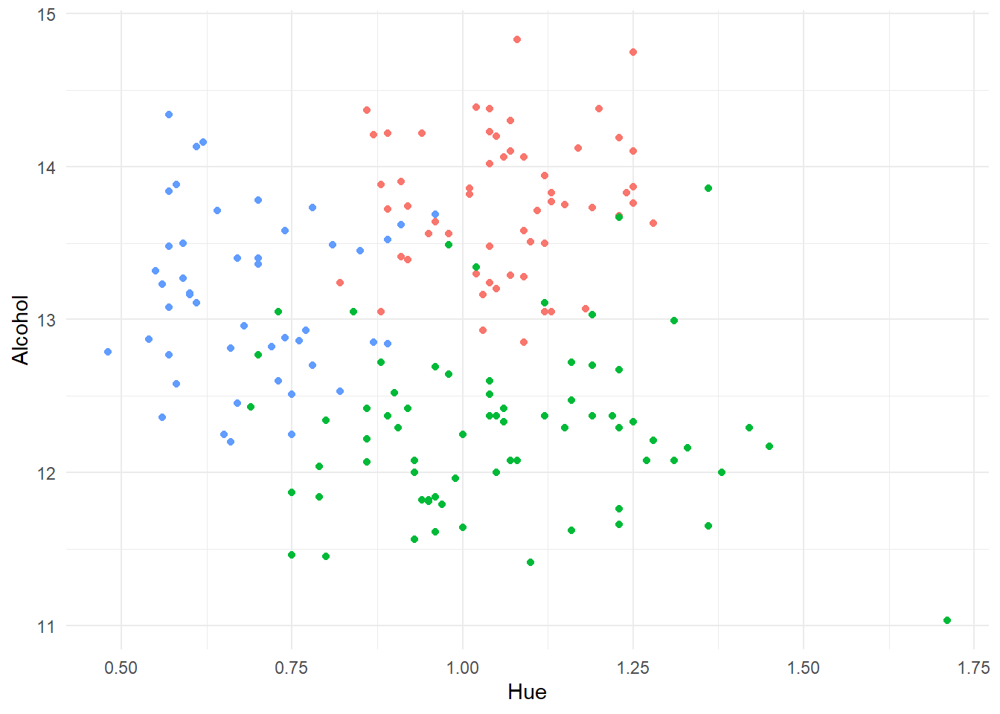
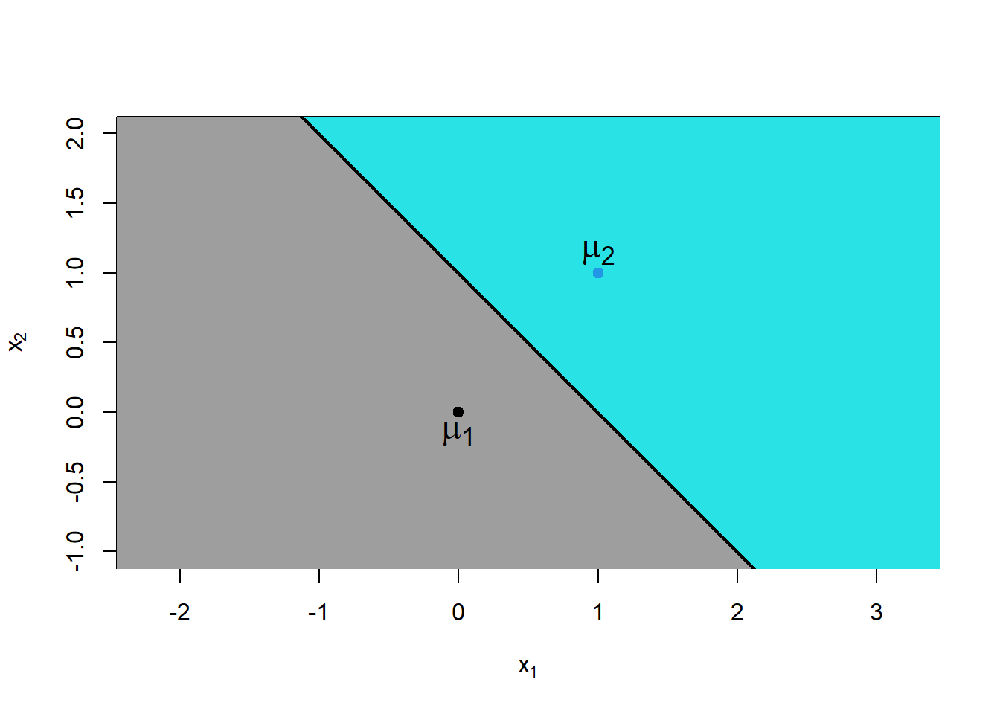
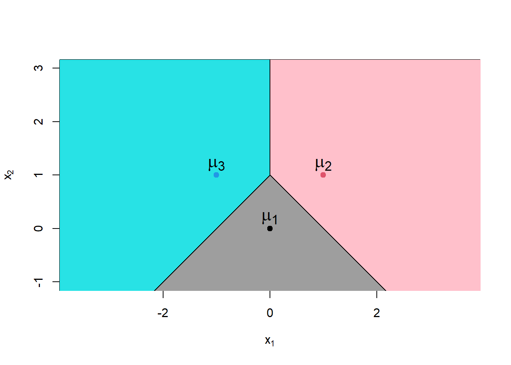
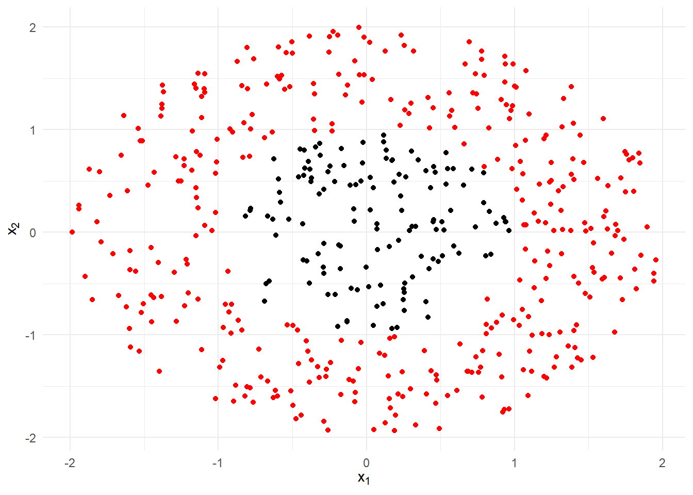
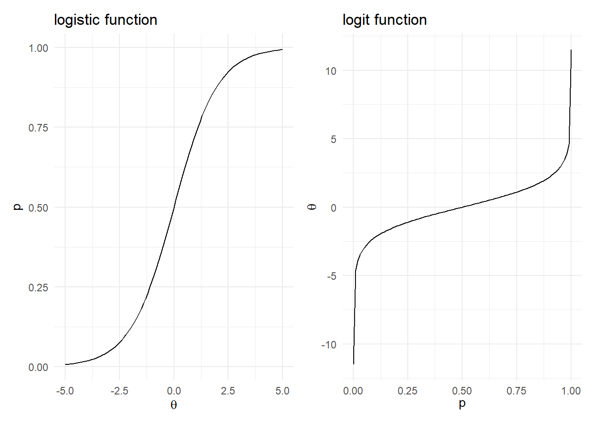
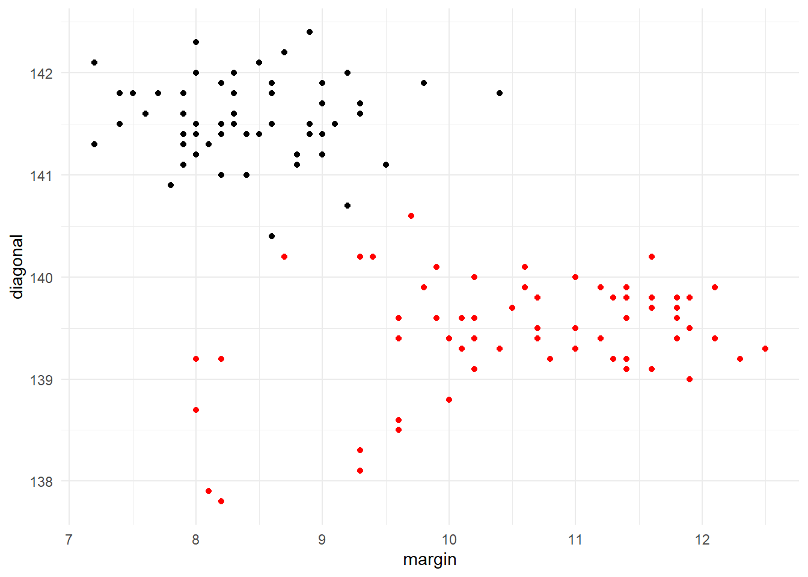
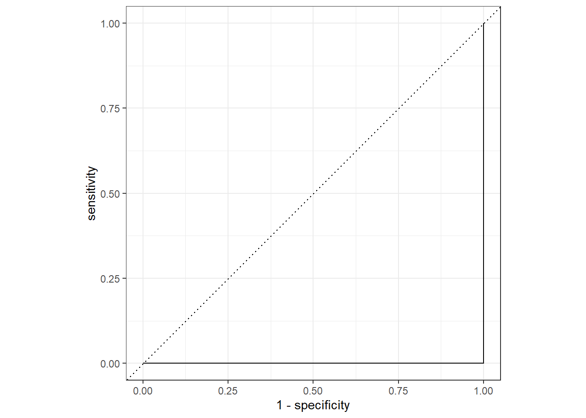
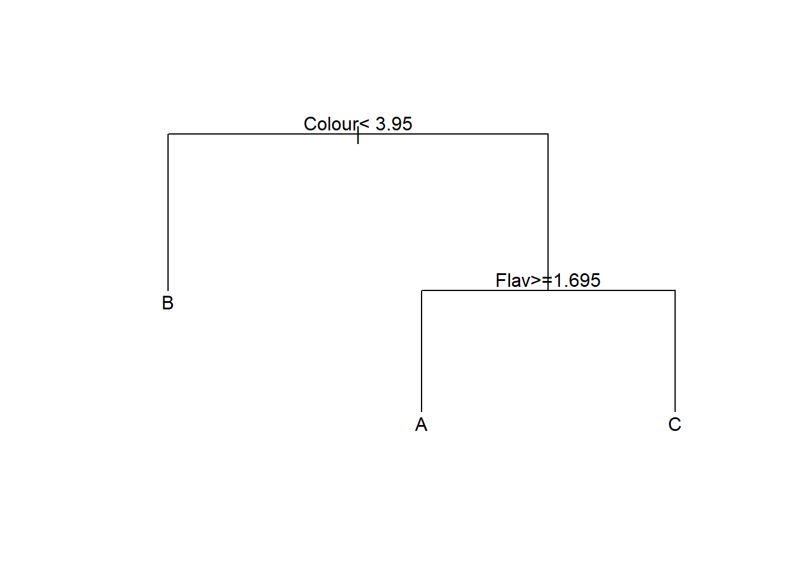

# Classification


## Introduction to Classification

In classification, our goal is to assign each observation in the test
dataset to one of a number of pre-specified categories. We do so using
information from the observed predictor variables (or 'features'), based
on a classification rule derived using the training data. Applications
of classification analysis are manifold, ranging from biological
taxonomy (the assignment organisms to species) to diagnosis of disease,
to the assessment of credit risk.

As with the prediction problem, in practice we will have training and
test datasets. For the training data we will have a record of both the
features and the true class membership for each case. The training data
can then be used to create a method for linking class membership to the
features. In the test data we will have just the features. We can then
apply the classification method developed on the training data to
allocate each test case to a group.

As we did when discussing prediction, we will at times look at validation
datasets (i.e. artificial test datasets) in which the true class
memberships are available. This is for illustrative purposes, helping us
to compare and contrast various classification technique.

**How this chapter connects.** This chapter focuses on the main
classification methods and the ideas behind them. When we want a more
reproducible implementation path with recipes, workflows, resampling,
and tuning, Chapter 5 is the place to look. The comparison table in
Section \@ref(sec:task-compare) is also a useful reminder of how
classification differs from prediction, clustering, and association
rules.

As an example of a classification problem, recall the Italian wine data
that we met in Exercise 1 of Laboratory 4. Thinking of this as a
training dataset, we display in Figure \@ref(fig:wineclass) a
scatterplot of the percentage alcohol content of the wine against its
hue, with the data plotted using different colour plotting symbols for
each of the three cultivars. These three groups are quite well separated
on just the plotted variables, suggesting that we should be able to
derive a classification method with a high degree of accuracy when using
information from all the variables.

<div class="figure">

<p class="caption">(\#fig:wineclass)Plot of percentage alcohol content against hue for a sample of Italian wines. The coloured plotting symbols distinguish the three different cultivars for the wines.</p>
</div>

If we think of class membership as being defined by a categorical target
variable, then this mirrors the prediction problem studied except for
the nature of the target. It should therefore be no surprise that some
of the techniques that we met in the context of prediction can also be
applied to the classification problem with only minor modifications.
Tree-based methods and neural networks are two prime examples that will
be considered in this chapter. We shall also a examine some specialized
methods for classification, including logistic regression, linear
discriminant analysis, kernel discriminant analysis and naive Bayes
classifiers[^discrimination].

In general, no classification method is likely to be 100% accurate. This
is because there will always be inherent uncertainty on class membership
based upon the observed features. For example, suppose that we try to
classify human sex based on height and weight. A person of 185cm and
85kg is likely to be male, but is not certain to be so. The best we can
do is to try and evaluate *classification probabilities*. These are the
probabilities of membership of the possible classes given the observed
features: ${\textsf P}(\mbox{class} | \mbox{features})$.

We will usually assign each test case to the class with highest
classification probability. However, this is not always the case, since
in some situations there are differing costs associated between
different types of mistake. For example, consider a dermatologist
classifying each skin lesion as benign or malignant. Mistakenly
classifying a lesion that is benign to the malignant class will result
in unnecessary treatment, but that is a less critical error than
classifying a malignant lesion as benign, when the delay in treatment
might be fatal. As a consequence, a dermatologist may act as if a lesion
is malignant (for example, by excising it) even if
${\textsf P}(\mbox{malignant} | \mbox{features}) = 0.1$.

Our broad approach to classification must be to estimate the
classification probabilities. There are two ways in which we might do
this: generational and discriminatory. Discriminatory (or *conditional*)
methods seek to estimate the classification probabilities directly.
Generational methods compute the classification problems by first
estimating related quantities, following a statistical theory for
classification which we now discuss.

### Statistical Theory for Classification

In classification we assume that each observation belongs to one of a
finite number of classes, which we will label $1, 2, \ldots, C$. We will
make each classification based on the observed vector
$\boldsymbol{x}= (x_1, x_2, \ldots, x_p)$ of variables (features). Let
the joint probability function[^jointpdf] of $\boldsymbol{x}$ for individuals
in class $j$ be denoted by $f_j$.

Now, suppose that we have some prior ideas about the probabilities of
each class; denote these by $\pi_1, \ldots, \pi_C$. If the training data
are a random sample then we can use the relative proportions to provide
these prior probabilities -- that is, $\pi_j = n_j/n$ where $n_j$ is the
number of training observations in class $j$, and $n$ is the total
number of training observations. This is the default method of
estimating the priors for most classifiers implemented in R. In other
situations we might have exogenous information about the class
probabilities. Sometimes we will have no useful information, when the
best course may be to simply set them equal: $\pi_j = 1/C$ for all
$j=1,\ldots,C$.

Suppose for now that the probability functions $f_1, \ldots, f_C$ and
prior probabilities are all known. We observe an individual with feature
vector $\boldsymbol{x}$. Which class is this individual most likely to
belong to? To answer this, we must compute the conditional probabilities
${\textsf P}(j | \boldsymbol{x})$ for $j=1,\ldots,C$. The quantity
${\textsf P}(j | \boldsymbol{x})$ is the probability that the individual
belongs to class $j$ given that they have feature vector
$\boldsymbol{x}$. Now, by Bayes' Theorem[^bayesthm] we have
\begin{equation}
{\textsf P}(j | \boldsymbol{x}) = \frac{ \pi_j f_j(\boldsymbol{x}) }{f(\boldsymbol{x})}~~~~~~~~~~(j=1,\ldots,C)
(\#eq:bayes)
\end{equation}
where $f(\boldsymbol{x}) = \sum_j \pi_j f_j(\boldsymbol{x})$. Because the
denominator on the right-hand side of Equation \@ref(eq:bayes)
does not depend upon the class $j$, it follows that the most probable
class is the one for which $\pi_j f_j(\boldsymbol{x})$ is largest.

::: {.example}
**Some Bayesian Reassurance for a Hypochondriac**

A nervous patient has a set of blood test results $\boldsymbol{x}$. He
surfs the Internet, and finds that the probability that a normal healthy
individual will return such results is $0.01$, but that for people with
Erdheim-Chester disease such test results would be reasonably common,
appearing with probability $0.5$. However, his GP (an avid Bayesian!)
seems very unconcerned. She notes that this is a classification problem
with two categories: diseased (class 1) and non-diseased (class 2). It
is well known that Erdheim-Chester disease is a very rare condition, so
that $\pi_1 = 0.000001$ (i.e. 1 in a million), and hence
$\pi_2 = 1 - \pi_1 = 0.999999$. From the test results the GP knows that
$f_1(\boldsymbol{x}) = 0.5$ and $f_2(\boldsymbol{x}) = 0.01$, but she
computes the conditional probability of being diseased given the test
results as
$${\textsf P}(1 | \boldsymbol{x}) = \frac{ 0.000001 \times 0.5 }{0.000001 \times 0.5 + 0.999999 \times 0.01} \approx 0.00005.$$
It is extremely unlikely that the patient's worries are well founded.
:::

### Misclassification Rates and Confusion Matrices

In order to implement classification based on the posterior
probabilities in Equation \@ref(eq:bayes) we need the prior probabilities $\pi_j$ and the
probability functions $f_j$ for all classes $j=1,\ldots,C$. Obtaining
values for $\pi_1,\ldots,\pi_C$ will not usually be a problem, as
discussed above. The challenge is to obtain estimates of
$f_1,\ldots,f_C$ from the training data. We shall examine a number of
options.

-   Assume that $f_1,\ldots,f_C$ are normal probability density
    functions (for continuous random variables). This leads to the
    method of linear discriminant analysis (Section \@ref(sec:lda)).

-   Estimate $f_1,\ldots,f_C$ using kernel density estimation. This
    leads to the method of kernel discriminant analysis (Section \@ref(sec:kda)).

-   Factorize the joint probability functions to facilitate their
    estimation, leading to naive Bayesian classification (Section \@ref(sec:naive)).

Given this variety of methods, as well as the more generic tree-based
and neural network classifiers, which should we prefer? We will usually
want to select the method with the lowest *misclassification rate*. The
misclassification rate is simply the proportion of observations that are
assigned to the wrong class. A more detailed analysis of the performance
of each classifier can be obtained from the *error matrix* or *confusion
matrix*, which cross-tabulates true and predicted classes. In some cases
the impact of certain types of misclassification may be far greater than
others, in which case one my wish to consider a weighted error rate.
This can occur, for example, in medical testing, where the consequences
of false positives may be somewhat unpleasant (e.g. unnecessary
biopsies) but the consequence of false negatives can be fatal
(e.g. failure to detect a disease while it is still treatable).

::: {.example}
**Comparison of Tests for Tuberculosis**

The Mantoux and Heaf tests are both used to detect tuberculosis in
patients. Suppose that they are each applied to 1000 subjects suspected
of having the disease, giving the following confusion tables. Note that
disease status is the true class here (positive or negative for
tuberculosis) and the test result (positive or negative) is the
predicted class.


<table class="kable_wrapper">
<caption>(\#tab:unnamed-chunk-2)Performance of the Mantoux (left) and Heaf (right) tests for detecting tuberculosis</caption>
<tbody>
  <tr>
   <td> 

|       | Disease +| Disease -|
|:------|---------:|---------:|
|Test + |        50|        50|
|Test - |         1|       899|

 </td>
   <td> 

|       | Disease +| Disease -|
|:------|---------:|---------:|
|Test + |        40|        30|
|Test - |        11|       929|

 </td>
  </tr>
</tbody>
</table>

The overall misclassification rate for the Mantoux test is
$51/1000 = 5.1\%$, while the over misclassification rate for the Heaf
test is $41/1000 = 4.1\%$. However, if we assign severity weights 1 to
false positives and 10 to false negatives, then the weighed error is
$(50+1 \times 10)/1000 = 0.06$ for the Mantoux test, which is rather
better than the figure of $(30+11\times 10)/1000 = 0.14$ for the Heaf
test.
:::

In practice we will need to estimate the misclassification rate for each
classifier that we use. Recall from the previous chapter that assessing
predictive accuracy (in terms of mean squared error) based on
predictions on the training data led to an overly optimistic assessment.
The methods enjoyed 'home ground advantage'. The same issue applies in
classification. If we develop a classification rule on the training
data, then it will tend to perform especially well on those data, and in
particular better than it would on real test data. We therefore need a
more independent method for estimation misclassification rates.

If we have an independent validation dataset for which the correct class
assignments are know, then misclassification rates can be assessed based
on performance thereon. As we saw previously, this could be achieve by
splitting the original training dataset into a smaller (new) training
set and a separate validation set, typically in a ratio of around 3:1.
Alternatively, we can employ cross-validation techniques, following
along the same lines as in Section \@ref(sec:validation)
(but with the squared error performance
measure replaced by the misclassification rate).

## Linear Discriminant Analysis{#sec:lda}

### The Method in Theory

Linear discriminant analysis (often abbreviated to LDA) is applicable
when all the features are quantitative. The method relies critically on
the assumption that that the joint distributions of the features is
multivariate normal, with a covariance matrix that is the same from
class to class. The thing which distinguishes the groups is inter-class
variation of the vector of feature means.

Consider a very simply case where there are just $C=2$ classes, and just
$p=2$ numerical features, $x_1$ and $x_2$. Suppose that these features
are statistically independent, and that the standard deviation of each
is equal to one (irrespective of class). Finally, let both features have
mean zero in group 1, and let both features have mean 1 in group 2. In
other words, if $\mu_{ij}$ is the mean for feature $i$ in group $j$ then
$\mu_{11} = \mu_{21} = 0$, and $\mu_{12} = \mu_{22} = 1$. Now, using
standard results for the multivariate normal distribution[^theorypaper], we have
$$\begin{aligned}
f_j(\boldsymbol{x}) &= \frac{1}{2 \pi} \exp \left \{ -\frac {(x_1 - \mu_{1j})^2}{2} \right \}  \exp \left \{ -\frac{(x_2 - \mu_{2j})^2}{2} \right \}\\
         &= 
\left \{
\begin{array}{ll}
\frac{1}{2 \pi} \exp \left \{ -\frac{x_1^2}{2} - \frac{x_2^2}{2} \right \}         & \mbox{for class $j=1$}\\
\frac{1}{2 \pi} \exp \left \{ -\frac{(x_1-1)^2}{2} - \frac{(x_2-1)^2}{2} \right \} & \mbox{for class $j=2$}
\end{array} 
\right .\end{aligned}$$
If the prior class probabilities are equal
(i.e. $\pi_1 = \pi_2 = 0.5$) then we will assign an observation
$\boldsymbol{x}= (x_1, x_2)$ to class $1$ if and only if
$$\begin{aligned}
                 f_1(\boldsymbol{x}) &> f_2(\boldsymbol{x}) \\
\Rightarrow\quad      \exp\{ (-x_1^2/2 - x_2^2/2)\}  &> \exp\{ (-(x_1-1)^2/2 - (x_2-1)^2/2)\} \\
\Rightarrow\quad      -x_1^2/2 - x_2^2/2  &> -(x_1-1)^2/2 - (x_2-1)^2/2 \\
\Rightarrow\quad      x_1^2 + x_2^2   &<  x_1^2 - 2 x_1 + 1 + x_2^2 - 2 x_2 +1 \\
\Rightarrow\quad      0  &< - 2 x_1 + 1 - 2 x_2 +1 \\
\Rightarrow\quad      x_1 + x_2 &<  1\\\end{aligned}$$
Time to take stock.
We have just shown that given an observation $(x_1,x_2)$, we should
assign it to class 1 if $x_1 + x_2 <  1$, and to class 2 if
$x_1 + x_2 \ge 1$. (In theory the possibility of equality can be
ignored, because for truly continuous data we will get precise equality
with probability zero.) In other words, $x_1 + x_2 <  1$ is a decision
rule that tell us where to classify the observation (class 1 if true,
class 2 if false). This can be plotted graphically, as in Figure \@ref(fig:toylda). Notice
that the boundary of the regions is given by the straight line
$x_1 + x_2 = 1$, hence the nomenclature *linear* discriminant analysis.
The combination $x_1 + x_2$ is referred to as a *linear discriminant* or
a *discriminant variable* because of its role in defining the decision
rule.

<div class="figure">

<p class="caption">(\#fig:toylda)Plot of decision regions for a linear discriminant analysis with two groups. Any observation in the grey region will be assigned to class 1; any observation in the cyan region will be assigned to class 2.</p>
</div>

The result is very intuitive. Each of observation will be assigned to
the class for which the mean is closest. While we have demonstrated this
result for two class problems, it extends naturally to cases with three
or more classes. In such situations the feature space will be divided
into multiple regions using line segment boundaries. See Figure \@ref(fig:toylda2) for
example. If there are more than two features then the boundaries of the
decision regions will be a defined by the intersection of hyperplanes
rather than lines.

<div class="figure">

<p class="caption">(\#fig:toylda2)Plot of decision regions for a linear discriminant analysis with three groups.</p>
</div>

### Implementation in R

Linear discriminant analysis can be implemented in R using the `lda`
function. This is part of the `MASS` library, which must be pre-loaded.
The syntax for `lda` is of the following form:


``` r
lda(y ~ x1 + x2, data=mydata, CV=FALSE, prior=c(0.5,0.5))
```

Here `y` in the formula is the true class, and `x1` and `x2` are
features. The argument `data` allows specification of a data frame in
the usual manner. The optional argument `CV` is logical, indicating
whether or not a cross-validation estimate of the posterior
probabilities $\{{\textsf P}(j | \boldsymbol{x}) \}$ is required. The
default is `CV=FALSE`. Finally, prior probabilities can be specified as a
vector valued argument `prior`. The default is to use the class
proportions in the data.

Predicted classes from an LDA model are obtained by the `predict`
function in the usual kind of way.

While this is relatively consistent with what we've seen in the past,
we'll be utilising the `tidymodels` framework instead, using `parsnip`
with the `discrim_linear()` function. We can then use the `yardstick`
to evaluate performance.

::: {.example}
**Prediction for the Wine Data Using LDA**

We start by splitting the wine data into training and test data (which
we shall refer to throughout this chapter). The `wine` data is in truth
a relatively straightforward one for classification, so we make things a
little more challenging by leaving only 100 observations in the training
set (with the remaining 78 in the validation dataset). These operations
are performed in the R code below, where we
first convert the target variable `Cultivar` to a factor.


``` r
library(rsample)
```

```
#> Warning: package 'rsample' was built under R version 4.5.2
```

``` r
wine <- read_csv("../data/wine.csv") |>
  mutate(Cultivar = factor(Cultivar))

set.seed(2021)
split <- initial_split(wine, prop=100/178)
wine.train <- training(split)
wine.test <- testing(split)
wine.train
```

```
#> # A tibble: 100 × 14
#>    Cultivar Alcohol Malic   Ash Alc.Ash    Mg Phenols  Flav Non.Flav Proan
#>    <fct>      <dbl> <dbl> <dbl>   <dbl> <dbl>   <dbl> <dbl>    <dbl> <dbl>
#>  1 C          12.51  1.24  2.25    17.5    85    2     0.58     0.6   1.25
#>  2 C          13.73  4.36  2.26    22.5    88    1.28  0.47     0.52  1.15
#>  3 C          13.71  5.65  2.45    20.5    95    1.68  0.61     0.52  1.06
#>  4 C          12.84  2.96  2.61    24     101    2.32  0.6      0.53  0.81
#>  5 B          12.21  1.19  1.75    16.8   151    1.85  1.28     0.14  2.5 
#>  6 C          13.17  2.59  2.37    20     120    1.65  0.68     0.53  1.46
#>  7 B          12.6   1.34  1.9     18.5    88    1.45  1.36     0.29  1.35
#>  8 B          11.61  1.35  2.7     20      94    2.74  2.92     0.29  2.49
#>  9 B          13.34  0.94  2.36    17     110    2.53  1.3      0.55  0.42
#> 10 B          12.34  2.45  2.46    21      98    2.56  2.11     0.34  1.31
#> # ℹ 90 more rows
#> # ℹ 4 more variables: Colour <dbl>, Hue <dbl>, ODRatio <dbl>, Proline <dbl>
```

We initially consider prediction with LDA using all the variables.


``` r
library(discrim)
```

```
#> Warning: package 'discrim' was built under R version 4.5.2
```

```
#> Warning: package 'parsnip' was built under R version 4.5.2
```

``` r
library(yardstick)
```

```
#> Warning: package 'yardstick' was built under R version 4.5.2
```

``` r
wine.lda1 <- discrim_linear() |> fit(Cultivar ~ ., data=wine.train)
wine.lda1
```

```
#> parsnip model object
#> 
#> Call:
#> lda(Cultivar ~ ., data = data)
#> 
#> Prior probabilities of groups:
#>    A    B    C 
#> 0.27 0.40 0.33 
#> 
#> Group means:
#>    Alcohol    Malic      Ash  Alc.Ash        Mg  Phenols      Flav  Non.Flav
#> A 13.72333 1.977407 2.509630 17.52593 105.96296 2.831111 3.0022222 0.2981481
#> B 12.24400 2.103250 2.229750 20.07250  95.50000 2.262500 2.0822500 0.3525000
#> C 13.11576 3.340909 2.418788 21.28788  99.54545 1.688182 0.7481818 0.4542424
#>      Proan   Colour       Hue  ODRatio   Proline
#> A 1.826296 5.444444 1.0566667 3.162593 1079.6296
#> B 1.690500 2.924250 1.0540000 2.922000  521.7750
#> C 1.136061 7.250606 0.6809091 1.709697  626.5152
#> 
#> Coefficients of linear discriminants:
#>                   LD1          LD2
#> Alcohol  -0.010317451  1.175068679
#> Malic     0.182260164  0.104519875
#> Ash       0.138964990  2.573625788
#> Alc.Ash   0.038864464 -0.160828615
#> Mg       -0.003958634  0.004833826
#> Phenols   0.767868607 -0.086488945
#> Flav     -2.569432136  0.050198155
#> Non.Flav -2.044924752 -0.504567571
#> Proan     0.358496497 -0.403501573
#> Colour    0.298461150  0.132267168
#> Hue      -1.850873874 -1.976866286
#> ODRatio  -1.288883722  0.078974327
#> Proline  -0.001686943  0.002915649
#> 
#> Proportion of trace:
#>    LD1    LD2 
#> 0.7512 0.2488
```

``` r
wine.lda1.pred <- wine.lda1 |> augment(new_data=wine.test)
wine.lda1.pred |>
  conf_mat(truth=Cultivar, estimate=.pred_class)
```

```
#>           Truth
#> Prediction  A  B  C
#>          A 32  1  0
#>          B  0 28  0
#>          C  0  2 15
```


Note the following:

-   We have first loaded the `discrim` library, an add-on package for
    `parsnip`, in order to access the `discrim_linear` function.

-   The dot on the right-hand side of a model formula has the usual
    meaning (of all variables in the data frame barring the response on
    the left-hand side).

-   The fit object `wine.lda1` is a parsnip model which then prints the
    output from `lda()`. Much of the resulting output
    is self explanatory. We note that the table of coefficients of the
    linear discriminants is a matrix which transforms standardized
    versions of the original observations to the linear discriminants.

-   We use `augment()` to add the `.pred_class`, `.pred_A`, `.pred_B`
    and `.pred_C` columns to the `wine.test` data. The first of these
    are the "hard" class predictions (based on maximum posterior
    probabilities) while the last 3 are the aforementioned posterior
    probabilities.

-   The `yardstick` function `conf_mat` tabulates the predicted classes
    against the true classes; i.e. the confusion matrix. We see that the
    overall misclassification rate is
    $3/78 \approx 3.8\%$.

We now consider trying to perform LDA using just the variables
`Alcohol`, `Color` and `Hue`.


``` r
wine.lda2 <- discrim_linear() |> fit(Cultivar ~ Alcohol + Colour + Hue, data=wine.train)
wine.lda2.pred <- wine.lda2 |> augment(new_data=wine.test)
wine.lda2.pred |> conf_mat(truth=Cultivar, estimate=.pred_class)
```

```
#>           Truth
#> Prediction  A  B  C
#>          A 30  3  1
#>          B  2 27  1
#>          C  0  1 13
```


We get a worse misclassification rate in this case:
$8/78 \approx 10.3\%$. Nonetheless, we used many less variables to
develop the classification model. The question remains, might we improve
on the initial (full) model by omitting some of the variables? This is
another instance of a bias-variance trade-off. In principle we could
perform some kind of variable selection algorithm to address this
matter, but it turns out that there are better 'dimension reducing'
approaches (though these are beyond the scope of this paper).
:::

Finally, we have used the training sample relative frequencies to define
the prior probabilities in both of these LDA classifiers. As you will
see from the output for `wine.lda1`, this gave
$(\pi_1,\pi_2,\pi_3) = (0.27, 0.4, 0.33)$. We can instead specify our
own prior probabilities through the `prior` argument to lda(). For
example, suppose that we thought that in practice all three cultivars
are equally prevalent. Then we could perform classification using the
prior $(\pi_1,\pi_2,\pi_3) = (1/3,  1/3,  1/3)$ instead. To pass the `prior`
information through from `discrim_linear()` we would use the `set_engine()`
function:


``` r
spec_lda_equal_priors <- discrim_linear() |> set_engine("MASS", prior = c(1,1,1)/3)
```

Note that we wouldn't expect the classifications to change much as the prior
is only a little different.

## Kernel Discriminant Analysis{#sec:kda}

While linear discriminant analysis can work well in many applications,
it can also fail spectacularly when the boundaries between the groups
are highly non-linear. Consider, for instance, the (artificial) data set
displayed in Figure \@ref(fig:circledata). The separation between the red and black
observations is clear to the eye, but linear discriminant analysis
cannot handle such a scenario.

<div class="figure">

<p class="caption">(\#fig:circledata)An artificial dataset for which linear discriminant analysis will completely fail.</p>
</div>

A (far) more flexible approach than LDA is to estimate the probability
functions $f_1,\ldots,f_C$ using kernel density estimation.

Recall that kernel density estimation in one dimension is where we estimate
a distribution $f$ using the mean of kernel functions (typically guassian)
centered at each observation.

$$
\hat{f}(x) = \frac{1}{n}\sum_{i=1}^n \frac{1}{h}K(\frac{x - x_i}{h}).
$$

Here, $h$ is the *bandwidth* of the kernel density estimator, which essentially
controls the amount of smoothing: a small value of $h$ will result in a noisy
distribution, while a large value of $h$ will result in something that may be overly
smooth and miss fine detail.

We can extend this concept readily to higher dimensions, though the bandwidth $h$
is replaced by a square matrix of bandwidths of size $d$ if the dimension is $d$.

In the case where we have continuous predictor variables, we can use the training
data from each class to construct kernel estimates $\hat f_1, \ldots, \hat f_C$.
Substituting these estimates in Equation \@ref(eq:bayes) leads to *kernel discriminant analysis*.

While kernel discriminant analysis wins over LDA in terms of
flexibility, the method can be somewhat unreliable when there are large
numbers of predictor variables. Indeed, kernel density estimation will
typically prove difficult in more than 3 dimensions, unless there
are very large numbers of observations available.

Kernel discriminant analysis is implemented in R using the `kda`
function within the `ks` library. To keep things consistent, we will
use the `tidykda` package[^tidykda] which implements a wrapper to coerce kernel
discriminant analysis into the `parsnip` framework.

The bandwidths are automatically found using a plugin-estimator, so
all we need to do is provide at most 3 predictors and utilise
the `discrim_kernel()` function. This can take some time to run for large datasets.

::: {.example}
**Kernel Discriminant Analysis for the Wine Data**

We apply kernel discriminant analysis to the Italian wine data.
Specifically, we attempt to classify `Cultivar` based on the three
predictors `Alcohol`, `Colour` and `Hue`.


``` r
library(tidykda)
wine.kda <- discrim_kernel() |> fit(Cultivar ~ Alcohol + Colour + Hue, data=wine.train)
wine.kda.pred <- wine.kda |> augment(new_data=wine.test)
wine.kda.pred |> conf_mat(truth=Cultivar, estimate=.pred_class)
```

```
#>           Truth
#> Prediction  A  B  C
#>          A 29  6  2
#>          B  0 23  0
#>          C  3  2 13
```


Points to note:

-   We use only 3 predictors, as this is the most that `discrim_kernel`
    will accept.

-   The error rate using kernel discriminant analysis is
    $13/78 \approx 16.7\%$.
    This is worse than we obtained using LDA.
    Hence, while linear boundaries may not be entirely satisfactory for
    distinguishing between classes, the errors thus arising are of a
    little less importance than those due to the extra complexity
    inherent in the kernel approach for this example.
:::

## Naive Bayes Classifiers{#sec:naive}

As we noted above, kernel discriminant analysis does not usually work at
all well when there are many predictor variables. Indeed, the R
implementation of the method can cope with no more than $p=6$. This is a
reflection of the *curse of dimensionality*, which in essence states
that many statistical estimation problems become much more difficult in
high dimensions.

This idea can be illustrated most easily if we consider the situation in
which the predictor variables are categorical. Specifically, imagine
that we have $p=10$ factors, each on 3 levels. To specify
$f_j(\boldsymbol{x})$ we must compute the probability for any
combination the factors. However, there are $3^{10} = 59049$ different
combinations. That's a lot! Even if we had a large training set with
$10000$ observations per class, it would still be the case that we would
have no training observations for more than $86\%$ of the possible
factorial combinations. How then can we hope to estimate the
probabilities thereof?

In naive Bayes classification this problem is addressed by making the
assumption that all the predictors are statistical independent within
each class. This means that we can factorize the probability functions
by
\begin{equation}
f_j(\boldsymbol{x}) = f_j(x_1) f_j(x_2) \cdots f_j(x_p)
(\#eq:factorize)
\end{equation}
where $f_j(x_i)$ denotes the marginal probability
function for predictor $x_i$ in class $j$. To appreciate the extent to
which this simplifies the problem, let us return to out example with 10
predictive factors each with 3 levels. In order to estimate the marginal
probability distribution for any single factor we need only estimate 2
probabilities[^sumtoone]. This in turn means that we need only estimate
$10\times 2=20$ probabilities in total to fully specify the probability
function in Equation \@ref(eq:factorize).

::: {.example}
**Coke or Pepsi?**

A sample of 100 people are questioned as to whether they prefer Coke or
Pepsi (the target classification). A total of 60 prefer Coke and 40
prefer Pepsi. The predictive factors are sex and age category (younger
than 20, or 20 and older) of person. The following results were
recorded.


<table class="kable_wrapper">
<caption>(\#tab:unnamed-chunk-12)Preference of Pepsi (left) and Coke (right) by sex and age</caption>
<tbody>
  <tr>
   <td> 

|       | Younger| Older|
|:------|-------:|-----:|
|Male   |      20|    10|
|Female |      10|    20|

 </td>
   <td> 

|       | Younger| Older|
|:------|-------:|-----:|
|Male   |      10|    20|
|Female |       5|     5|

 </td>
  </tr>
</tbody>
</table>

To specify the probability distribution $f_1$ for coke drinkers we must
compute probabilities for each combination of predictive factors. We can
do so using the observed proportions. Under the full Bayesian model we
have $$\hat f_1(\{Male,Older\}) = \tfrac{10}{60} = \tfrac{1}{6}$$ for
example. Using naive Bayes on the other hand, we obtain
$$\hat f_1(\{Male,Older\}) \approx \hat f_1(Male) \hat f_1(Older) = \tfrac{30}{60} \times \tfrac{30}{60} = \tfrac{1}{4}.$$
:::

Naturally there is a price to pay for such a huge reduction in model
complexity. The assumption of independence of predictors within each
class is strong, and will almost certainly be incorrect in practice.
Nonetheless, such a simplification may still be a good idea, based on
the kind of bias-variance trade off arguments with which you should now
be familiar.

Naive Bayes classification in R is implemented in a range of different packages,
such as the `e1071` package (with function `naiveBayes()`), the `naivebayes`
package (with function `naivebayes()`) and the `klaR` package (with function `NaiveBayes()`).

As before, we will be using the `tidymodels` framework, where `discrim` provides
the model tidier `naive_Bayes()`. We'll utilise the `naivebayes` engine.
Predictions will then be made in the same way
(i.e. using `predict()` or `augment()`).

The implementation of the naive Bayes classifier can take
both quantitative and categorical predictors. The marginal distributions
(i.e. the $f_j(x_i)$ mentioned above) for the numerical variables are
estimated using kernel density estimators (or, alternatively univariate normal
distributions), while marginal probabilities for the categorical variables are
estimated using class-specific proportions.

::: {.example}
**Naive Bayes Classification for the Wine Data**

We apply naive Bayes classification to the Italian wine data, first
using all the predictor variables and then using just `Alcohol`,
`Colour` and `Hue`. Lastly, we'll use a normal distribution in place
of the kernel density estimates.


``` r
spec_nB <- naive_Bayes(engine="naivebayes")
wine.nB.1 <- spec_nB |>
  fit(Cultivar ~ ., data=wine.train)
wine.nB.1.pred <- wine.nB.1 |>
  augment(new_data=wine.test)
wine.nB.1.pred |>
  conf_mat(truth=Cultivar, estimate=.pred_class)
```

```
#>           Truth
#> Prediction  A  B  C
#>          A 30  2  0
#>          B  2 26  0
#>          C  0  3 15
```

``` r
wine.nB.2 <- spec_nB |>
  fit(Cultivar ~ Alcohol + Colour + Hue, data=wine.train)
wine.nB.2.pred <- wine.nB.2 |>
  augment(new_data=wine.test)
wine.nB.2.pred |>
  conf_mat(truth=Cultivar, estimate=.pred_class)
```

```
#>           Truth
#> Prediction  A  B  C
#>          A 32  4  1
#>          B  0 25  1
#>          C  0  2 13
```

``` r
wine.nB.3 <- spec_nB |>
  set_engine(engine="naivebayes", usekernel=FALSE) |>
  fit(Cultivar ~ Alcohol + Colour + Hue, data=wine.train)
wine.nB.3
```

```
#> parsnip model object
#> 
#> 
#> ================================= Naive Bayes ==================================
#> 
#> Call:
#> naive_bayes.default(x = maybe_data_frame(x), y = y, usekernel = ~FALSE)
#> 
#> -------------------------------------------------------------------------------- 
#>  
#> Laplace smoothing: 0
#> 
#> -------------------------------------------------------------------------------- 
#>  
#> A priori probabilities: 
#> 
#>    A    B    C 
#> 0.27 0.40 0.33 
#> 
#> -------------------------------------------------------------------------------- 
#>  
#> Tables: 
#> 
#> -------------------------------------------------------------------------------- 
#> :: Alcohol (Gaussian) 
#> -------------------------------------------------------------------------------- 
#>        
#> Alcohol          A          B          C
#>    mean 13.7233333 12.2440000 13.1157576
#>    sd    0.4691646  0.4963188  0.5086258
#> 
#> -------------------------------------------------------------------------------- 
#> :: Colour (Gaussian) 
#> -------------------------------------------------------------------------------- 
#>       
#> Colour         A         B         C
#>   mean 5.4444444 2.9242500 7.2506060
#>   sd   1.1854546 0.7474191 2.1912438
#> 
#> -------------------------------------------------------------------------------- 
#> :: Hue (Gaussian) 
#> -------------------------------------------------------------------------------- 
#>       
#> Hue            A         B         C
#>   mean 1.0566667 1.0540000 0.6809091
#>   sd   0.1271885 0.1816562 0.1231961
#> 
#> --------------------------------------------------------------------------------
```

``` r
wine.nB.3.pred <- wine.nB.3 |>
  augment(new_data=wine.test)
wine.nB.3.pred |>
  conf_mat(truth=Cultivar, estimate=.pred_class)
```

```
#>           Truth
#> Prediction  A  B  C
#>          A 30  4  1
#>          B  2 24  1
#>          C  0  3 13
```


Points to note:

-   The output for the fitted objects (e.g. `wine.nB.3`) aren't
    strongly useful. There are tables per predictor with a summary of
    the model fit - kernel densities or the mean/sd of the normal
    distributions as seen for `wine.nB.3`.

-   The naive Bayes classifier implement with all predictors has an
    error rate of $7/78 \approx 9\%$. With just the predictors
    `Alcohol`, `Colour` and `Hue` this rises to $8/78 \approx 10.3\%$. Using normal distributions rather than kernel densities
    for the marginal distributions is worse again, at $11/78 \approx 14.1\%$
:::

## Logistic regression

Logistic regression is a type of discriminatory classifier. This, along
with the other methods of classification in the next section, attempt to
learn the probability $P(j|\boldsymbol{x})$ directly, rather than
generating it from the joint probability function within each class and
prior probabilities via Bayes' Theorem.

Logistic regression learns $P(j|\boldsymbol{x})$ directly by assuming a
parameteric form for the probability. It is one of a class of methods
known as *generalised linear models* (GLMs), and is thus closely related
to linear regression. The generalisation involved is that the
distribution of the response variable $y$ need not be a normal
distribution. In particular, logistic regression is primarily concerned
with a binary (i.e. 0 and 1) response variable, whose expected value
will be the probability of a response $y=1$. Thus, it is useful for
classifying data into two groups, which we can associate with the two
outcomes -- say $y=0$ codes for group 1, and $y=1$ for group 2.
Extensions to more than two groups will be given in section \@ref(sec:multinomial).

It is linear in the sense that a transformation links a linear
combination of predictors
$$\theta(\boldsymbol{x}) = \beta_0 + \beta_1 x_1 + \cdots + \beta_p x_p,$$
with the probability
$p(\boldsymbol{x}) = {\textsf P}(y=1 | \boldsymbol{x})$[^whichp]. This
transformation is the sigmoid function[^sigmoid], also known as the *logistic*
function:
$$p(\boldsymbol{x}) = \frac{1}{1+e^{-\theta(\boldsymbol{x})}}.$$ The
logistic function ensures that the expected outcome is between 0 and 1,
see the left-hand panel of Figure \@ref(fig:logistic).


```
#> Warning: package 'patchwork' was built under R version 4.5.2
```

<div class="figure">

<p class="caption">(\#fig:logistic)The logistic and logit functions.</p>
</div>

The inverse of the logistic function is the *logit* function
$$\theta(\boldsymbol{x}) = {\textsf {logit}}(p(\boldsymbol{x})) = \log\left(\frac{p(\boldsymbol{x})}{1-p(\boldsymbol{x})}\right).$$
See the right-hand panel of Figure \@ref(fig:logistic).
The logit may also be interpreted
as the log odds, where the odds are defined as
$\tfrac{p(\boldsymbol{x})}{1-p(\boldsymbol{x})}$. Odds are an alternate
scale for interpreting the chance of something happening. Rather than
writing the probability of it occurring, we instead give a ratio of the
probability that it occurs to the probability that it does not occur. As
an example, the odds of something that occurs twice in five are 2:3 --
you expect it to occur twice for every 3 times it does not occur. Notice
that, while proportions are restricted between 0 and 1, the odds may
take any positive number, and hence the log odds may take any real
number. This makes the log odds appropriate for a linear combination of
predictors which, if we allow any possible values for the predictors,
will also produce all real numbers.

The formulation of logistic regression is therefore:
$$\begin{aligned}
y_i &\sim \mathsf{Bernoulli}(p(\boldsymbol{x}_i))\\
{\textsf {logit}}(p(\boldsymbol{x}_i)) &= \beta_0 + \beta_1x_{i1} + \cdots+ \beta_p{x_ik}.\end{aligned}$$
where

-   $y_i$ is the binary outcome for observation $i$;

-   $\boldsymbol{x}_i = (x_{i1}, \ldots, x_{ip})^\mathsf{T}$ is the
    vector of predictor variables for the $i$th observation;

-   $p(\boldsymbol{x}_i) = {\textsf P}(y_i = 1 | \boldsymbol{x}_i)$;

-   $\beta_1, \ldots, \beta_p$ are unknown regression coefficients.

Note that, as with linear regression, we can use either quantitative
variables or factors as predictors. When factors are used, we code them
as 0/1 dummy variables in the same way as is done for linear regression.

There is then a natural way of interpreting the fitted coefficients for
factors in terms of odds. Suppose we have a factor with one of its
levels is coded as the binary variable $x_1$, and let $x_2, \ldots, x_p$
be other predictors (including any other levels of the factor). Then if
$x_1$ is a 1, the log odds will be given by
$${\textsf {logit}}(p(\boldsymbol{x})) = \beta_0 + \beta_1 + \sum_{j=2}^p \beta_j x_j.$$
If $x_1$ is a 0, the log odds is given by
$${\textsf {logit}}(p(\boldsymbol{x})) = \beta_0 + \sum_{j=2}^p \beta_jx_j.$$
Thus, the ratio of the odds, or *odds ratio* associated with $x_1$ is
given by
$$\begin{aligned}
\mathsf{OR}(x_1) &= \frac{e^{\beta_0 + \beta_1 + \sum_{j=2}^p \beta_jx_j}}{e^{\beta_0 + \sum_{j=2}^p\beta_jx_j}}\\
& = e^{\beta_1}.\end{aligned}$$
An odds ratio of $x_1$ greater than one
means the odds that $y=1$ increase when $x_1$ is 1; an odds ratio less
than one means the odds that $y=1$ decreases when $x_1$ is 1. Thus, the
odds increase if $\beta_1 > 0$ and decrease if $\beta_1 < 0$.

### Fitting Logistic Regression Models

Unlike linear regression, we cannot estimate the unknown regression
coefficients $\beta_1, \ldots, \beta_p$ via a closed form expression
that minimises the sum of squared errors. Instead, we must find the
regression coefficients by an iterative procedure which attempts to
maximise the *likelihood* of the data[^maths] The likelihood is simply the
probability of the data regarded as a function of the parameters.

For a particular observation $y_i$, the likelihood for logistic
regression is
$$\begin{aligned}
{\textsf P}(y_i|\boldsymbol{x}_i,\boldsymbol{\beta}) &= \left\{\begin{array}{ll}p & \textrm{if}\quad y_i = 1\\
1-p & \textrm{if}\quad y_i = 0,\end{array}\right.\\
&= \left\{\begin{array}{ll}\frac{1}{1 + e^{-\beta_0 - \sum_j \beta_j x_{ij}}} & \textrm{if}\quad y_i = 1\\
\\
\frac{e^{-\beta_0 - \sum_j \beta_j x_{ij}}}{1 + e^{-\beta_0 - \sum_j \beta_j x_{ij}}} & \textrm{if}\quad y_i = 0,\end{array}\right.\\
& = \frac{e^{(-\beta_0 -\sum_j \beta_j x_{ij})(1-y_i)}}{1 + e^{-\beta_0 -\sum_j \beta_i x_{ij}}}.\end{aligned}$$
Thus, the likelihood of the full data arising, assuming the data are
independent, is
\begin{equation}
L(\boldsymbol{\beta}) = P(\boldsymbol{y}|\boldsymbol{x},\boldsymbol{\beta}) = \prod_{i=1}^n \frac{e^{(-\beta_0 - \sum_j \beta_j x_{ij})(1-y_i)}}{1 + e^{-\beta_0 - \sum_j \beta_j x_{ij}}}.
(\#eq:likelihood)
\end{equation}
The parameter vector $\boldsymbol{\beta}$ that maximises equation
\@ref(eq:likelihood) will be the one that is most likely to
produce the data we observe, known as the *maximum likelihood estimate*
[^mle]. In practice, we typically maximise the log-likelihood function
instead
$$\begin{aligned}
\ell(\boldsymbol{\beta}) = \log L(\boldsymbol{\beta}) &= \sum_{i=1}^n \log\left(\frac{e^{(-\beta_0 - \sum_j \beta_j x_{ij})(1-y_i)}}{1 + e^{-\beta_0 - \sum_j \beta_j x_{ij}}}\right)\\
& = \sum_{i=1}^n \log(e^{(-\beta_0 - \sum_j \beta_j x_{ij})(1-y_i)}) - \log(1 + e^{-\beta_0 - \sum_j \beta_j x_{ij}})\\
& = \sum_{i=1}^n (-\beta_0 - \sum_j \beta_j x_{ij})(1-y_i) - \log(1 + e^{-\beta_0 - \sum_j \beta_j x_{ij}}).\end{aligned}$$
There is no closed form solution for the maximum of
$\ell(\boldsymbol{\beta})$, so the maximum likelihood estimator is
typically found using numerical techniques such as Newton's method.

Logistic regression models may be fit in R using the `glm` function. The
basic syntax is


``` r
glm(formula, family, data)
```

where

-   `formula` is the model formula,

-   `family` describes the error distribution. Specify `family=binomial`
    for logistic regression[^glm],

-   `data` is the data frame to use (optional).

As with linear regression, the fitted model should be assigned to a
fitted model object for later use.

The `formula` is of the same form as for linear regression


``` r
y ~ x1 + x2
```

where `y` in this case is a binary variable (0/1) and `x1` and `x2` are
predictor variables, either quantitative or factors.

::: {.example}
**Logistic regression modelling for Swiss bank notes**

We have measurements on 100 forged and 100 genuine Swiss bank notes. On each
bank note the size of the bottom margin was recorded, as was the
diagonal length of the note (all measurements in mm). We are interested
in classifying the notes into forged and genuine classes based on the
margin and diagonal measurements. The data has been split into training
and validation sets, containing 120 and 80 notes respectively.


``` r
swiss.train <- read_csv("../data/swiss-train.csv") |>
  mutate(type = factor(type))
swiss.test <- read_csv("../data/swiss-test.csv") |>
  mutate(type = factor(type))
glimpse(swiss.train)
```

```
#> Rows: 120
#> Columns: 3
#> $ margin   <dbl> 9.7, 9.5, 10.0, 11.2, 10.7, 7.4, 11.6, 7.7, 9.3, 8.0, 8.2, 11…
#> $ diagonal <dbl> 140.6, 141.1, 139.4, 139.9, 139.5, 141.8, 140.2, 141.8, 138.3…
#> $ type     <fct> forged, genuine, forged, forged, forged, genuine, forged, gen…
```

``` r
swiss.glm.1 <- glm(type ~ margin, family=binomial, data=swiss.train)
summary(swiss.glm.1)
```

```
#> 
#> Call:
#> glm(formula = type ~ margin, family = binomial, data = swiss.train)
#> 
#> Coefficients:
#>             Estimate Std. Error z value Pr(>|z|)    
#> (Intercept)  19.9677     3.5250   5.665 1.47e-08 ***
#> margin       -2.1582     0.3842  -5.618 1.93e-08 ***
#> ---
#> Signif. codes:  0 '***' 0.001 '**' 0.01 '*' 0.05 '.' 0.1 ' ' 1
#> 
#> (Dispersion parameter for binomial family taken to be 1)
#> 
#>     Null deviance: 165.822  on 119  degrees of freedom
#> Residual deviance:  73.596  on 118  degrees of freedom
#> AIC: 77.596
#> 
#> Number of Fisher Scoring iterations: 6
```

``` r
swiss.glm.2 <- glm(type ~., family=binomial, data=swiss.train)
step(swiss.glm.2)
```

```
#> Start:  AIC=13.26
#> type ~ margin + diagonal
#> 
#>            Df Deviance    AIC
#> <none>           7.260 13.260
#> - margin    1   12.651 16.651
#> - diagonal  1   73.596 77.596
```

```
#> 
#> Call:  glm(formula = type ~ margin + diagonal, family = binomial, data = swiss.train)
#> 
#> Coefficients:
#> (Intercept)       margin     diagonal  
#>    -985.258       -4.920        7.324  
#> 
#> Degrees of Freedom: 119 Total (i.e. Null);  117 Residual
#> Null Deviance:	    165.8 
#> Residual Deviance: 7.26 	AIC: 13.26
```


Some comments on this R snippet.

-   The `type` variable has two levels, `forged` and `genuine` in that
    order. Thus, `forged` will be taken as the class represented by
    $y=0$, and `genuine` will be the class represented by $y=1$ in the
    logistic regression.

-   The `glm` line is fitting a logistic model with `type`, a factor
    with two possible values as the response. For `swiss.glm.1` there is
    just a single predictor, `margin`. For `swiss.glm.2` both `margin`
    and `diagonal` are predictors.

-   For `swiss.glm.1` we see that the coefficient of `margin` is
    negative, so ${\textsf P}(y=1 | \texttt{margin})$ (i.e. probability
    of genuine note) decreases as `margin` increases.

-   For `swiss.glm.1` linear predictor is
    $\theta(\texttt{margin}) = \beta_0 + \beta_1 \texttt{margin}$. The
    maximum likelihood estimates for the parameters are
    $\hat \beta_0 = 19.9677$ and $\hat \beta_1 = -2.1582$.

-   The *Deviance* mentioned in the output is the logistic regression
    analogue of sum of squares in linear regression.

-   As with linear regression, there is the question of what selection
    of predictor variables provide a model with best bias-variance
    trade-off. Again, mirroring our discussion of linear regression for
    prediction, we can use backwards variable selection implemented to
    minimze AIC as a way of finding a reasonable set of predictor
    variables. In this particular case we see that the model
    `swiss.glm.2` has a lower AIC than either of the models that can be
    obtained by removing a single predictor, so the backwards variable
    selection algorithm (implemented using `step`) terminates
    immediately.
:::

### Logistic Regression as a classifier

When using logistic regression as a classifier, for a given value of the
predictors $\boldsymbol{x}$ we would classify as a 1 if
${\textsf P}(Y=1|\boldsymbol{x}) > {\textsf P}(Y=0|\boldsymbol{x})$ and
as 0 otherwise. i.e. we classify as a 1 if
$$\frac{{\textsf P}(Y=1|\boldsymbol{x})}{{\textsf P}(Y=0|\boldsymbol{x})} > 1.$$
Now, ${\textsf P}(Y=1|\boldsymbol{x}) = p(\boldsymbol{x})$, and thus
${\textsf P}(Y=0|\boldsymbol{x}) = 1-p(\boldsymbol{x})$. Hence, we
classify as a 1 if $$\begin{aligned}
& & \frac{P(Y=1|\boldsymbol{x})}{P(Y=0|\boldsymbol{x})} &> 1,\\
& \iff & \frac{p(\boldsymbol{x})}{1-p(\boldsymbol{x})} &> 1,\\
& \iff & \log(\frac{p(\boldsymbol{x})}{1-p(\boldsymbol{x})}) &> 0,\\
& \iff & {\textsf {logit}}(p(\boldsymbol{x})) &> 0.\\
& \iff & \beta_0 + \beta_1x_1 + \cdots \beta_px_p &> 0.\end{aligned}$$
This gives a simple formula for classifying: evaluate the linear
predictor and assign to class 1 if positive and class 0 if negative.

::: {.example}
**Classifying the Swiss Bank Notes data**

Recall from the previous example that the model `swiss.glm.1` had
$\theta(\texttt{margin}) = \beta_0 + \beta_1 \texttt{margin}$ with
maximum likelihood estimates $\hat \beta_0 = 19.9677$ and
$\hat \beta_1 = -2.1582$. It follows that the fitted model (based on
training data) has linear predictor
$\hat \theta(\texttt{margin}) = 19.9677 -2.1582~\texttt{margin}$. We
would hence classify a test case to genuine notes (coded by $y=1$) if
and only if $$\begin{aligned}
19.9677 -2.1582~\texttt{margin} \ge 0 &\Leftrightarrow& \texttt{margin} \le \frac{19.9677}{2.1582} \\
                                      &\Leftrightarrow& \texttt{margin} \le 9.252~~~.\end{aligned}$$
A quick exploration of the data should persuade you that this is a
natural result: most of the forged notes are detectable by their
surprisingly large bottom margins.
:::

The `predict` command on a fitted model object from `glm` by default
returns predictions from the linear predictor, rather than on the
original scale of the data. This is a bit fiddly - we could optionally
assign the positive predictions to the second class (class 1),
and the negative productions to the first class (class 0).

Alternatively, we can just use the `tidymodels` framework with the
`logistic_reg()` function in place of `glm()`.

::: {.example}
**More on Classifying the Swiss Bank Notes data**

We continue our example on the Swiss bank notes by using the output
from `glm()` to compute the class probabilities ourselves:


``` r
library(broom)
```

```
#> Warning: package 'broom' was built under R version 4.5.2
```

``` r
swiss.glm.2 |> augment(newdata=swiss.test) |>
  mutate(.pred_genuine = 1/(1 + exp(-.fitted)))
```

```
#> # A tibble: 80 × 5
#>    margin diagonal type     .fitted .pred_genuine
#>     <dbl>    <dbl> <fct>      <dbl>         <dbl>
#>  1    8.7    137.8 forged  -18.767     7.0707 e-9
#>  2    8.9    142.3 genuine  13.208     1.00000e+0
#>  3   10.3    139.7 forged  -12.723     2.9821 e-6
#>  4   10.2    139.6 forged  -12.963     2.3447 e-6
#>  5   10.1    139.2 forged  -15.401     2.0483 e-7
#>  6   10.6    139.7 forged  -14.199     6.8157 e-7
#>  7    9.1    141.5 genuine   6.3648    9.9828 e-1
#>  8   10.4    140.3 forged   -8.8203    1.4769 e-4
#>  9    7.9    140.9 genuine   7.8741    9.9962 e-1
#> 10    8      139.6 genuine  -2.1396    1.0531 e-1
#> # ℹ 70 more rows
```


The `.fitted` entry contains the predicted logits for the
test cases. Hence for test case 1 (the predictors for which
we denote by the vector $\boldsymbol{x}_0$),
$$\theta(\boldsymbol{x}_0) = \log \left ( \frac{p(\boldsymbol{x}_0)}{1 - p(\boldsymbol{x}_0)} \right ) = -18.77 .$$
It follows that
$${\textsf P}(y=1 | \boldsymbol{x}_0) = 1/(1+e^{-\theta(\boldsymbol{x}_0)}) = 1/(1+e^{18.77}) \approx 0.$$

Thus, each test case will be assigned to the genuine class (coded $y=1$) if
and only if it has a posterior probability $p(\boldsymbol{x}) > 0.5$, or
equivalently if and only if its linear predictor
$\theta(\boldsymbol{x}_0) > 0$.

Ofcourse, the `tidymodels` framework takes care of this for us, so if we
instead utilise our existing framework knowledge, we can get the same
predictions as we're used to:


``` r
swiss.lr.2 <- logistic_reg() |>
  fit(type ~ ., data=swiss.train)
swiss.lr.2.pred <- swiss.lr.2 |>
  augment(new_data=swiss.test)
swiss.lr.2.pred
```

```
#> # A tibble: 80 × 6
#>    .pred_class .pred_forged .pred_genuine margin diagonal type   
#>    <fct>              <dbl>         <dbl>  <dbl>    <dbl> <fct>  
#>  1 forged      1.00000         7.0707 e-9    8.7    137.8 forged 
#>  2 genuine     0.0000018354    1.00000e+0    8.9    142.3 genuine
#>  3 forged      1.00000         2.9821 e-6   10.3    139.7 forged 
#>  4 forged      1.00000         2.3447 e-6   10.2    139.6 forged 
#>  5 forged      1.00000         2.0483 e-7   10.1    139.2 forged 
#>  6 forged      1.00000         6.8157 e-7   10.6    139.7 forged 
#>  7 genuine     0.0017181       9.9828 e-1    9.1    141.5 genuine
#>  8 forged      0.99985         1.4769 e-4   10.4    140.3 forged 
#>  9 genuine     0.00038034      9.9962 e-1    7.9    140.9 genuine
#> 10 forged      0.89469         1.0531 e-1    8      139.6 genuine
#> # ℹ 70 more rows
```

As always, `augment()` augments the test data `swiss.test` with the
predicted class `.pred_class` as well as the predicted probabilies
of each class (`.pred_forged` and `.pred_genuine`). We can thus
directly cross tabulate the usual way:


``` r
swiss.lr.2.pred |>
  conf_mat(truth=type, estimate=.pred_class)
```

```
#>           Truth
#> Prediction forged genuine
#>    forged      36       1
#>    genuine      0      43
```


Some comments:

-   The confusion matrix tabulates the predicted class versus the true
    class from the `swiss.valid` set. This shows that all but one of the
    bank notes has been correctly classified, a misclassification rate
    of just $1/80$.
:::

Logistic regression, particularly when being applied to data sets that
can be relatively easily classified, can end up creating a perfect
classifier based on the training data. In this case there is no unique
solution for the maximum likelihood estimate of the coefficients --
there are an infinite number of possibile coefficients that will produce
the same perfect predictions. We illustrate this with a slight change of
the Swiss bank notes data.

::: {.example #swiss5}
**Classification of modified Swiss Bank Notes**

Consider the following R snippet, where we have changed a single
observation in the `swiss.train` data set slightly. The plot is given in
Figure \@ref(fig:swiss5).


``` r
swiss2.train <- swiss.train |>
  mutate(diagonal = if_else(row_number() == 103, 140.2, diagonal))

ggplot(data=swiss2.train) +
  geom_point(mapping = aes(x=margin, y=diagonal, col=type)) +
  scale_colour_manual(guide = 'none', values=c('red', 'black'))
```

<div class="figure">

<p class="caption">(\#fig:swiss5)Forged (black) and genuine (red) Swiss bank notes from Example \@ref(exm:swiss5)</p>
</div>

``` r
swiss2.lr <- logistic_reg() |> fit(type ~ ., data=swiss2.train)
```

```
#> Warning: glm.fit: algorithm did not converge
```

```
#> Warning: glm.fit: fitted probabilities numerically 0 or 1 occurred
```

Some comments on the R code.

-   `glm.fit` gives two warning messages, firstly that the algorithm did not
    converge, and secondly that fitted probabilities that were
    numerically no different than 0 or 1 occurred.

-   Figure \@ref(fig:swiss5)
    suggests there is a line that perfectly separates the data into the
    two groups. It is this perfect separation based on a linear
    estimator that causes `glm` to not find a unique maximum likelihood
    estimate, and thus fail to converge. Further, the predicted
    probabilities on the training set are indistinguishable from 0
    and 1.

-   In this particular case, the coefficients found from the model lead
    to a perfect fit of the training data. However, the algorithm used
    to find the maximum likelihood estimators may fail to converge for
    other reasons, such as collinearity of the predictors, or a lack of
    data (no observations) for certain combinations of factors.
:::

### Extending Logistic Regression to more than two classes {#sec:multinomial}

Logistic regression extends naturally to more than two categories by
moving from a single probability of success $p$ to the probability of
each class $p_c$ for $c \in 1, \ldots, C$ where $C$ is the number of
classes. We then model $p_c$ as
$$p_c = \left\{ \begin{array}{ll}\frac{\displaystyle 1}{\displaystyle 1 + \sum_{m=2}^C e^{-\beta_{m0} - \sum_{j=1}^k \beta_{mj}x_j}} & \textrm{if } c=1\\
\\
\frac{\displaystyle e^{-\beta_{c0} - \sum_{j=1}^k \beta_{cj}x_j}}{\displaystyle 1 + \sum_{m=2}^C e^{-\beta_{m0} - \sum_{j=1}^k \beta_{mj}x_j}} &   \textrm{if } c\in \{2, \ldots, C\}.
\end{array}\right.$$ Notice that we now have $C-1$ lots of $k$
coefficients to estimate, one set for each of the classes excluding one.
The last class need not have separate estimators, as the probabilities
$p_c$ must sum to one[^lastclass].

Such models are typically referred to as *multinomial* regression
models, as they extend the binomial distribution to trials with more
than 2 outcomes.

The `multinom_reg` function in `parsnip` fits this by default using
a neural network via the `nnet` library. We illustrate this with an
analysis of the Italian wine data.

::: {.example}
**Multinomial Regression for the Wine Data**

We perform classification using the `multinom_reg` function.


``` r
wine.mn <- multinom_reg() |>
  fit(Cultivar ~ ., data=wine.train)
wine.mn |>
  extract_fit_engine()
```

```
#> Call:
#> nnet::multinom(formula = Cultivar ~ ., data = data, trace = FALSE)
#> 
#> Coefficients:
#>   (Intercept)   Alcohol      Malic       Ash  Alc.Ash         Mg  Phenols
#> B  279.836344  2.510949 -14.231258 -95.03628 2.485551 0.14497172 53.54385
#> C   -4.627004 23.977218  -9.053405 -26.39729 2.855262 0.09578787 58.79897
#>        Flav  Non.Flav    Proan    Colour       Hue  ODRatio    Proline
#> B -92.06688 106.00528 60.79086 -16.23188 218.29240 20.26225 -0.5097276
#> C -99.62994 -47.82549 35.94083  15.05347 -31.03135 21.60742 -0.4933040
#> 
#> Residual Deviance: 4.412777e-06 
#> AIC: 56
```

``` r
wine.mn.pred <- wine.mn |> augment(new_data=wine.test)
wine.mn.pred |>
  conf_mat(truth=Cultivar, estimate=.pred_class)
```

```
#>           Truth
#> Prediction  A  B  C
#>          A 32  3  1
#>          B  0 28  0
#>          C  0  0 14
```


Some comments:

-   The summary for `multinom` objects gives the values of the
    coefficients for classes B and C but not for class A, as that is
    then determined as the probabilities sum to 1.

-   A misclassification rate of $4/78 \approx 5.1\%$ is
similar to that achieved earlier.

We continue by attempting to fit a model containing just the variables
`Alcohol`, `Color`, and `Hue`.


``` r
wine.mn2 <- multinom_reg() |>
  fit(Cultivar ~ Alcohol + Colour + Hue, data=wine.train)
wine.mn2.pred <- wine.mn2 |> augment(new_data=wine.test)
wine.mn2.pred |>
  conf_mat(truth=Cultivar, estimate=.pred_class)
```

```
#>           Truth
#> Prediction  A  B  C
#>          A 30  3  1
#>          B  2 23  0
#>          C  0  5 14
```


We get a worse misclassification rate in this case of
$11/78 \approx 14.1\%$. Nonetheless,
this used significantly fewer
variables in the model. Might we improve on the full model by omitting
some of the variables? We now consider a variable selection algorithm.
:::

### Model selection

As with linear regression, model selection is necessary for logistic
regression in order to eliminate variables that are only weakly
informative (or not informative at all) for classification. Eliminating
such a variable will increase the bias of the model but reduce the
variance, as we need not estimate a coefficient for those variables.
This variance/bias trade-off requires a balance between model fit and
model complexity.

The Akaike Information Criterion (AIC) may be used in logistic
regression in the same way as it was used in linear regression. Indeed,
we can utilise the `step` function to perform backwards elimination from
a full model.

Unfortunately, doing so means moving away from the `tidymodels` framework,
as `step()` does not know what to do with the wrapped `glm` or `multinom`
model. The nicest way to do this is to fit the model using `multinom` and
then `step`. Then, refit the resulting model in the `tidymodels` framework
to benefit from the improved manipulation tools.

::: {.example}
**Multinomial model selection for the Wine Data**

We use the `step` function on the full model `wine.mn` to produce a
model with reduced AIC.


``` r
wine.mn.refit <- nnet::multinom(Cultivar ~ ., data=wine.train, trace=FALSE)
wine.mn3.refit <- step(wine.mn.refit)
summary(wine.mn3.refit)
```


```
#> Call:
#> nnet::multinom(formula = Cultivar ~ Alcohol + Flav + Hue + Proline, 
#>     data = wine.train, trace = FALSE)
#> 
#> Coefficients:
#>   (Intercept)   Alcohol      Flav       Hue     Proline
#> B   245.00573 -17.44169 -12.94913  71.47596 -0.08345328
#> C   -11.09361  15.55645 -42.50990 -73.13526 -0.09441435
#> 
#> Std. Errors:
#>    (Intercept)    Alcohol         Flav          Hue    Proline
#> B 0.2640822466 3.23025129 14.678344719 0.2261703773 0.01391875
#> C 0.0005947043 0.00824314  0.005362715 0.0003049169 0.19855427
#> 
#> Residual Deviance: 0.3720929 
#> AIC: 20.37209
```


``` r
wine.mn3 <- multinom_reg() |>
  fit(Cultivar ~ Alcohol + Flav + Hue + Proline, data=wine.train)
wine.mn3.pred <- wine.mn3 |> augment(new_data=wine.test)
wine.mn3.pred |>
  conf_mat(truth=Cultivar, estimate=.pred_class)
```

```
#>           Truth
#> Prediction  A  B  C
#>          A 32  2  0
#>          B  0 27  0
#>          C  0  2 15
```


Some comments on this R snippet.

-   The `step` command can be used in the same way as for linear
    regression, but only if not using the `tidymodels` framework.
    Note that we've used `nnet::multinom()` - this means we don't
    have to explicitly load the `nnet` library (it will be implicitly
    loaded).

-   The final model contained `Alcohol`, `Flav`, `Hue` and `Proline` as
    predictors. We then re-fit this model in the `tidymodels` framework
    so we can simply use `augment()` and `conf_mat()` as always.

-   The final model has a misclassification rate of $4/78 \approx 5.1\%$
    which is the same as the full model, however it contains only 4
    predictors.
:::

### ROC curves and the classification threshold {#sec:roc}

In the examples above we have used the default classification rule:
assign to the class with the highest predicted posterior probability.
For a binary classifier this amounts to predicting class 1 when
$\hat p(\boldsymbol{x}) > 0.5$ and class 0 otherwise. Not all problems
are symmetric, however. When the consequences of a false negative differ
from those of a false positive -- as in medical screening, fraud
detection, or adoption prediction -- it can be worthwhile to use a
different threshold $\tau$, predicting class 1 when
$\hat p(\boldsymbol{x}) > \tau$.

As $\tau$ varies from 0 to 1, the *sensitivity* (true positive rate,
TPR) and *specificity* (true negative rate, TNR) of the classifier
change in opposite directions:
\begin{align}
\text{Sensitivity}(\tau) &= \frac{\text{TP}(\tau)}{\text{TP}(\tau) + \text{FN}(\tau)}, \\
1 - \text{Specificity}(\tau) &= \frac{\text{FP}(\tau)}{\text{FP}(\tau) + \text{TN}(\tau)}.
(\#eq:tpr-fpr)
\end{align}
The *Receiver Operating Characteristic* (ROC) curve is a plot of
sensitivity against $1 - \text{specificity}$ as $\tau$ ranges over
$[0, 1]$. A perfect classifier produces a point at $(0, 1)$ for some
threshold (all positives detected, no false alarms). A random classifier
produces a diagonal line from $(0, 0)$ to $(1, 1)$.

The *area under the ROC curve* (AUC) summarises the overall
discrimination ability of a model in a single number. It has a useful
probabilistic interpretation: it is the probability that a randomly
selected positive case receives a higher predicted probability than a
randomly selected negative case:
$$\text{AUC} = P\!\left(\hat p(\boldsymbol{x}^+) > \hat p(\boldsymbol{x}^-)\right)$$
where $\boldsymbol{x}^+$ and $\boldsymbol{x}^-$ are drawn from the
positive and negative class distributions respectively. AUC = 0.5
corresponds to a coin-flip classifier; practical classifiers typically
achieve AUC $> 0.7$, and values above 0.9 are considered excellent.

AUC has the advantage over accuracy of being independent of the
classification threshold and of class proportions, making it suitable
for comparing models in the presence of class imbalance.

When the positive class is rare, a complementary summary is the
*area under the precision-recall curve* (AUCPR). The precision
$\frac{\text{TP}}{\text{TP} + \text{FP}}$ and recall
$\frac{\text{TP}}{\text{TP} + \text{FN}}$ are plotted against each
other as $\tau$ varies; a perfect classifier achieves
$(\text{recall}, \text{precision}) = (1, 1)$ for some threshold.

::: {.example}
**ROC curve and AUC for logistic regression on the Swiss bank notes**


``` r
library(yardstick)

swiss.lr.2.pred |>
  roc_curve(truth = type, .pred_genuine) |>
  autoplot()
```



``` r
swiss.lr.2.pred |>
  roc_auc(truth = type, .pred_genuine)
```

```
#> # A tibble: 1 × 3
#>   .metric .estimator .estimate
#>   <chr>   <chr>          <dbl>
#> 1 roc_auc binary             0
```

The curve hugs the top-left corner, confirming that the logistic
regression model is a strong discriminator for this dataset.

The `roc_curve()` function from `yardstick` requires the predicted
probabilities for one of the classes (here `type = genuine`). The
`autoplot()` method produces the standard ROC plot; `roc_auc()`
computes the AUC directly.
:::

When the costs of misclassification differ between the two classes, an
alternative to changing the threshold is to incorporate
misclassification costs explicitly into the training or evaluation.
If a false negative costs $c_{\text{FN}}$ and a false positive costs
$c_{\text{FP}}$, the expected cost-weighted misclassification rate is
$$C(\tau) = c_{\text{FN}} \cdot \text{FNR}(\tau) \cdot \pi_+ + c_{\text{FP}} \cdot \text{FPR}(\tau) \cdot \pi_-$$
where $\pi_+$ and $\pi_-$ are the class prior probabilities, and one
minimises $C(\tau)$ over $\tau$ to obtain the optimal threshold for
deployment.

## Other Methods of Classification

The classifiers that we have considered to date have either been based
on Equation \@ref(eq:bayes) using various explicit models for the probability
functions $\{f_j\}$ or, in the case of Logistic regression, based on a
functional form of the probabilities $P(j | \boldsymbol{x})$. We now
turn to some classification techniques that are more model-free in
nature, namely k-nearest neighbour classifiers, classification trees and
neural networks. The first of these is designed to work with
quantitative predictors only, but the latter pair can also incorporate
factors.

### k-Nearest Neighbour Classification

The idea behind k-nearest neighbour classification is to find the $k$
data points in the training set that are most similar to the test
observation at hand, and then assign the test case to the most common
class for these proximate training data. This general idea should ring
some bells -- we discussed nearest neighbour imputation for handling
missing values.

Two important issues to consider are the scaling of the data, and the
choice of $k$. With regard to the former, note that k-nearest neighbour
classification is (usually) based on Euclidean distances between
observations. This means that if there is disparity in the scales of the
variables, those taking larger values will tend to dominate.
Furthermore, it means that the methodology will not be scale invariant.
For example, changing the unit of measurement for a variable from metres
to centimetres will change the resulting classifier, which is
undesirable. If the raw variables are on comparable, natural scales then
this may not be a significant problem, but otherwise it will usually be
wise to transform the predictors so that they have common means and
standard deviations. Fortunately, the default engine for nearest neighbours
in the `tidymodels` framework automatically scales the predictors to have
common standard deviations for us.

Turning to the choice of $k$, the usual considerations of the
bias-variance trade-off apply. A small value of $k$ (e.g. $k=1$) will
result in a method with considerable variability. A large value of $k$
will reduce the variability (since the choice of class will now be
determined by majority vote over a larger number of observations), but
at the expense of introducing bias (since we will be comparing
observations with greater disparity in the pattern of predictor values).

The method of k-nearest neighbour classification is implemented in R by
several packages. We'll be utilising the `kknn` package for this via
the `parsnip` wrapper `nearest_neighbour()`.

::: {.example}
**k-Nearest Neighbour Classification for the Wine Data**

We perform classification using the k-nearest neighbour method. Note
that this automatically scales our predictor variables to have a common
variance. We try $k=1$ and $k=20$ to compare.


``` r
wine.knn1 <- nearest_neighbor(mode="classification", neighbors = 1) |>
  fit(Cultivar ~ ., data=wine.train)
```

```
#> Warning: package 'kknn' was built under R version 4.5.2
```

``` r
wine.knn1.pred <- wine.knn1 |>
  augment(new_data = wine.test)
wine.knn1.pred |>
  conf_mat(truth=Cultivar, estimate=.pred_class)
```

```
#>           Truth
#> Prediction  A  B  C
#>          A 32  5  0
#>          B  0 22  0
#>          C  0  4 15
```

``` r
wine.knn2 <- nearest_neighbor(mode="classification", neighbors = 20) |>
  fit(Cultivar ~ ., data=wine.train)
wine.knn2.pred <- wine.knn2 |>
  augment(new_data = wine.test)
wine.knn2.pred |>
  conf_mat(truth=Cultivar, estimate=.pred_class)
```

```
#>           Truth
#> Prediction  A  B  C
#>          A 32  1  0
#>          B  0 27  0
#>          C  0  3 15
```


Using $k=1$ results in a misclassification rate of $9/78 \approx 11.5\%$, while using $k=20$ results in a missclassification rate of $4/78 \approx 5.1\%$.
:::

### Classification Trees

The regression trees introduced in Section \@ref(sec:regtree)
are easily adapted to the problem of
classification. We will continue to use binary trees, but with the
sequence of splits now chosen so as to most improve classification (as
opposed to prediction) performance. This means that we need to modify
the sum of squares error criterion that was used to assess splits with
regression trees.

A common option (and the default with the R function `rpart`) is to
measure node *impurity* using the *Gini splitting index*. The Gini index
measures how often a randomly selected observation would be
misclassified if the class labels of all observations at the node were
randomly reallocated, and so is given by
\begin{equation}
G = \sum_{j=1}^C \hat p_j (1 - \hat p_j) = 1 - \sum_{j=1}^C \hat p_j^2
(\#eq:gini)
\end{equation}
where $\hat p_j$ is the proportion of observations at
the node in question which are of class $j$. Note that if the node is
entirely pure, in the sense that only observations from one class are
present, then $G = 0$. On the other hand, if the observations at the
node are equally split between all classes, then $G = 1 - 1/C$ (the
maximum value it can take). We will seek splits that minimize Gini index
and hence minimize impurity.

An alternative (which can be implemented using `rpart`) is to instead
aim to minimize the cross-entropy information criterion
\begin{equation}
I_E = \sum_{j=1}^C \hat p_j \log(\hat p_j).
(\#eq:entropy)
\end{equation}

::: {.example}
**Growing Classification Trees for the Wine Data**

We grow a classification tree for the wine data using the default
settings.


``` r
wine.rp.1 <- decision_tree(mode="classification") |>
  fit(Cultivar ~ . ,data=wine.train)
wine.rp.1.pred <- wine.rp.1 |>
  augment(new_data=wine.test)
wine.rp.1.pred |>
  conf_mat(truth=Cultivar, estimate=.pred_class)
```

```
#>           Truth
#> Prediction  A  B  C
#>          A 29  5  0
#>          B  3 24  1
#>          C  0  2 14
```


This R snippet should largely be self explanatory, as it largely follows
the same pattern that should now be familiar. The overall misclassification rate is $11/78 \approx 14.1\%$.

<div class="figure">

<p class="caption">(\#fig:winetree)Classification tree for the wine data.</p>
</div>

The tree employed is displayed in Figure \@ref(fig:winetree). It is
very simple, being built on just the variables `Colour` and `Flav`.
Nonetheless, it is difficult to improve on this. Changing the
complexity parameter to `cost_complexity=0.0001` (output not shown) results in no
change to the model, for example.
:::

### Random Forests for Classification

Random Forests may be adapted to the task of classification in the same
way as decision trees are adapted: We change the trees to classification
trees rather than regression trees, and assemble an ensemble of trees.
Prediction is then done by each tree creating its individual predicted
classes for each observation, and voting across all the trees, choosing
the most frequently predicted class. Note that in some cases this choice
may result in an even split (e.g. 200 trees might say class "A", 200 trees
say class "B", and 100 trees class "C") where the assignment may then
be implementation-specific, but typically decided through random allocation.

In modern R workflows, `ranger` is usually the default random-forest
engine because it is fast and integrates cleanly with `tidymodels`.

::: {.example}
**A Classification Forest for the Wine Data**

Our classification forest is fit in the same way as we did for prediction,
switching out the `mode` to be "classification". We'll utilise the
`ranger` engine here.


``` r
wine.rf <- rand_forest(mode="classification", engine="ranger") |>
  fit(Cultivar ~ . ,data=wine.train)
wine.rf.pred <- wine.rf |>
  augment(new_data=wine.test)
wine.rf.pred |>
  conf_mat(truth=Cultivar, estimate=.pred_class)
```

```
#>           Truth
#> Prediction  A  B  C
#>          A 32  1  0
#>          B  0 28  0
#>          C  0  2 15
```


The misclassification error is $3/78 \approx 3.8\%$,
similar to many of the other models. These data are not hard to classify!

For a more systematic tuning workflow for forests and other classifiers,
see Chapter 5.

:::
### Neural Networks for Classification

Neural networks for classification work much like neural networks for
prediction, although the model fitting criterion is changed from least
squares (as it was for prediction). The R implementation `nnet` handles
situations with two classes a little differently to cases with three or
more classes. In the former case there is need for just one output node,
and model fitting is done with respect to the entropy criterion of
Equation \@ref(eq:entropy). When the target variable has three or more
classes, the number of output nodes equals the number of classes, and
fitting is done using conditional maximum likelihood estimation[^maxlik]. In
either case, the the output is a classification probability (and so
constrained to the interval $[0,1]$) given by
$$\hat p = \psi(\beta_0 + \beta_1 z_1 + \cdots + \beta_M z_M)$$
where $z_1,\ldots,z_M$ are the derived features of the hidden nodes, and
$\psi$ is a sigmoid transformation of the form that we saw previously in
Figure \@ref(fig:activation). With the R function `nnet` this means that
the argument `linout` must be set to `FALSE` (which is the default, so
there is no need to do so explicitly).

::: {.example}
**Neural Network Classification for the Wine Data**

We will apply a neural network for classifying the Italian wine data. As
was indicated in the chapter on prediction, the `nnet` function does not work well if
there is significant variation in the scales of the predictor variables.
This is certainly the case with the wine data; for example, in the
training set the variable `Proline` ranges from 290 to 1680, while
`Non.Flav` ranges from 0.14 to 0.66. We therefore use a `recipe` to scale
the data first.


``` r
library(recipes)
```

```
#> Warning: package 'recipes' was built under R version 4.5.2
```

``` r
scaling <- recipe(Cultivar ~ ., data=wine.train) |>
  step_normalize(all_numeric_predictors()) |>
  prep(wine.train)

set.seed(1000)
wine.nn.1 <- mlp(mode="classification", hidden_units = 7) |>
  fit(Cultivar ~ ., data = bake(scaling, wine.train))
wine.nn.1 |> extract_fit_engine() |> pluck("convergence")
```

```
#> [1] 0
```

``` r
wine.nn.1.pred <- wine.nn.1 |>
  augment(new_data = bake(scaling, wine.test))
wine.nn.1.pred |>
  conf_mat(truth=Cultivar, estimate=.pred_class)
```

```
#>           Truth
#> Prediction  A  B  C
#>          A 32  0  0
#>          B  0 28  0
#>          C  0  3 15
```


Some notes:

-   Our `scaling` recipe is setup the usual way, adding a step to normalise all
    the numeric predictors, and then preparing the recipe using the training data.
    We then `bake()` the data prior to passing to `fit()` or `augment()/predict()`.

-   The line with `pluck("convergence")` is checking whether the neural network has
    converged: The fitted neural network object (extracted via `extract_fit_engine()`)
    is a list (as are many R model objects) with a 'convergence' entry - you can see
    this from the help for `nnet()`. The `pluck()` function is for pulling information
    out of (possibly nested) lists. In this case we could have also used:
    
    
    ``` r
    wine.nn.1 |> pluck("fit", "convergence")
    ```
    
    as the `wine.nn.1` object returned from `parsnip` is itself a list, with the engine
    fit object in the entry `fit`. Thus, the pluck here would traverse the first list
    to find the `fit` entry, and then traverse within that list to find `convergence`.
  
-   The overall model fit here is pretty good, with misclassification rate
    $3/78 \approx 3.8\%$,
    although it should be remembered that results
    from `nnet` may vary a little depending on the (random) choice of
    initial conditions. It follows that running the above code with a
    different setting of `set.seed` may give a slightly different error
    rate.
:::

## Dealing with Class Imbalance {#sec:classimbalance}

Many real classification problems have highly unequal class sizes: fraud
transactions are a tiny fraction of all transactions; disease cases are
rare relative to healthy individuals; adoption events may be
considerably less common than other shelter outcomes. When one class
greatly outnumbers another, standard classifiers tend to predict the
majority class most of the time, achieving high accuracy while failing
to detect the minority class.

A simple baseline illustrates the problem: if $5\%$ of cases are
positive, a classifier that always predicts negative achieves $95\%$
accuracy while having zero sensitivity. Standard accuracy is therefore a
misleading metric in this setting; AUC, F1-score, or cost-weighted
metrics (Section \@ref(sec:roc)) are more informative.

### Resampling strategies

One direct remedy is to modify the training set to make the class
distribution less extreme before fitting the classifier.

**Undersampling** randomly removes majority-class observations from
the training set until the desired ratio is achieved. It is simple and
fast, but discards potentially informative data.

**Oversampling** duplicates minority-class observations. Naïve random
oversampling creates exact duplicates, which can cause overfitting.

### SMOTE: synthetic minority oversampling {#sec:smote}

SMOTE (Synthetic Minority Over-sampling Technique, Chawla et al. 2002)
creates *synthetic* minority-class observations rather than exact
duplicates.

For each minority-class observation $x_i$, SMOTE:

1.  Finds the $k$ nearest neighbours of $x_i$ among the minority class
    (typically $k = 5$).
2.  Selects one neighbour $x_j$ at random.
3.  Creates a new synthetic observation
    $x_{\text{new}} = x_i + u(x_j - x_i)$ where $u \sim
    \operatorname{Uniform}(0, 1)$.

The new point $x_{\text{new}}$ lies on the line segment between $x_i$
and $x_j$ at a random position, interpolating between real minority-class
cases. This fills in the minority-class region of the feature space
rather than simply repeating existing points, making it more difficult
for the classifier to find a shortcut boundary that ignores the minority
class.

SMOTE as originally defined applies to continuous features. The
extension SMOTE-NC (SMOTE for Nominal and Continuous) handles datasets
with a mix of numeric and categorical predictors: numeric features are
interpolated as above, while the synthetic observation's categorical
features are copied from the most frequent value among the $k$ nearest
neighbours.

In `tidymodels`, the `themis` package provides `step_smote()` and
`step_smotenc()` as recipe steps, ensuring that the synthetic
observations are created only within the training data of each
cross-validation fold and are never applied to the validation fold.

::: {.example}
**SMOTE-NC for a binary classification recipe**

Suppose we are building a classifier where `outcome` is highly
imbalanced. The recipe below illustrates the standard placement of
`step_smotenc()`:


``` r
library(themis)

imbalanced_recipe <- recipe(outcome ~ ., data = train_data) |>
  step_novel(all_nominal_predictors()) |>
  step_unknown(all_nominal_predictors()) |>
  step_dummy(all_nominal_predictors())   |>  # must come before smotenc
  step_normalize(all_numeric_predictors()) |>
  step_smotenc(outcome, over_ratio = 0.5)
```

Some notes on this code:

-   `step_smotenc()` requires that dummy encoding has already been
    applied, because it uses Euclidean distances over the numeric
    columns while handling the binary dummy variables through the
    majority-value rule.

-   The `over_ratio` argument sets the ratio of minority to majority
    class observations after oversampling. `over_ratio = 0.5` results
    in the minority class being brought up to half the size of the
    majority class.

-   Because oversampling is a recipe step, it is applied *only* during
    training when the recipe is `prep()`-ed or baked via a workflow.
    Validation and test folds are never oversampled, which is
    essential for honest evaluation.
:::

SMOTE can improve classifier performance on the minority class, but it
is not a universal remedy. If the minority class genuinely overlaps with
the majority class in feature space, synthetic interpolation will create
ambiguous extra observations and may hurt overall accuracy. Adjusting
the classification threshold (Section \@ref(sec:roc)) is often a simpler
and equally effective first step.

## High Class Classifiers

We have discussed a variety of techniques for classification. As usual,
the ones that require the greatest number of assumptions regarding the
data will typically perform best when those assumptions hold, but can do
very poorly when they do not. Given that in practice we will not know
for certain what assumptions are valid, many data miners prefer to use
more flexible tools like classification trees and neural networks.

In these notes we have provided an outline of how each method works.
Nonetheless, there is considerable scope for tinkering with the details!
In particular, much time and effort continues to be expended in
attempting to improve classification accuracy by fractions of one
percent. There are frequently competitions on the Internet where teams
of researchers seek to obtain the best classifications possible. At
present, Kaggle (`www.kaggle.com`) hosts arguably the most well known
website for such competitions.

## Summary

Classification is the supervised-learning task where the target variable
is categorical rather than numeric.

-   Different classifiers make different assumptions about class
    structure. Stronger assumptions can help when they are reasonable,
    but they can also fail badly when they are not.

-   Evaluation needs more than one number. Confusion matrices, class
    probabilities, ROC curves, and threshold choice all matter.

-   Flexible modern workflows still rest on the same basic sequence:
    split the data, preprocess carefully, fit the model, and evaluate it
    honestly on held-out cases.

Looking ahead, Section \@ref(sec:cluster-compare) drops the labelled
response entirely and turns to clustering, where the groups must be
discovered from the predictors alone.

[^discrimination]: As the names of the first two listed techniques suggest,
    statistical classification can also be referred to as discriminant
    analysis. As we saw earlier, *supervised learning* is another name
    for classification, favoured in computer science and related areas.

[^jointpdf]: We use the somewhat ambiguous term *probability function* to refer
    to the probability mass function for discrete random variables, or
    the probability density function for continuous random variables, as
    appropriate.

[^bayesthm]: Bayes' Theorem is a result of huge importance in Statistics. The
    result is credited to English mathematician and Presbyterian
    minister, Reverend Thomas Bayes (1701?-1760).

[^theorypaper]: If you would like to learn more about the multivariate normal
    distribution, and the theory of statistics in general (which is both
    wonderfully elegant and useful) then you should consider taking the
    paper 161.304.

[^tidykda]: Note that this package is not on CRAN but can be installed from Github
using the `remotes` package. See https://github.com/jmarshallnz/tidykda for details.

[^sumtoone]: We need estimate only 2 of the probabilities because the third is
    then determined by the constraint that the probabilities in a
    distribution must sum to one.

[^whichp]: Beware of a possible notational confusion between
    $p=p(\boldsymbol{x})$, the probability of a response $y=1$ given
    predictors $\boldsymbol{x}=(x_1, \ldots, x_p)^\mathsf{T}$, and $p$
    the number of predictors. The distinction will usually be obvious by
    the context. Moreover, we will usually write $p(\boldsymbol{x})$ for
    the probability, emphasising its dependence on the predictor
    variables.

[^sigmoid]: Recall the sigmoid function was also used for the activation
    function in neural networks.

[^maths]: If the mathematics that follows below is beyond you, do not worry:
    you won't be examined on this. We include it for the mathematically
    interested. Nonetheless, be aware that if you want to learn more
    about statistics and data mining, then it is important to learn
    enough mathematics so that you can cope with this type of material.

[^mle]: The maximum likelihood estimate in linear regression is given by
    the least squares solution, as the log-likelihood reduces to the sum
    of squared residuals.

[^glm]: The `glm` function may be used for more than just logistic
    regression. It can be used in place of `lm` for linear regression
    via `family=gaussian`, or used for Poisson regression via
    `family=poisson`.

[^lastclass]: For the same reason, we required only one probability $p$ for the
    binary case, as the other probability was necessarily $1-p$.

[^maxlik]: We do not cover the details of conditional maximum likelihood
    here. An introduction to the method of maximum likelihood estimation
    is provided in the paper 161.304 Statistical Modelling.
