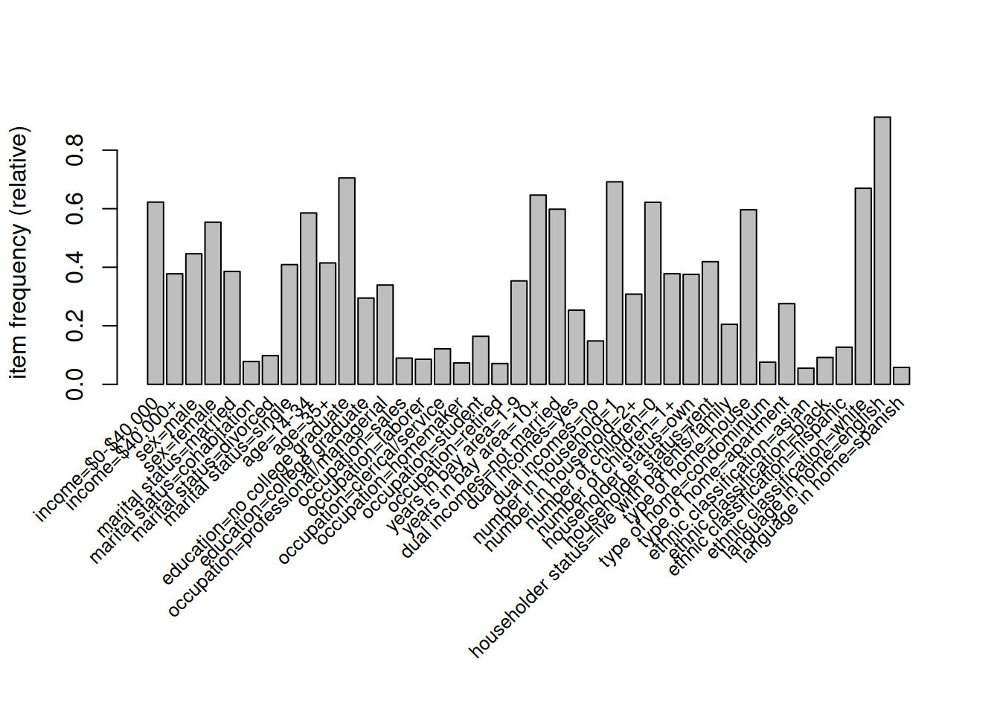
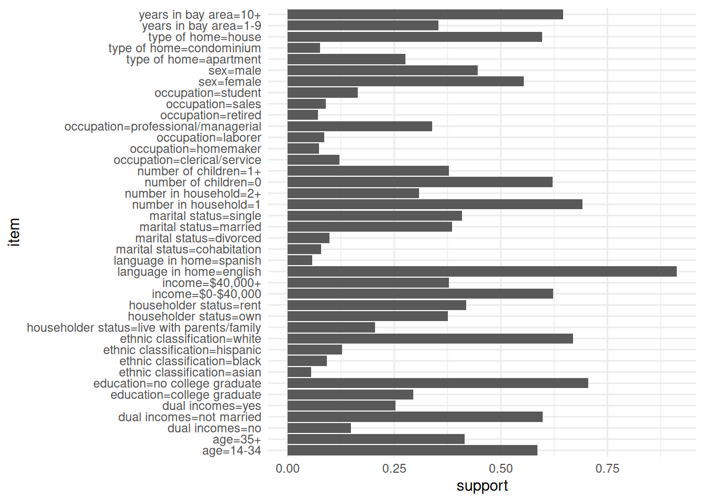

# Association rule mining


While $K$-means clustering is used primarily for numerical measures, we
often have data where the variables are categorical. A common database
type that we haven't yet met comes in the form of a list of sets of
items. A classical example is that of market basket analysis. A retail
store has a large number of transactions during a particular time
period, and is interested whether certain groups of items are
consistently purchased together. With knowledge of such associations the
store layout could be designed to place items optimally with respect to
each other, or the data might be used for cross-selling (discounting an
item if you purchase the second), catalogue design, or to identify
customer segments based on purchasing patterns.

A number of other examples are similar to this, however. Results from
questionnaires (particularly when the questions permit categorical
answers) yield similar data, and the analyst may be interested in
associations between the answers to different questions. Data from web
searches may also be analysed in the same manner. People that search for
certain terms may be more likely to also search for other terms.
Further, there's the possibility that improved search results[^paranoid] might
be gleaned: If a person has previously searched for 'Apple' and later
searches for 'Leopard' then it may be that they are interested in Mac
OS 10.5 (codenamed 'Leopard') rather than whether leopards eat apples.

Typically, such datasets consist of a large number of possible items and
a large number of collections of those items, where each collection may
contain only a small fraction of the total items available. A
supermarket for example may have many thousands of products, yet each
transaction may consist of at most a few hundred items, and in many
cases fewer than ten items. Table \@ref(tab:market1)
shows a few entries from a typical transaction
database.

**How this chapter connects.** Association rules are another
unsupervised task from the comparison table in
Section \@ref(sec:task-compare), but the focus is different from
clustering. Here we study which items or conditions co-occur, rather
than how to group the observations themselves. This makes the chapter a
natural companion to Section \@ref(sec:cluster-compare) for categorical
or transactional data.


Table: (\#tab:market1)An example supermarket database with six transactions.

| transaction|items               |
|-----------:|:-------------------|
|           1|bread, milk         |
|           2|beer                |
|           3|butter              |
|           4|bread, butter, milk |
|           5|bread, butter       |
|           6|bread, beer         |

The retailer is primarily interested in whether a product is purchased
(presence/absence) rather than how many instances of the same item were
purchased in the same transaction, so the data may typically be
represented by a binary matrix as in Table \@ref(tab:market2).


Table: (\#tab:market2)The binary matrix of transactions from Table \@ref(tab:market1)

| transaction| bread| milk| beer| butter|
|-----------:|-----:|----:|----:|------:|
|           1|     1|    1|    0|      0|
|           2|     0|    0|    1|      0|
|           3|     0|    0|    0|      1|
|           4|     1|    1|    0|      1|
|           5|     1|    0|    0|      1|
|           6|     1|    0|    1|      0|

*Association rules* provide information about implications between item
sets: if a transaction has items from set $A$, do they also tend to have
items from set $B$? This is an example of a *rule* which is an
implication of the form $A \Rightarrow B$, where $A, B$ are *itemsets*
with the requirement that they are disjoint ($A \cap B = \emptyset$).
$A$ is known as the *antecedent* (or lhs) and $B$ is the *consequent*
(or rhs) of the rule.

From Table \@ref(tab:market1),
an example rule for the supermarket might be
$\{\textrm{milk},\textrm{bread}\} \Rightarrow \{\textrm{butter}\}$, meaning that if the customer
purchases milk and bread, they also purchase butter. Even with this
small dataset (just 4 items), there are 50 association rules. In
general, for $d$ items, the number of association rules is given by
$$3^d - 2^{d+1} + 1,$$ and thus is exponential in the number of items.
The majority of these rules are of no use: It will be unlikely that
there are transactions in the data set that contains the rules, thus we
need to be able to select the interesting rules from all possible rules,
without having to generate all possible rules to begin with.

The *support* $\mathop{\mathrm{supp}}(A)$ of an itemset $A$ is defined
as the proportion of transactions in the database which contain the
itemset. For the example database in Table \@ref(tab:market1), the itemset
$\{\textrm{milk},\textrm{bread}\}$ has a support of $2/6$ since it
occurs in 2 out of the 6 transactions, whereas the itemset
$\{\textrm{bread}\}$ has support $5/6$. The support of a rule
$A \Rightarrow B$ is then just the support of $A \cup B$, i.e. the
proportion of transactions in the database containing all the items in
the rule.

The *confidence* of a rule is defined as
$$\mathop{\mathrm{conf}}(A \Rightarrow B) = \frac{\mathop{\mathrm{supp}}(A \cup B)}{\mathop{\mathrm{supp}}(A)},$$
and can be interpreted as an estimate of the probability $P(B|A)$, the
probability of finding the consequent of the rule given the antecedent.
From Table \@ref(tab:market1) we see that the rule
$\{\textrm{milk}, \textrm{bread}\} \Rightarrow \{\textrm{butter}\}$ has
confidence $\frac{1/6}{2/6} = 0.5$, so that 50% of the transactions
containing milk and bread also contain butter.

Interesting association rules are those that satisfy both a minimum
support clause and a minimum confidence constraint simultaneously. The
minimal support constraint allows rules to be mined efficiently, as if
an itemset $B$ has high support, then we know that all subsets of $B$
must also have high support. This allows algorithms to be designed that
mine all *maximal frequent itemsets* efficiently.

Even with such constraints, however, there may still be a large number
of association rules found. Further, one must be careful to consider
association rules with high support and high confidence as being
interesting, as example \@ref(exm:coffeetea) shows.

::: {.example #coffeetea}
**Coffee and tea drinking**

Suppose that 1000 people were asked whether
they drank tea or coffee, or both. The results of this are given in the
contigency table \@ref(tab:coffeetea).


Table: (\#tab:coffeetea)Contigency table of drinking preferences for 1000 people.

|       | coffee| no coffee| total|
|:------|------:|---------:|-----:|
|tea    |    150|       650|   800|
|no tea |     50|       150|   200|
|total  |    200|       800|  1000|

The association rule $\{\textrm{coffee}\}\Rightarrow\{\textrm{tea}\}$
may be considered, and we find it has relatively high support (15%) and
confidence (75%). At first glance it might appear that those that drink
coffee also tend to drink tea. However, the probability of a person
drinking tea is 80% regardless of whether they drink coffee, and this
reduces to 75% if they drink coffee. Thus, knowing that a particular
person drinks coffee actually reduces the chance that they're a tea
drinker! The high confidence of the rule
$\{\textrm{coffee}\}\Rightarrow\{\textrm{tea}\}$ is therefore
misleading. The pitfall of high confidence is due to the fact that the
confidence measure does not take into account the support of the rule
consequent. Once we take into account the support of tea drinkers, it is
no surprise that many coffee drinkers also drink tea.
:::

A popular measure useful for ranking association rules in terms of
"interestingness\" is *lift*, which is defined as
$$\mathop{\mathrm{lift}}(A \Rightarrow B) = \frac{\mathop{\mathrm{supp}}(A \cup B)}{\mathop{\mathrm{supp}}(A)\mathop{\mathrm{supp}}(B)}.$$
This may be interpreted as the deviation of the support of the rule from
what might be expected if the antecedent and consequent were
independent. A large lift value indicates a strong positive association.
A lift of 1 indicates no association, and a lift smaller than one
indicates a negative association. The lift of the rule
$\{\textrm{milk},\textrm{bread}\}\Rightarrow\{\textrm{butter}\}$ is $1$.
The lift of the rule $\{\textrm{coffee}\}\Rightarrow\{\textrm{tea}\}$ is
$\frac{0.15}{(0.2)(0.8)} = 0.9375$, indicating a slight negative
correlation.

Using the definition of confidence, lift may also be written as
$$\mathop{\mathrm{lift}}(A \Rightarrow B)
  = \frac{\mathop{\mathrm{conf}}(A \Rightarrow B)}{\mathop{\mathrm{supp}}(B)}
  = \frac{P(B|A)}{P(B)}.$$
Thus lift measures how much the knowledge that $A$ has occurred changes
the probability of observing $B$, relative to the baseline probability
of $B$. In that sense it behaves like a likelihood ratio: lift above 1
indicates positive association, lift equal to 1 corresponds to
independence, and lift below 1 indicates negative association.

While the former statistical criteria for interesting-ness of
association rules is important, often subjective measures may be of more
interest to the data-miner. An association might be considered
uninteresting if it provides only information that was already known (or
suspected). The associations that provide connections that were not
previously known are those that are subjectively of interest. For
example, the association
$\{\textrm{bread}\}\Rightarrow\{\textrm{butter}\}$ is not subjectively
interesting, whereas $\{\textrm{nappies}\}\Rightarrow\{\textrm{beer}\}$
is interesting!

There have been several algorithms developed for mining association
rules, with the *Apriori* and *Eclat* algorithms being two of the more
popular techniques. The R package `arules` implements both algorithms.

## Transaction data as a binary matrix

Suppose that the database contains $N$ transactions and that there are
$d$ distinct possible items. Let
$$z_{ir} = {\bf 1}[\mbox{transaction $i$ contains item $r$}],
\qquad i = 1,\ldots,N,\; r = 1,\ldots,d.$$
Then the transaction database may be represented as an $N \times d$
binary matrix $Z = (z_{ir})$. If $A$ is an itemset, then transaction
$i$ contains $A$ precisely when $z_{ir}=1$ for every item $r \in A$.
Thus the support of $A$ may be written as
$$\mathop{\mathrm{supp}}(A)
  = \frac{1}{N}\sum_{i=1}^N {\bf 1}[A \subseteq T_i]
  = \frac{1}{N}\sum_{i=1}^N \prod_{r \in A} z_{ir},$$
where $T_i$ denotes the set of items in transaction $i$.

This binary representation is conceptually useful even when the data are
stored in a sparse format, since it makes clear that association rule
mining is fundamentally about the co-occurrence structure of the items.

## The Apriori principle

The support measure satisfies an antimonotonicity property: if
$A \subseteq B$, then every transaction containing $B$ must also contain
$A$, and hence
$$\mathop{\mathrm{supp}}(B) \leq \mathop{\mathrm{supp}}(A).$$
This is known as the *Apriori principle*. It is the key fact that makes
large-scale rule mining possible. If an itemset fails the minimum
support threshold, then all supersets of that itemset must also fail,
and they may be discarded without ever having their support counted.

This principle applies only to support, not to confidence or lift. In
practice one therefore first mines the frequent itemsets using a support
threshold, and only afterwards generates the rules and filters them by
confidence, lift or other measures of interest.

## The Apriori algorithm

The Apriori algorithm works level-by-level through the itemset lattice.

1.  Count the support of all 1-itemsets and retain those exceeding the
    minimum support threshold.

2.  Generate candidate 2-itemsets from the surviving 1-itemsets, count
    their support, and discard those that are infrequent.

3.  Generate candidate 3-itemsets from the surviving 2-itemsets, again
    pruning any candidate whose subsets are not all frequent.

4.  Continue until no new frequent itemsets remain.

5.  For each frequent itemset $F$, generate rules
    $A \Rightarrow F \setminus A$ for non-empty proper subsets $A$ of
    $F$, and retain those meeting the confidence requirement.

Although this is still a combinatorial problem, the support-based
pruning means that the overwhelming majority of impossible or
uninteresting candidates are never counted.

## Apriori and Eclat

Apriori uses a *horizontal* representation of the data: the algorithm
repeatedly scans through the transactions and counts how many contain
each candidate itemset. Eclat instead uses a *vertical* representation.
For each item $r$, we store the transaction identifiers
$$I_r = \{i : z_{ir} = 1\}.$$
The support of an itemset may then be obtained by set intersection. For
example,
$$\mathop{\mathrm{supp}}(\{r,s,t\}) = \frac{|I_r \cap I_s \cap I_t|}{N}.$$
Eclat is often faster in practice because intersections of transaction
identifier sets can be cheaper than repeated scans through the full
database.

## Inspecting and filtering rules in `arules`

Once rules have been mined, the main task is usually to sort and filter
them. The `arules` package returns an object of class `rules`, which may
be inspected using


``` r
rules |> inspect()
rules |> sort(by = "lift") |> head(n = 10) |> inspect()
rules |> subset(lhs %in% "garlic")
rules |> subset(lhs %ain% c("garlic", "onion"))
rules |> subset(lhs %pin% "wine")
```

The `%in%` operator matches complete item names, `%ain%` requires all
specified items to be present, and `%pin%` performs a partial match. In
practice these tools are often more useful than the original mining
step, because even moderate support thresholds can still produce a large
number of candidate rules.

::: {.example}
**Household incomes and demographic information**

A total of $N=9409$ questionnaires containg 502 questions were filled
out by shopping mall customers in the San Francisco Bay area. The
dataset consists of 14 demographic attributes, one of which is annual
household income.

We start by loading the data in and checking the frequency of items in
the dataset with support greater than 5%, given in Figure \@ref(fig:income1).


``` r
library(arules)
data("Income")
itemFrequencyPlot(Income, support=0.05, cex.names=0.8)
```

<div class="figure">

<p class="caption">(\#fig:income1)The freqency of items in the Income data set with support greater than 5%</p>
</div>

We can re-do this plot using `ggplot` instead which will make it a little nicer. We first use `enframe()` to convert the named vector returned by `itemFrequency()` to a `tibble`:


``` r
Income |>
  itemFrequency() |>
  enframe(name="item", value="support") |>
  filter(support >= 0.05) |>
  ggplot() +
  geom_col(mapping = aes(x=support, y=item))
```



There are several other variables with support less than 5% - all
variables can be seen using `labels(Income)$items`. The next step is to
generate association rules using the `apriori` function. We specify a
support of 0.01 and confidence of 0.6, yielding just over a million
rules.


``` r
rules <- Income |> apriori(parameter=list(support=0.01, confidence=0.6))
```

```
#> Apriori
#> 
#> Parameter specification:
#>  confidence minval smax arem  aval originalSupport maxtime support minlen
#>         0.6    0.1    1 none FALSE            TRUE       5    0.01      1
#>  maxlen target  ext
#>      10  rules TRUE
#> 
#> Algorithmic control:
#>  filter tree heap memopt load sort verbose
#>     0.1 TRUE TRUE  FALSE TRUE    2    TRUE
#> 
#> Absolute minimum support count: 68 
#> 
#> set item appearances ...[0 item(s)] done [0.00s].
#> set transactions ...[50 item(s), 6876 transaction(s)] done [0.00s].
#> sorting and recoding items ... [49 item(s)] done [0.00s].
#> creating transaction tree ... done [0.00s].
#> checking subsets of size 1 2 3 4 5 6 7 8 9 10
```

```
#> Warning in apriori(Income, parameter = list(support = 0.01, confidence = 0.6)):
#> Mining stopped (maxlen reached). Only patterns up to a length of 10 returned!
```

```
#>  done [0.41s].
#> writing ... [1200801 rule(s)] done [0.13s].
#> creating S4 object  ... done [0.61s].
```

``` r
rules
```

```
#> set of 1200801 rules
```

``` r
summary(rules)
```

```
#> set of 1200801 rules
#> 
#> rule length distribution (lhs + rhs):sizes
#>      1      2      3      4      5      6      7      8      9     10 
#>      7    382   5447  34793 119273 245153 315139 265573 153451  61583 
#> 
#>    Min. 1st Qu.  Median    Mean 3rd Qu.    Max. 
#>   1.000   6.000   7.000   7.121   8.000  10.000 
#> 
#> summary of quality measures:
#>     support          confidence        coverage            lift        
#>  Min.   :0.01003   Min.   :0.6000   Min.   :0.01003   Min.   : 0.6573  
#>  1st Qu.:0.01265   1st Qu.:0.7238   1st Qu.:0.01556   1st Qu.: 1.1386  
#>  Median :0.01745   Median :0.8333   Median :0.02152   Median : 1.3910  
#>  Mean   :0.02476   Mean   :0.8272   Mean   :0.03076   Mean   : 1.6330  
#>  3rd Qu.:0.02792   3rd Qu.:0.9423   3rd Qu.:0.03476   3rd Qu.: 1.9247  
#>  Max.   :0.91289   Max.   :1.0000   Max.   :1.00000   Max.   :24.3140  
#>      count       
#>  Min.   :  69.0  
#>  1st Qu.:  87.0  
#>  Median : 120.0  
#>  Mean   : 170.2  
#>  3rd Qu.: 192.0  
#>  Max.   :6277.0  
#> 
#> mining info:
#>    data ntransactions support confidence
#>  Income          6876    0.01        0.6
#>                                                                        call
#>  apriori(data = Income, parameter = list(support = 0.01, confidence = 0.6))
```

The rules may be inspected via the `inspect` command. Sorting the rules
first based on confidence or lift is useful to obtain the most
interesting (objectively!) relationships first:


``` r
rules |>
  sort(by="confidence") |>
  head(n = 5) |>
  inspect()
```

```
#>     lhs                              rhs                           support confidence   coverage     lift count
#> [1] {marital status=widowed}      => {dual incomes=not married} 0.02937755          1 0.02937755 1.671366   202
#> [2] {marital status=divorced}     => {dual incomes=not married} 0.09787667          1 0.09787667 1.671366   673
#> [3] {marital status=single}       => {dual incomes=not married} 0.40910413          1 0.40910413 1.671366  2813
#> [4] {occupation=military,                                                                                      
#>      ethnic classification=white} => {language in home=english} 0.01207097          1 0.01207097 1.095428    83
#> [5] {marital status=single,                                                                                    
#>      ethnic classification=other} => {dual incomes=not married} 0.01163467          1 0.01163467 1.671366    80
```

As you can see, there are rules with confidence=1, indicating that all
transactions in the datasets containing the lhs also contain the rhs.
The items `dual income=not married` and `marital status=single` are
clearly giving the same information. We can filter out all such rules
using the `subset` command[^subset]:


``` r
rules <- rules |>
  subset(confidence < 1)

rules |> sort(by="confidence") |>
  head(n=2) |>
  inspect()
```

```
#>     lhs                                              rhs           support confidence  coverage     lift count
#> [1] {marital status=single,                                                                                   
#>      occupation=student,                                                                                      
#>      householder status=live with parents/family} => {age=14-34} 0.1137289  0.9987229 0.1138743 1.706141   782
#> [2] {marital status=single,                                                                                   
#>      occupation=student,                                                                                      
#>      dual incomes=not married,                                                                                
#>      householder status=live with parents/family} => {age=14-34} 0.1137289  0.9987229 0.1138743 1.706141   782
```

These are a little more interesting, but hardly surprising - if you're a
student living with your parents/family, then you're very likely to be
less than 35 years of age.

We can also inspect things interactively via the `inspectDT` function in `arulesViz`, though you'll want to make sure you don't have too many rules first:


``` r
library(arulesViz)
rules |>
  head(n=100) |>
  inspectDT()
```

```{=html}
<div class="datatables html-widget html-fill-item" id="htmlwidget-71c9f6dd1e674414f84a" style="width:100%;height:auto;"></div>
<script type="application/json" data-for="htmlwidget-71c9f6dd1e674414f84a">{"x":{"filter":"top","vertical":false,"filterHTML":"<tr>\n  <td><\/td>\n  <td data-type=\"factor\" style=\"vertical-align: top;\">\n    <div class=\"form-group has-feedback\" style=\"margin-bottom: auto;\">\n      <input type=\"search\" placeholder=\"All\" class=\"form-control\" style=\"width: 100%;\"/>\n      <span class=\"glyphicon glyphicon-remove-circle form-control-feedback\"><\/span>\n    <\/div>\n    <div style=\"width: 100%; display: none;\">\n      <select multiple=\"multiple\" style=\"width: 100%;\" data-options=\"[&quot;{}&quot;,&quot;{ethnic classification=pacific islander}&quot;,&quot;{type of home=mobile Home}&quot;,&quot;{ethnic classification=american indian}&quot;,&quot;{occupation=military}&quot;,&quot;{ethnic classification=other}&quot;,&quot;{language in home=other}&quot;,&quot;{marital status=widowed}&quot;,&quot;{occupation=unemployed}&quot;,&quot;{type of home=other}&quot;,&quot;{ethnic classification=asian}&quot;,&quot;{language in home=spanish}&quot;,&quot;{occupation=retired}&quot;,&quot;{occupation=homemaker}&quot;]\"><\/select>\n    <\/div>\n  <\/td>\n  <td data-type=\"factor\" style=\"vertical-align: top;\">\n    <div class=\"form-group has-feedback\" style=\"margin-bottom: auto;\">\n      <input type=\"search\" placeholder=\"All\" class=\"form-control\" style=\"width: 100%;\"/>\n      <span class=\"glyphicon glyphicon-remove-circle form-control-feedback\"><\/span>\n    <\/div>\n    <div style=\"width: 100%; display: none;\">\n      <select multiple=\"multiple\" style=\"width: 100%;\" data-options=\"[&quot;{number of children=0}&quot;,&quot;{income=$0-$40,000}&quot;,&quot;{years in bay area=10+}&quot;,&quot;{ethnic classification=white}&quot;,&quot;{number in household=1}&quot;,&quot;{education=no college graduate}&quot;,&quot;{language in home=english}&quot;,&quot;{householder status=own}&quot;,&quot;{age=35+}&quot;,&quot;{sex=female}&quot;,&quot;{age=14-34}&quot;,&quot;{dual incomes=not married}&quot;,&quot;{years in bay area=1-9}&quot;,&quot;{householder status=rent}&quot;,&quot;{sex=male}&quot;,&quot;{marital status=single}&quot;,&quot;{type of home=house}&quot;,&quot;{ethnic classification=hispanic}&quot;,&quot;{marital status=married}&quot;,&quot;{dual incomes=no}&quot;]\"><\/select>\n    <\/div>\n  <\/td>\n  <td data-type=\"number\" style=\"vertical-align: top;\">\n    <div class=\"form-group has-feedback\" style=\"margin-bottom: auto;\">\n      <input type=\"search\" placeholder=\"All\" class=\"form-control\" style=\"width: 100%;\"/>\n      <span class=\"glyphicon glyphicon-remove-circle form-control-feedback\"><\/span>\n    <\/div>\n    <div style=\"display: none;position: absolute;width: 200px;opacity: 1\">\n      <div data-min=\"0.010180337405468\" data-max=\"0.912885398487493\" data-scale=\"15\"><\/div>\n      <span style=\"float: left;\"><\/span>\n      <span style=\"float: right;\"><\/span>\n    <\/div>\n  <\/td>\n  <td data-type=\"number\" style=\"vertical-align: top;\">\n    <div class=\"form-group has-feedback\" style=\"margin-bottom: auto;\">\n      <input type=\"search\" placeholder=\"All\" class=\"form-control\" style=\"width: 100%;\"/>\n      <span class=\"glyphicon glyphicon-remove-circle form-control-feedback\"><\/span>\n    <\/div>\n    <div style=\"display: none;position: absolute;width: 200px;opacity: 1\">\n      <div data-min=\"0.602272727272727\" data-max=\"0.985655737704918\" data-scale=\"15\"><\/div>\n      <span style=\"float: left;\"><\/span>\n      <span style=\"float: right;\"><\/span>\n    <\/div>\n  <\/td>\n  <td data-type=\"number\" style=\"vertical-align: top;\">\n    <div class=\"form-group has-feedback\" style=\"margin-bottom: auto;\">\n      <input type=\"search\" placeholder=\"All\" class=\"form-control\" style=\"width: 100%;\"/>\n      <span class=\"glyphicon glyphicon-remove-circle form-control-feedback\"><\/span>\n    <\/div>\n    <div style=\"display: none;position: absolute;width: 200px;opacity: 1\">\n      <div data-min=\"0.012798138452588\" data-max=\"1\" data-scale=\"15\"><\/div>\n      <span style=\"float: left;\"><\/span>\n      <span style=\"float: right;\"><\/span>\n    <\/div>\n  <\/td>\n  <td data-type=\"number\" style=\"vertical-align: top;\">\n    <div class=\"form-group has-feedback\" style=\"margin-bottom: auto;\">\n      <input type=\"search\" placeholder=\"All\" class=\"form-control\" style=\"width: 100%;\"/>\n      <span class=\"glyphicon glyphicon-remove-circle form-control-feedback\"><\/span>\n    <\/div>\n    <div style=\"display: none;position: absolute;width: 200px;opacity: 1\">\n      <div data-min=\"0.79194512949441\" data-max=\"6.82479420395232\" data-scale=\"15\"><\/div>\n      <span style=\"float: left;\"><\/span>\n      <span style=\"float: right;\"><\/span>\n    <\/div>\n  <\/td>\n  <td data-type=\"integer\" style=\"vertical-align: top;\">\n    <div class=\"form-group has-feedback\" style=\"margin-bottom: auto;\">\n      <input type=\"search\" placeholder=\"All\" class=\"form-control\" style=\"width: 100%;\"/>\n      <span class=\"glyphicon glyphicon-remove-circle form-control-feedback\"><\/span>\n    <\/div>\n    <div style=\"display: none;position: absolute;width: 200px;opacity: 1\">\n      <div data-min=\"70\" data-max=\"6277\"><\/div>\n      <span style=\"float: left;\"><\/span>\n      <span style=\"float: right;\"><\/span>\n    <\/div>\n  <\/td>\n<\/tr>","data":[["[1]","[2]","[3]","[4]","[5]","[6]","[7]","[8]","[9]","[10]","[11]","[12]","[13]","[14]","[15]","[16]","[17]","[18]","[19]","[20]","[21]","[22]","[23]","[24]","[25]","[26]","[27]","[28]","[29]","[30]","[31]","[32]","[33]","[34]","[35]","[36]","[37]","[38]","[39]","[40]","[41]","[42]","[43]","[44]","[45]","[46]","[47]","[48]","[49]","[51]","[52]","[53]","[54]","[55]","[56]","[57]","[58]","[59]","[60]","[61]","[62]","[63]","[64]","[65]","[66]","[67]","[68]","[69]","[70]","[71]","[72]","[73]","[74]","[75]","[76]","[77]","[78]","[79]","[80]","[81]","[82]","[83]","[84]","[85]","[86]","[87]","[88]","[89]","[90]","[91]","[92]","[93]","[94]","[95]","[96]","[97]","[98]","[99]","[100]","[101]"],["{}","{}","{}","{}","{}","{}","{}","{ethnic classification=pacific islander}","{type of home=mobile Home}","{type of home=mobile Home}","{type of home=mobile Home}","{type of home=mobile Home}","{type of home=mobile Home}","{type of home=mobile Home}","{type of home=mobile Home}","{type of home=mobile Home}","{type of home=mobile Home}","{type of home=mobile Home}","{ethnic classification=american indian}","{ethnic classification=american indian}","{ethnic classification=american indian}","{ethnic classification=american indian}","{ethnic classification=american indian}","{ethnic classification=american indian}","{ethnic classification=american indian}","{occupation=military}","{occupation=military}","{occupation=military}","{occupation=military}","{occupation=military}","{occupation=military}","{occupation=military}","{occupation=military}","{occupation=military}","{ethnic classification=other}","{ethnic classification=other}","{ethnic classification=other}","{ethnic classification=other}","{ethnic classification=other}","{ethnic classification=other}","{ethnic classification=other}","{language in home=other}","{language in home=other}","{language in home=other}","{language in home=other}","{language in home=other}","{marital status=widowed}","{marital status=widowed}","{marital status=widowed}","{marital status=widowed}","{marital status=widowed}","{marital status=widowed}","{marital status=widowed}","{marital status=widowed}","{marital status=widowed}","{marital status=widowed}","{occupation=unemployed}","{occupation=unemployed}","{occupation=unemployed}","{occupation=unemployed}","{occupation=unemployed}","{occupation=unemployed}","{occupation=unemployed}","{occupation=unemployed}","{type of home=other}","{type of home=other}","{type of home=other}","{type of home=other}","{type of home=other}","{type of home=other}","{type of home=other}","{type of home=other}","{type of home=other}","{ethnic classification=asian}","{ethnic classification=asian}","{ethnic classification=asian}","{ethnic classification=asian}","{ethnic classification=asian}","{ethnic classification=asian}","{language in home=spanish}","{language in home=spanish}","{language in home=spanish}","{language in home=spanish}","{language in home=spanish}","{language in home=spanish}","{occupation=retired}","{occupation=retired}","{occupation=retired}","{occupation=retired}","{occupation=retired}","{occupation=retired}","{occupation=retired}","{occupation=retired}","{occupation=retired}","{occupation=retired}","{occupation=retired}","{occupation=homemaker}","{occupation=homemaker}","{occupation=homemaker}","{occupation=homemaker}"],["{number of children=0}","{income=$0-$40,000}","{years in bay area=10+}","{ethnic classification=white}","{number in household=1}","{education=no college graduate}","{language in home=english}","{language in home=english}","{householder status=own}","{age=35+}","{sex=female}","{number of children=0}","{income=$0-$40,000}","{years in bay area=10+}","{ethnic classification=white}","{number in household=1}","{education=no college graduate}","{language in home=english}","{age=14-34}","{dual incomes=not married}","{income=$0-$40,000}","{years in bay area=10+}","{number in household=1}","{education=no college graduate}","{language in home=english}","{years in bay area=1-9}","{householder status=rent}","{sex=male}","{age=14-34}","{number of children=0}","{income=$0-$40,000}","{number in household=1}","{education=no college graduate}","{language in home=english}","{age=14-34}","{dual incomes=not married}","{income=$0-$40,000}","{years in bay area=10+}","{number in household=1}","{education=no college graduate}","{language in home=english}","{marital status=single}","{age=14-34}","{dual incomes=not married}","{income=$0-$40,000}","{education=no college graduate}","{householder status=own}","{age=35+}","{sex=female}","{number of children=0}","{income=$0-$40,000}","{years in bay area=10+}","{ethnic classification=white}","{number in household=1}","{education=no college graduate}","{language in home=english}","{marital status=single}","{age=14-34}","{dual incomes=not married}","{income=$0-$40,000}","{years in bay area=10+}","{number in household=1}","{education=no college graduate}","{language in home=english}","{householder status=rent}","{age=14-34}","{dual incomes=not married}","{number of children=0}","{income=$0-$40,000}","{ethnic classification=white}","{number in household=1}","{education=no college graduate}","{language in home=english}","{age=14-34}","{type of home=house}","{dual incomes=not married}","{income=$0-$40,000}","{education=no college graduate}","{language in home=english}","{ethnic classification=hispanic}","{age=14-34}","{type of home=house}","{dual incomes=not married}","{income=$0-$40,000}","{education=no college graduate}","{householder status=own}","{marital status=married}","{age=35+}","{type of home=house}","{number of children=0}","{income=$0-$40,000}","{years in bay area=10+}","{ethnic classification=white}","{number in household=1}","{education=no college graduate}","{language in home=english}","{dual incomes=no}","{householder status=own}","{marital status=married}","{age=35+}"],[0.6218731820826061,0.622454915648633,0.6465968586387435,0.6697207678883071,0.691826643397324,0.7052065154159395,0.9128853984874927,0.01119837114601513,0.01105293775450844,0.0101803374054683,0.01047120418848168,0.01207097149505526,0.01221640488656195,0.01090750436300175,0.01134380453752181,0.01308900523560209,0.01192553810354858,0.01381617219313554,0.01076207097149505,0.01076207097149505,0.01119837114601513,0.01076207097149505,0.01076207097149505,0.01308900523560209,0.01454333915066899,0.01468877254217568,0.01381617219313554,0.01701570680628272,0.01483420593368237,0.01425247236765561,0.01512507271669575,0.0158522396742292,0.01570680628272251,0.01847004072134962,0.01745200698080279,0.01672484002326934,0.01672484002326934,0.0158522396742292,0.01541593949970913,0.01890634089586969,0.02181500872600349,0.01788830715532286,0.02152414194299011,0.02065154159394997,0.01977894124490983,0.02050610820244328,0.018760907504363,0.02821407795229785,0.02254217568353694,0.0274869109947644,0.02283304246655032,0.02385107620709715,0.02283304246655032,0.02763234438627109,0.02123327515997673,0.02777777777777778,0.02297847585805701,0.02661431064572426,0.03010471204188482,0.02908667830133799,0.02356020942408377,0.02152414194299011,0.02981384525887144,0.03083187899941827,0.02486910994764398,0.02632344386271088,0.02705061082024433,0.02675974403723095,0.02632344386271088,0.02850494473531123,0.02821407795229785,0.02719604421175102,0.03519488074461896,0.03941244909831297,0.03737638161721931,0.03694008144269924,0.03446771378708551,0.03548574752763235,0.03984874927283304,0.05002908667830134,0.03897614892379291,0.03504944735311227,0.03504944735311227,0.0447934845840605,0.05031995346131472,0.056282722513089,0.04348458406050029,0.06995346131471786,0.04828388598022106,0.06762652705061083,0.04610238510762071,0.06093659104130308,0.06253635834787667,0.06762652705061083,0.04741128563118092,0.06849912739965096,0.0504653868528214,0.04464805119255381,0.05890052356020942,0.0462478184991274],[0.6218731820826061,0.622454915648633,0.6465968586387435,0.6697207678883071,0.691826643397324,0.7052065154159395,0.9128853984874927,0.875,0.7450980392156863,0.6862745098039216,0.7058823529411765,0.8137254901960784,0.8235294117647058,0.7352941176470589,0.7647058823529411,0.8823529411764706,0.803921568627451,0.9313725490196079,0.6607142857142857,0.6607142857142857,0.6875,0.6607142857142857,0.6607142857142857,0.8035714285714286,0.8928571428571429,0.7214285714285714,0.6785714285714286,0.8357142857142857,0.7285714285714285,0.7,0.7428571428571429,0.7785714285714286,0.7714285714285715,0.9071428571428571,0.6818181818181818,0.6534090909090909,0.6534090909090909,0.6193181818181818,0.6022727272727273,0.7386363636363636,0.8522727272727273,0.6089108910891089,0.7326732673267327,0.7029702970297029,0.6732673267326733,0.698019801980198,0.6386138613861386,0.9603960396039604,0.7673267326732673,0.9356435643564357,0.7772277227722773,0.8118811881188119,0.7772277227722773,0.9405940594059405,0.7227722772277227,0.9455445544554455,0.6528925619834711,0.7561983471074381,0.8553719008264463,0.8264462809917356,0.6694214876033058,0.6115702479338843,0.8471074380165289,0.8760330578512396,0.66796875,0.70703125,0.7265625,0.71875,0.70703125,0.765625,0.7578125,0.73046875,0.9453125,0.7150395778364116,0.6781002638522428,0.6701846965699209,0.6253298153034301,0.6437994722955145,0.7229551451187335,0.8664987405541562,0.6750629722921915,0.6070528967254408,0.6070528967254408,0.7758186397984886,0.871536523929471,0.7930327868852459,0.6127049180327869,0.985655737704918,0.680327868852459,0.9528688524590164,0.6495901639344263,0.8586065573770492,0.8811475409836066,0.9528688524590164,0.6680327868852459,0.9651639344262295,0.6884920634920635,0.6091269841269841,0.8035714285714286,0.6309523809523809],[1,1,1,1,1,1,1,0.01279813845258872,0.01483420593368237,0.01483420593368237,0.01483420593368237,0.01483420593368237,0.01483420593368237,0.01483420593368237,0.01483420593368237,0.01483420593368237,0.01483420593368237,0.01483420593368237,0.01628853984874927,0.01628853984874927,0.01628853984874927,0.01628853984874927,0.01628853984874927,0.01628853984874927,0.01628853984874927,0.02036067481093659,0.02036067481093659,0.02036067481093659,0.02036067481093659,0.02036067481093659,0.02036067481093659,0.02036067481093659,0.02036067481093659,0.02036067481093659,0.02559627690517743,0.02559627690517743,0.02559627690517743,0.02559627690517743,0.02559627690517743,0.02559627690517743,0.02559627690517743,0.02937754508435137,0.02937754508435137,0.02937754508435137,0.02937754508435136,0.02937754508435137,0.02937754508435137,0.02937754508435137,0.02937754508435137,0.02937754508435137,0.02937754508435137,0.02937754508435137,0.02937754508435137,0.02937754508435137,0.02937754508435137,0.02937754508435137,0.03519488074461896,0.03519488074461896,0.03519488074461896,0.03519488074461896,0.03519488074461897,0.03519488074461897,0.03519488074461897,0.03519488074461897,0.03723094822571262,0.03723094822571262,0.03723094822571262,0.03723094822571262,0.03723094822571262,0.03723094822571262,0.03723094822571262,0.03723094822571262,0.03723094822571262,0.05511925538103549,0.05511925538103548,0.05511925538103549,0.05511925538103548,0.05511925538103549,0.05511925538103549,0.0577370564281559,0.0577370564281559,0.0577370564281559,0.0577370564281559,0.05773705642815591,0.0577370564281559,0.07097149505526468,0.07097149505526469,0.07097149505526469,0.07097149505526469,0.07097149505526469,0.07097149505526468,0.07097149505526469,0.07097149505526469,0.07097149505526469,0.07097149505526468,0.07097149505526469,0.07329842931937172,0.07329842931937174,0.07329842931937172,0.07329842931937174],[1,1,1,1,1,1,1,0.9584992830970208,1.982698961937716,1.655146800916087,1.274257563356138,1.308507125956089,1.323034634414513,1.137175517980472,1.141827936386281,1.275396010832334,1.139980347676295,1.02025133775033,1.128713398402839,1.104295437183138,1.104497663551402,1.021833429728167,0.9550286795399261,1.139483840556227,0.9780604929561438,2.041375661375661,1.618965004461188,1.873613116586706,1.244635314995563,1.125631431244153,1.193431241655541,1.125385146701102,1.093904486933978,0.993709460843442,1.164765669113495,1.092085782472268,1.049729184367035,0.957811924917188,0.8705543983029794,1.047404338289057,0.9336031978217736,1.488400741958305,1.251642580407109,1.174920700626212,1.08163227537707,0.9898090654600622,1.699345553750421,2.316269087448906,1.385176847955208,1.504556863544166,1.248649023780883,1.25562191846715,1.160525042732286,1.359580566002785,1.024908677710419,1.035775745807813,1.595908018556113,1.291831014834967,1.429639569781878,1.327720707499807,1.035299628601064,0.8839934884997662,1.201218961394443,0.9596309233368048,1.593668676266482,1.207837732919255,1.214351908118619,1.155782273152479,1.135875438084112,1.143200325732899,1.095379178053395,1.035822463394514,1.035521546917317,1.221518543404513,1.136669286749883,1.120123960528628,1.004618647202427,0.9129233185200984,0.79194512949441,6.824794203952323,1.1532255894363,1.017575747899593,1.014607612514373,1.246385272722992,1.23585999969871,2.11025288027204,1.588596914175506,2.377190056983169,1.140403321850197,1.532255900259167,1.043593917573158,1.327885445012278,1.31569391787259,1.377323151042295,0.9472867483239742,1.057267359107018,4.64124649859944,1.620881247235736,2.08346800258565,1.521721701658566],[4276,4280,4446,4605,4757,4849,6277,77,76,70,72,83,84,75,78,90,82,95,74,74,77,74,74,90,100,101,95,117,102,98,104,109,108,127,120,115,115,109,106,130,150,123,148,142,136,141,129,194,155,189,157,164,157,190,146,191,158,183,207,200,162,148,205,212,171,181,186,184,181,196,194,187,242,271,257,254,237,244,274,344,268,241,241,308,346,387,299,481,332,465,317,419,430,465,326,471,347,307,405,318]],"container":"<table class=\"display\">\n  <thead>\n    <tr>\n      <th> <\/th>\n      <th>LHS<\/th>\n      <th>RHS<\/th>\n      <th>support<\/th>\n      <th>confidence<\/th>\n      <th>coverage<\/th>\n      <th>lift<\/th>\n      <th>count<\/th>\n    <\/tr>\n  <\/thead>\n<\/table>","options":{"columnDefs":[{"targets":3,"render":"function(data, type, row, meta) {\n    return type !== 'display' ? data : DTWidget.formatRound(data, 3, 3, \",\", \".\", null);\n  }"},{"targets":4,"render":"function(data, type, row, meta) {\n    return type !== 'display' ? data : DTWidget.formatRound(data, 3, 3, \",\", \".\", null);\n  }"},{"targets":5,"render":"function(data, type, row, meta) {\n    return type !== 'display' ? data : DTWidget.formatRound(data, 3, 3, \",\", \".\", null);\n  }"},{"targets":6,"render":"function(data, type, row, meta) {\n    return type !== 'display' ? data : DTWidget.formatRound(data, 3, 3, \",\", \".\", null);\n  }"},{"targets":7,"render":"function(data, type, row, meta) {\n    return type !== 'display' ? data : DTWidget.formatRound(data, 3, 3, \",\", \".\", null);\n  }"},{"className":"dt-right","targets":[3,4,5,6,7]},{"orderable":false,"targets":0},{"name":" ","targets":0},{"name":"LHS","targets":1},{"name":"RHS","targets":2},{"name":"support","targets":3},{"name":"confidence","targets":4},{"name":"coverage","targets":5},{"name":"lift","targets":6},{"name":"count","targets":7}],"order":[],"autoWidth":false,"orderClasses":false,"orderCellsTop":true}},"evals":["options.columnDefs.0.render","options.columnDefs.1.render","options.columnDefs.2.render","options.columnDefs.3.render","options.columnDefs.4.render"],"jsHooks":[]}</script>
```

The `subset()` command is useful for filtering things down somewhat. We can
use the `%in%`, `%ain%`, and `%pin%` operators to filter what appears on
the lhs or rhs of the rules. The `%in%` operator matches any of the
following complete strings, the `%ain%` operator matches all of the
strings, and `%pin%` partially matches any of the following strings. Let
us start by finding rules that associate with high income, with moderate
lift.


``` r
high_income <- rules |>
  subset(rhs %in% "income=$40,000+" & lift > 1.2)
high_income |>
  sort(by="confidence") |>
  head(n=3) |>
  inspect()
```

```
#>     lhs                                      rhs                  support confidence   coverage     lift count
#> [1] {education=college graduate,                                                                              
#>      years in bay area=1-9,                                                                                   
#>      dual incomes=yes,                                                                                        
#>      number of children=0,                                                                                    
#>      householder status=own,                                                                                  
#>      language in home=english}            => {income=$40,000+} 0.01308901  0.9782609 0.01337987 2.591110    90
#> [2] {sex=male,                                                                                                
#>      age=35+,                                                                                                 
#>      education=college graduate,                                                                              
#>      occupation=professional/managerial,                                                                      
#>      dual incomes=yes,                                                                                        
#>      number of children=0,                                                                                    
#>      householder status=own}              => {income=$40,000+} 0.01265271  0.9775281 0.01294357 2.589169    87
#> [3] {marital status=married,                                                                                  
#>      education=college graduate,                                                                              
#>      years in bay area=1-9,                                                                                   
#>      dual incomes=yes,                                                                                        
#>      number of children=0,                                                                                    
#>      householder status=own,                                                                                  
#>      language in home=english}            => {income=$40,000+} 0.01265271  0.9775281 0.01294357 2.589169    87
```

This suggests that a college graduate in a household with two incomes
that own their home is likely to have a high household income, as one
would expect. A little more interesting is the association with no
children. Let us look at a different measure of wealth, home ownership.
Obviously home ownership will be associated with high household income,
but what about home ownership by those that aren't earning a high annual
income?


``` r
home_own <- rules |>
  subset(lhs %in% "income=$0-$40,000" & 
         rhs %in% "householder status=own" &
         lift > 1.2)
home_own |>
  sort(by="confidence") |>
  head(n=2) |>
  inspect()
```

```
#>     lhs                               rhs                         support confidence   coverage     lift count
#> [1] {income=$0-$40,000,                                                                                       
#>      sex=female,                                                                                              
#>      marital status=married,                                                                                  
#>      age=35+,                                                                                                 
#>      dual incomes=no,                                                                                         
#>      number of children=0,                                                                                    
#>      type of home=house,                                                                                      
#>      ethnic classification=white}  => {householder status=own} 0.01163467  0.9756098 0.01192554 2.596088    80
#> [2] {income=$0-$40,000,                                                                                       
#>      sex=female,                                                                                              
#>      marital status=married,                                                                                  
#>      age=35+,                                                                                                 
#>      dual incomes=no,                                                                                         
#>      number of children=0,                                                                                    
#>      type of home=house,                                                                                      
#>      ethnic classification=white,                                                                             
#>      language in home=english}     => {householder status=own} 0.01163467  0.9756098 0.01192554 2.596088    80
```

The recurring theme in these rules are older people in a single-income
household with no children. Finally, we look at one of the variables not
present in Figure \@ref(fig:income1), i.e. one of those variables that is rare in the
dataset: whether the person had answered the question regarding how long
they'd resided in the San Francisco bay area.


``` r
new_to_bay <- rules |>
  subset(rhs %in% "years in bay area=1-9" &
         lift > 1.2)
new_to_bay |>
  sort(by="lift") |>
  head(n=5) |>
  inspect()
```

```
#>     lhs                                 rhs                        support confidence   coverage     lift count
#> [1] {education=no college graduate,                                                                            
#>      occupation=military,                                                                                      
#>      number in household=1}          => {years in bay area=1-9} 0.01032577  0.8452381 0.01221640 2.391711    71
#> [2] {occupation=military,                                                                                      
#>      householder status=rent,                                                                                  
#>      language in home=english}       => {years in bay area=1-9} 0.01018034  0.8139535 0.01250727 2.303187    70
#> [3] {occupation=military,                                                                                      
#>      householder status=rent}        => {years in bay area=1-9} 0.01105294  0.8000000 0.01381617 2.263704    76
#> [4] {income=$0-$40,000,                                                                                        
#>      sex=male,                                                                                                 
#>      occupation=military}            => {years in bay area=1-9} 0.01003490  0.7931034 0.01265271 2.244189    69
#> [5] {income=$0-$40,000,                                                                                        
#>      age=14-34,                                                                                                
#>      occupation=military}            => {years in bay area=1-9} 0.01003490  0.7931034 0.01265271 2.244189    69
```

With small numbers, one shouldn't read too much into this, but it is
interesting that the military occupation comes up in the top 5
association rules.
:::

::: {.example}
**Recipe ingredients and recommendation-style rules**

The lecture used a TidyTuesday dataset of recipes grouped by cuisine.
Each recipe may be treated as a transaction and each ingredient as an
item. After some string cleaning of the `ingredients` variable, the data
may be converted to a `transactions` object and mined in exactly the
same way as any supermarket basket dataset:


``` r
library(arules)
library(tidyverse)

cuisines_raw <- read_csv(
  "https://raw.githubusercontent.com/rfordatascience/tidytuesday/main/data/2025/2025-09-16/cuisines.csv",
  show_col_types = FALSE
)

recipe_trans <- cuisines_raw |>
  ... # clean ingredients, keep one ingredient per row
  as("transactions")

recipe_rules <- recipe_trans |>
  apriori(parameter = list(support = 0.05, confidence = 0.4,
                           minlen = 2, maxlen = 4))

recipe_rules |>
  subset(lhs %in% "garlic" & lift > 1.1) |>
  sort(by = "lift") |>
  head(n = 10) |>
  inspect()
```

The same interpretive issues arise as before. Ingredients that appear in
many cuisines may lead to high-confidence but uninteresting rules,
whereas large lift values tend to indicate more distinctive cuisine or
technique pairings. This is very close in spirit to the recommender
system statement "users who selected $A$ also selected $B$".
:::

## Where association rules fit {#sec:association-fit}

Association rule mining sits naturally beside several other topics in
data mining and statistics.

-   Confidence is simply an estimate of the conditional probability
    $P(B|A)$.

-   Lift compares $P(B|A)$ with the marginal probability $P(B)$, so it
    acts as a measure of departure from independence.

-   Unlike clustering, which groups observations, association rule
    mining studies co-occurrence patterns among the variables or items.

-   Unlike classification, there is no designated target variable and no
    claim of causation. The rules are descriptive rather than
    predictive in the usual supervised-learning sense.

-   In recommender systems, market basket analysis provides the basic
    intuition behind statements such as "customers who bought $A$ also
    bought $B$".

## Summary

Association rule mining is designed for sparse transactional or
categorical data where co-occurrence is the main object of interest.

-   Support controls how common an itemset is, confidence estimates a
    conditional probability, and lift compares that probability with a
    baseline of independence.

-   The Apriori principle makes the search over large itemsets feasible,
    while filtering and visualisation help us focus on rules that are
    both strong and interesting.

-   Association rules are descriptive rather than causal. Their value is
    usually in summarising behaviour, supporting recommendation, or
    surfacing patterns worth following up.

Looking ahead, Section \@ref(sec:ensemble) returns to supervised
learning and shows how multiple models can be combined to improve
prediction and classification performance.

[^paranoid]: or, for the paranoid, a more complete profile of each user.

[^subset]: Note, however, that we may also be filtering out useful
    information here, so an alternate might be to drop superfluous items
    instead
